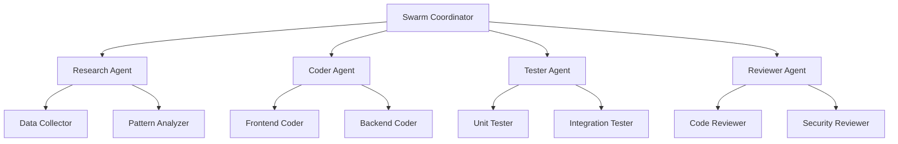

# Swarm Coordination Architecture

## Overview

The Prompt Card System utilizes Claude-Flow's advanced swarm coordination architecture to orchestrate multiple AI agents for optimal performance, scalability, and fault tolerance. This document details the swarm coordination mechanisms, agent roles, and distributed processing capabilities.

## Swarm Architecture Overview

### 1. Hierarchical Coordination Model



### 2. Coordination Layers

#### Layer 1: Swarm Orchestrator
- **Primary Coordinator**: Central command and control
- **Task Distribution**: Intelligent workload allocation
- **Resource Management**: Agent lifecycle and resource optimization
- **Fault Tolerance**: Automatic failure detection and recovery

#### Layer 2: Specialized Agents
- **Research Agents**: Requirement analysis and data gathering
- **Development Agents**: Code generation and implementation
- **Testing Agents**: Quality assurance and validation
- **Review Agents**: Code review and security analysis

#### Layer 3: Execution Agents
- **Worker Agents**: Task-specific execution units
- **Monitoring Agents**: Real-time performance tracking
- **Coordination Agents**: Inter-agent communication and synchronization

## Agent Types and Roles

### 1. Core Development Agents

#### Research Agent
```typescript
interface ResearchAgent {
  id: string;
  type: 'researcher';
  capabilities: [
    'requirement-analysis',
    'market-research',
    'technology-assessment',
    'pattern-identification'
  ];
  tools: [
    'web-search',
    'document-analysis',
    'data-extraction',
    'trend-analysis'
  ];
}
```

**Responsibilities:**
- Analyze user requirements and specifications
- Research best practices and industry standards
- Identify patterns in existing codebase
- Generate technical recommendations

#### Coder Agent
```typescript
interface CoderAgent {
  id: string;
  type: 'coder';
  capabilities: [
    'code-generation',
    'refactoring',
    'optimization',
    'documentation'
  ];
  tools: [
    'file-manipulation',
    'syntax-validation',
    'dependency-management',
    'version-control'
  ];
  specializations: [
    'frontend',
    'backend',
    'database',
    'infrastructure'
  ];
}
```

**Responsibilities:**
- Generate high-quality code based on specifications
- Implement features following best practices
- Optimize code for performance and maintainability
- Create comprehensive documentation

#### Tester Agent
```typescript
interface TesterAgent {
  id: string;
  type: 'tester';
  capabilities: [
    'test-generation',
    'test-execution',
    'coverage-analysis',
    'performance-testing'
  ];
  tools: [
    'jest',
    'playwright',
    'k6',
    'coverage-tools'
  ];
  testTypes: [
    'unit',
    'integration',
    'e2e',
    'performance'
  ];
}
```

**Responsibilities:**
- Generate comprehensive test suites
- Execute tests and analyze results
- Ensure code coverage standards
- Perform performance and load testing

#### Reviewer Agent
```typescript
interface ReviewerAgent {
  id: string;
  type: 'reviewer';
  capabilities: [
    'code-review',
    'security-analysis',
    'quality-assessment',
    'compliance-checking'
  ];
  tools: [
    'static-analysis',
    'security-scanners',
    'linting-tools',
    'metrics-analyzers'
  ];
}
```

**Responsibilities:**
- Conduct thorough code reviews
- Identify security vulnerabilities
- Ensure coding standards compliance
- Provide improvement recommendations

### 2. Specialized Coordination Agents

#### Orchestrator Agent
```typescript
interface OrchestratorAgent {
  id: string;
  type: 'orchestrator';
  responsibilities: [
    'task-distribution',
    'resource-allocation',
    'workflow-coordination',
    'conflict-resolution'
  ];
  coordination: {
    algorithm: 'adaptive-priority-scheduling';
    loadBalancing: 'round-robin-with-capacity';
    faultTolerance: 'circuit-breaker-pattern';
  };
}
```

#### Memory Manager Agent
```typescript
interface MemoryManagerAgent {
  id: string;
  type: 'memory-manager';
  capabilities: [
    'context-preservation',
    'knowledge-sharing',
    'state-synchronization',
    'cache-management'
  ];
  storage: {
    shortTerm: 'redis-cache';
    longTerm: 'persistent-database';
    distributed: 'swarm-memory-network';
  };
}
```

## Coordination Protocols

### 1. Task Distribution Algorithm

```typescript
class TaskDistributor {
  private agents: Map<string, Agent> = new Map();
  private taskQueue: PriorityQueue<Task> = new PriorityQueue();
  
  async distributeTask(task: Task): Promise<string> {
    // Analyze task requirements
    const requirements = this.analyzeTaskRequirements(task);
    
    // Find suitable agents
    const candidateAgents = this.findSuitableAgents(requirements);
    
    // Score agents based on current load and capabilities
    const scoredAgents = this.scoreAgents(candidateAgents, task);
    
    // Select optimal agent
    const selectedAgent = this.selectOptimalAgent(scoredAgents);
    
    // Assign task with coordination metadata
    return this.assignTask(selectedAgent, task);
  }
  
  private analyzeTaskRequirements(task: Task): TaskRequirements {
    return {
      complexity: this.calculateComplexity(task),
      resourceNeeds: this.estimateResources(task),
      dependencies: this.identifyDependencies(task),
      priority: task.priority,
      estimatedDuration: this.estimateDuration(task)
    };
  }
  
  private scoreAgents(agents: Agent[], task: Task): ScoredAgent[] {
    return agents.map(agent => ({
      agent,
      score: this.calculateAgentScore(agent, task)
    })).sort((a, b) => b.score - a.score);
  }
  
  private calculateAgentScore(agent: Agent, task: Task): number {
    const capabilityScore = this.getCapabilityMatch(agent, task);
    const loadScore = this.getCurrentLoadScore(agent);
    const performanceScore = this.getHistoricalPerformance(agent);
    
    return (capabilityScore * 0.4) + (loadScore * 0.3) + (performanceScore * 0.3);
  }
}
```

### 2. Inter-Agent Communication

```typescript
class AgentCommunicationHub {
  private messageQueue: Map<string, MessageQueue> = new Map();
  private subscribers: Map<string, Set<string>> = new Map();
  
  async sendMessage(from: string, to: string, message: AgentMessage): Promise<void> {
    const targetQueue = this.getOrCreateQueue(to);
    
    const enrichedMessage = {
      ...message,
      id: generateId(),
      timestamp: Date.now(),
      from,
      to,
      priority: message.priority || 'normal'
    };
    
    await targetQueue.enqueue(enrichedMessage);
    this.notifySubscribers(to, enrichedMessage);
  }
  
  async broadcastMessage(from: string, message: BroadcastMessage): Promise<void> {
    const activeAgents = this.getActiveAgents();
    
    const broadcastTasks = activeAgents.map(agentId => 
      this.sendMessage(from, agentId, {
        ...message,
        type: 'broadcast'
      })
    );
    
    await Promise.all(broadcastTasks);
  }
  
  subscribe(agentId: string, eventTypes: string[]): void {
    eventTypes.forEach(eventType => {
      if (!this.subscribers.has(eventType)) {
        this.subscribers.set(eventType, new Set());
      }
      this.subscribers.get(eventType)!.add(agentId);
    });
  }
}
```

### 3. Consensus Mechanisms

```typescript
class SwarmConsensus {
  private nodes: Map<string, ConsensusNode> = new Map();
  private proposals: Map<string, Proposal> = new Map();
  
  async proposeChange(proposer: string, proposal: Proposal): Promise<string> {
    const proposalId = generateId();
    
    this.proposals.set(proposalId, {
      ...proposal,
      id: proposalId,
      proposer,
      timestamp: Date.now(),
      votes: new Map(),
      status: 'pending'
    });
    
    // Broadcast proposal to all nodes
    await this.broadcastProposal(proposalId, proposal);
    
    // Start voting timeout
    setTimeout(() => this.finalizeVoting(proposalId), proposal.votingTimeout || 30000);
    
    return proposalId;
  }
  
  async vote(nodeId: string, proposalId: string, vote: Vote): Promise<void> {
    const proposal = this.proposals.get(proposalId);
    if (!proposal || proposal.status !== 'pending') {
      throw new Error('Invalid proposal or voting closed');
    }
    
    proposal.votes.set(nodeId, vote);
    
    // Check if we have enough votes to make a decision
    if (this.hasQuorum(proposalId)) {
      await this.processVotingResult(proposalId);
    }
  }
  
  private hasQuorum(proposalId: string): boolean {
    const proposal = this.proposals.get(proposalId)!;
    const totalNodes = this.nodes.size;
    const votesReceived = proposal.votes.size;
    
    return votesReceived >= Math.ceil(totalNodes * 0.6); // 60% quorum
  }
  
  private async processVotingResult(proposalId: string): Promise<void> {
    const proposal = this.proposals.get(proposalId)!;
    const votes = Array.from(proposal.votes.values());
    
    const approvalCount = votes.filter(vote => vote.decision === 'approve').length;
    const totalVotes = votes.length;
    
    const approved = approvalCount > totalVotes / 2;
    
    proposal.status = approved ? 'approved' : 'rejected';
    
    if (approved) {
      await this.executeProposal(proposal);
    }
    
    // Notify all nodes of the result
    await this.broadcastResult(proposalId, proposal.status);
  }
}
```

## Distributed Processing

### 1. Parallel Task Execution

```typescript
class ParallelExecutor {
  private executionPools: Map<string, ExecutionPool> = new Map();
  private resourceManager: ResourceManager;
  
  async executeParallel(tasks: Task[]): Promise<ExecutionResult[]> {
    // Analyze task dependencies
    const dependencyGraph = this.buildDependencyGraph(tasks);
    
    // Group tasks by execution level
    const executionLevels = this.topologicalSort(dependencyGraph);
    
    const results: ExecutionResult[] = [];
    
    // Execute tasks level by level
    for (const level of executionLevels) {
      const levelResults = await this.executeLevelParallel(level);
      results.push(...levelResults);
    }
    
    return results;
  }
  
  private async executeLevelParallel(tasks: Task[]): Promise<ExecutionResult[]> {
    // Allocate resources for parallel execution
    const resourceAllocations = await this.resourceManager.allocateResources(tasks);
    
    // Create execution contexts
    const executionContexts = tasks.map((task, index) => ({
      task,
      resources: resourceAllocations[index],
      executor: this.selectExecutor(task),
      isolation: this.createIsolationContext(task)
    }));
    
    // Execute all tasks in parallel
    const executionPromises = executionContexts.map(context => 
      this.executeWithContext(context)
    );
    
    // Wait for all executions to complete
    const results = await Promise.allSettled(executionPromises);
    
    // Process results and handle failures
    return this.processExecutionResults(results);
  }
  
  private async executeWithContext(context: ExecutionContext): Promise<ExecutionResult> {
    const { task, resources, executor, isolation } = context;
    
    try {
      // Setup isolation environment
      await isolation.setup();
      
      // Execute task with allocated resources
      const result = await executor.execute(task, resources);
      
      return {
        taskId: task.id,
        status: 'completed',
        result,
        executionTime: result.metrics.executionTime,
        resourceUsage: result.metrics.resourceUsage
      };
    } catch (error) {
      return {
        taskId: task.id,
        status: 'failed',
        error: error.message,
        executionTime: 0,
        resourceUsage: {}
      };
    } finally {
      // Cleanup isolation environment
      await isolation.cleanup();
      
      // Release allocated resources
      await this.resourceManager.releaseResources(resources);
    }
  }
}
```

### 2. Load Balancing and Scaling

```typescript
class SwarmLoadBalancer {
  private agents: Map<string, AgentMetrics> = new Map();
  private loadThresholds = {
    cpu: 0.8,
    memory: 0.85,
    taskQueue: 0.9
  };
  
  async balanceLoad(): Promise<void> {
    const metrics = await this.collectAgentMetrics();
    const overloadedAgents = this.identifyOverloadedAgents(metrics);
    const underutilizedAgents = this.identifyUnderutilizedAgents(metrics);
    
    if (overloadedAgents.length > 0) {
      await this.redistributeTasks(overloadedAgents, underutilizedAgents);
    }
    
    // Scale up if needed
    if (this.shouldScaleUp(metrics)) {
      await this.scaleUpAgents();
    }
    
    // Scale down if possible
    if (this.shouldScaleDown(metrics)) {
      await this.scaleDownAgents();
    }
  }
  
  private async redistributeTasks(
    overloaded: AgentMetrics[],
    underutilized: AgentMetrics[]
  ): Promise<void> {
    for (const overloadedAgent of overloaded) {
      const tasksToMove = await this.selectTasksToMove(overloadedAgent);
      
      for (const task of tasksToMove) {
        const targetAgent = this.selectTargetAgent(underutilized, task);
        
        if (targetAgent) {
          await this.moveTask(task, overloadedAgent.agentId, targetAgent.agentId);
        }
      }
    }
  }
  
  private shouldScaleUp(metrics: AgentMetrics[]): boolean {
    const averageLoad = metrics.reduce((sum, m) => sum + m.overallLoad, 0) / metrics.length;
    const highLoadCount = metrics.filter(m => m.overallLoad > 0.8).length;
    
    return averageLoad > 0.7 && (highLoadCount / metrics.length) > 0.6;
  }
  
  private async scaleUpAgents(): Promise<void> {
    const agentTypes = this.analyzeAgentTypeNeeds();
    
    for (const [agentType, count] of agentTypes.entries()) {
      for (let i = 0; i < count; i++) {
        await this.spawnAgent(agentType);
      }
    }
  }
}
```

## Fault Tolerance and Recovery

### 1. Agent Health Monitoring

```typescript
class AgentHealthMonitor {
  private healthChecks: Map<string, HealthCheck> = new Map();
  private alertThresholds = {
    responseTime: 5000,
    errorRate: 0.1,
    memoryUsage: 0.9
  };
  
  async monitorAgentHealth(agentId: string): Promise<HealthStatus> {
    const healthCheck = this.healthChecks.get(agentId);
    
    if (!healthCheck) {
      throw new Error(`No health check configured for agent ${agentId}`);
    }
    
    const startTime = Date.now();
    
    try {
      // Perform health check
      const response = await this.performHealthCheck(healthCheck);
      const responseTime = Date.now() - startTime;
      
      // Analyze health metrics
      const healthStatus = this.analyzeHealthMetrics(response, responseTime);
      
      // Update agent status
      await this.updateAgentStatus(agentId, healthStatus);
      
      // Trigger alerts if necessary
      if (healthStatus.status === 'unhealthy') {
        await this.triggerHealthAlert(agentId, healthStatus);
      }
      
      return healthStatus;
    } catch (error) {
      // Agent is completely unresponsive
      const criticalStatus: HealthStatus = {
        status: 'critical',
        responseTime: Date.now() - startTime,
        error: error.message,
        timestamp: Date.now()
      };
      
      await this.handleCriticalFailure(agentId, criticalStatus);
      return criticalStatus;
    }
  }
  
  private async handleCriticalFailure(agentId: string, status: HealthStatus): Promise<void> {
    // Mark agent as failed
    await this.markAgentAsFailed(agentId);
    
    // Redistribute tasks from failed agent
    await this.redistributeFailedAgentTasks(agentId);
    
    // Attempt to restart agent
    await this.attemptAgentRestart(agentId);
    
    // Notify system administrators
    await this.notifyAdministrators('critical_agent_failure', {
      agentId,
      status,
      timestamp: Date.now()
    });
  }
}
```

### 2. Circuit Breaker Pattern

```typescript
class CircuitBreaker {
  private state: 'closed' | 'open' | 'half-open' = 'closed';
  private failureCount = 0;
  private lastFailureTime = 0;
  private successCount = 0;
  
  constructor(
    private threshold: number = 5,
    private timeout: number = 60000,
    private resetSuccessCount: number = 3
  ) {}
  
  async execute<T>(operation: () => Promise<T>): Promise<T> {
    if (this.state === 'open') {
      if (Date.now() - this.lastFailureTime >= this.timeout) {
        this.state = 'half-open';
        this.successCount = 0;
      } else {
        throw new Error('Circuit breaker is open');
      }
    }
    
    try {
      const result = await operation();
      
      if (this.state === 'half-open') {
        this.successCount++;
        if (this.successCount >= this.resetSuccessCount) {
          this.reset();
        }
      }
      
      return result;
    } catch (error) {
      this.recordFailure();
      throw error;
    }
  }
  
  private recordFailure(): void {
    this.failureCount++;
    this.lastFailureTime = Date.now();
    
    if (this.failureCount >= this.threshold) {
      this.state = 'open';
    }
  }
  
  private reset(): void {
    this.state = 'closed';
    this.failureCount = 0;
    this.successCount = 0;
    this.lastFailureTime = 0;
  }
}
```

## Performance Optimization

### 1. Resource Allocation

```typescript
class ResourceAllocator {
  private availableResources: ResourcePool;
  private allocations: Map<string, ResourceAllocation> = new Map();
  
  async allocateResources(request: ResourceRequest): Promise<ResourceAllocation> {
    // Validate resource availability
    this.validateResourceAvailability(request);
    
    // Calculate optimal allocation
    const allocation = this.calculateOptimalAllocation(request);
    
    // Reserve resources
    await this.reserveResources(allocation);
    
    // Track allocation
    this.allocations.set(request.taskId, allocation);
    
    return allocation;
  }
  
  private calculateOptimalAllocation(request: ResourceRequest): ResourceAllocation {
    const baseAllocation = this.calculateBaseRequirements(request);
    const scalingFactor = this.calculateScalingFactor(request);
    const priorityBoost = this.calculatePriorityBoost(request);
    
    return {
      cpu: Math.min(
        baseAllocation.cpu * scalingFactor * priorityBoost,
        this.availableResources.cpu * 0.8 // Don't allocate more than 80% of available
      ),
      memory: Math.min(
        baseAllocation.memory * scalingFactor * priorityBoost,
        this.availableResources.memory * 0.8
      ),
      storage: baseAllocation.storage,
      networkBandwidth: baseAllocation.networkBandwidth * scalingFactor,
      taskId: request.taskId,
      expiresAt: Date.now() + (request.estimatedDuration * 1.2) // 20% buffer
    };
  }
  
  async optimizeResourceUsage(): Promise<void> {
    const currentAllocations = Array.from(this.allocations.values());
    const underutilizedAllocations = this.identifyUnderutilizedAllocations(currentAllocations);
    
    for (const allocation of underutilizedAllocations) {
      const newAllocation = this.reduceAllocation(allocation);
      await this.updateAllocation(allocation.taskId, newAllocation);
    }
  }
}
```

### 2. Caching and Memory Management

```typescript
class SwarmMemoryManager {
  private localCache: LRUCache<string, any>;
  private distributedCache: DistributedCache;
  private persistentStorage: PersistentStorage;
  
  constructor() {
    this.localCache = new LRUCache({ max: 1000, ttl: 300000 }); // 5-minute TTL
    this.distributedCache = new DistributedCache();
    this.persistentStorage = new PersistentStorage();
  }
  
  async get(key: string, options?: CacheOptions): Promise<any> {
    // Try local cache first (fastest)
    let value = this.localCache.get(key);
    if (value !== undefined) {
      return value;
    }
    
    // Try distributed cache (fast)
    value = await this.distributedCache.get(key);
    if (value !== undefined) {
      // Store in local cache for faster future access
      this.localCache.set(key, value);
      return value;
    }
    
    // Try persistent storage (slower)
    if (options?.includePersistent) {
      value = await this.persistentStorage.get(key);
      if (value !== undefined) {
        // Cache in both layers
        this.localCache.set(key, value);
        await this.distributedCache.set(key, value, { ttl: 3600000 }); // 1-hour TTL
        return value;
      }
    }
    
    return undefined;
  }
  
  async set(key: string, value: any, options?: CacheOptions): Promise<void> {
    const ttl = options?.ttl || 300000;
    const persistent = options?.persistent || false;
    
    // Always store in local cache
    this.localCache.set(key, value);
    
    // Store in distributed cache for swarm access
    await this.distributedCache.set(key, value, { ttl });
    
    // Store in persistent storage if required
    if (persistent) {
      await this.persistentStorage.set(key, value);
    }
  }
  
  async invalidate(pattern: string): Promise<void> {
    // Invalidate local cache
    this.localCache.clear();
    
    // Invalidate distributed cache
    await this.distributedCache.invalidatePattern(pattern);
    
    // Optionally clean persistent storage
    if (pattern.includes('temp:')) {
      await this.persistentStorage.deletePattern(pattern);
    }
  }
}
```

## Configuration and Tuning

### 1. Swarm Configuration

```typescript
interface SwarmConfiguration {
  coordination: {
    algorithm: 'round-robin' | 'least-loaded' | 'capability-based';
    maxAgents: number;
    minAgents: number;
    autoScaling: boolean;
    loadThreshold: number;
  };
  
  communication: {
    protocol: 'http' | 'websocket' | 'grpc';
    timeout: number;
    retryAttempts: number;
    batchSize: number;
  };
  
  faultTolerance: {
    healthCheckInterval: number;
    maxFailureCount: number;
    recoveryTimeout: number;
    circuitBreakerThreshold: number;
  };
  
  performance: {
    cacheSize: number;
    cacheTTL: number;
    maxConcurrency: number;
    resourceLimits: ResourceLimits;
  };
  
  monitoring: {
    metricsEnabled: boolean;
    loggingLevel: 'error' | 'warn' | 'info' | 'debug';
    alertingEnabled: boolean;
    tracingEnabled: boolean;
  };
}
```

### 2. Performance Tuning

```typescript
class SwarmPerformanceTuner {
  private configuration: SwarmConfiguration;
  private metrics: MetricsCollector;
  
  async optimizeConfiguration(): Promise<SwarmConfiguration> {
    const currentMetrics = await this.metrics.getAggregatedMetrics();
    const bottlenecks = this.identifyBottlenecks(currentMetrics);
    
    const optimizedConfig = { ...this.configuration };
    
    // Optimize coordination settings
    if (bottlenecks.includes('task-distribution')) {
      optimizedConfig.coordination.algorithm = 'capability-based';
      optimizedConfig.coordination.maxAgents = Math.min(
        optimizedConfig.coordination.maxAgents * 1.5,
        20
      );
    }
    
    // Optimize communication settings
    if (bottlenecks.includes('communication')) {
      optimizedConfig.communication.batchSize *= 2;
      optimizedConfig.communication.timeout *= 0.8;
    }
    
    // Optimize performance settings
    if (bottlenecks.includes('memory')) {
      optimizedConfig.performance.cacheSize *= 1.5;
      optimizedConfig.performance.cacheTTL *= 0.8;
    }
    
    return optimizedConfig;
  }
  
  private identifyBottlenecks(metrics: AggregatedMetrics): string[] {
    const bottlenecks: string[] = [];
    
    if (metrics.averageTaskWaitTime > 5000) {
      bottlenecks.push('task-distribution');
    }
    
    if (metrics.communicationLatency > 1000) {
      bottlenecks.push('communication');
    }
    
    if (metrics.cacheHitRate < 0.8) {
      bottlenecks.push('caching');
    }
    
    if (metrics.memoryUsage > 0.85) {
      bottlenecks.push('memory');
    }
    
    return bottlenecks;
  }
}
```

## Integration with Prompt Card System

### 1. SPARC Methodology Integration

```typescript
class SPARCSwarmOrchestrator {
  private swarm: SwarmCoordinator;
  
  async executeSPARCWorkflow(requirements: Requirements): Promise<SPARCResult> {
    // Specification Phase
    const specificationAgent = await this.swarm.spawnAgent('researcher');
    const specification = await specificationAgent.analyzeRequirements(requirements);
    
    // Pseudocode Phase
    const architectAgent = await this.swarm.spawnAgent('architect');
    const pseudocode = await architectAgent.generatePseudocode(specification);
    
    // Architecture Phase
    const architecture = await architectAgent.designArchitecture(pseudocode);
    
    // Refinement Phase (Parallel Implementation)
    const implementationTasks = this.breakdownImplementation(architecture);
    const coderAgents = await this.swarm.spawnMultipleAgents('coder', implementationTasks.length);
    
    const implementations = await Promise.all(
      implementationTasks.map((task, index) => 
        coderAgents[index].implement(task)
      )
    );
    
    // Completion Phase (Testing and Integration)
    const testerAgent = await this.swarm.spawnAgent('tester');
    const reviewerAgent = await this.swarm.spawnAgent('reviewer');
    
    const [testResults, reviewResults] = await Promise.all([
      testerAgent.testImplementations(implementations),
      reviewerAgent.reviewCode(implementations)
    ]);
    
    // Integration
    const integrationAgent = await this.swarm.spawnAgent('integrator');
    const finalResult = await integrationAgent.integrate({
      specification,
      architecture,
      implementations,
      testResults,
      reviewResults
    });
    
    return finalResult;
  }
}
```

### 2. Real-Time Coordination

```typescript
class RealTimeCoordinator {
  private websocketServer: WebSocketServer;
  private progressTracker: ProgressTracker;
  
  setupRealTimeUpdates(): void {
    this.websocketServer.on('connection', (socket) => {
      socket.on('subscribe-task', (taskId: string) => {
        this.subscribeToTaskUpdates(socket, taskId);
      });
      
      socket.on('subscribe-swarm', () => {
        this.subscribeToSwarmUpdates(socket);
      });
    });
  }
  
  private subscribeToTaskUpdates(socket: WebSocket, taskId: string): void {
    this.progressTracker.onProgress(taskId, (progress) => {
      socket.send(JSON.stringify({
        type: 'task-progress',
        taskId,
        progress: {
          percentage: progress.percentage,
          currentStep: progress.currentStep,
          estimatedTimeRemaining: progress.estimatedTimeRemaining,
          agentAssigned: progress.agentId
        }
      }));
    });
  }
  
  private subscribeToSwarmUpdates(socket: WebSocket): void {
    this.swarm.onStatusChange((status) => {
      socket.send(JSON.stringify({
        type: 'swarm-status',
        status: {
          activeAgents: status.activeAgents,
          queuedTasks: status.queuedTasks,
          completedTasks: status.completedTasks,
          systemLoad: status.systemLoad
        }
      }));
    });
  }
}
```

## Monitoring and Observability

### 1. Metrics Collection

```typescript
class SwarmMetricsCollector {
  private prometheus: PrometheusRegistry;
  
  initializeMetrics(): void {
    // Agent metrics
    this.prometheus.register(new Gauge({
      name: 'swarm_active_agents',
      help: 'Number of active agents in the swarm',
      labelNames: ['agent_type']
    }));
    
    this.prometheus.register(new Histogram({
      name: 'task_execution_duration_seconds',
      help: 'Duration of task execution',
      labelNames: ['task_type', 'agent_id'],
      buckets: [0.1, 0.5, 1, 2, 5, 10, 30, 60]
    }));
    
    // Coordination metrics
    this.prometheus.register(new Counter({
      name: 'coordination_messages_total',
      help: 'Total number of coordination messages',
      labelNames: ['message_type', 'source_agent', 'target_agent']
    }));
    
    // Performance metrics
    this.prometheus.register(new Gauge({
      name: 'swarm_resource_utilization',
      help: 'Resource utilization percentage',
      labelNames: ['resource_type']
    }));
  }
  
  recordTaskExecution(taskType: string, agentId: string, duration: number): void {
    this.prometheus.getMetric('task_execution_duration_seconds')
      .labels(taskType, agentId)
      .observe(duration);
  }
  
  updateActiveAgents(agentType: string, count: number): void {
    this.prometheus.getMetric('swarm_active_agents')
      .labels(agentType)
      .set(count);
  }
}
```

### 2. Alerting System

```typescript
class SwarmAlertingSystem {
  private alertRules: AlertRule[] = [
    {
      name: 'high_task_failure_rate',
      condition: 'task_failure_rate > 0.1',
      severity: 'warning',
      description: 'Task failure rate is above 10%'
    },
    {
      name: 'agent_unavailable',
      condition: 'agent_health_status == 0',
      severity: 'critical',
      description: 'Agent is unavailable'
    },
    {
      name: 'high_coordination_latency',
      condition: 'coordination_latency > 5000',
      severity: 'warning',
      description: 'Coordination latency is above 5 seconds'
    }
  ];
  
  async checkAlerts(): Promise<void> {
    const metrics = await this.collectCurrentMetrics();
    
    for (const rule of this.alertRules) {
      const triggered = this.evaluateCondition(rule.condition, metrics);
      
      if (triggered) {
        await this.triggerAlert(rule, metrics);
      }
    }
  }
  
  private async triggerAlert(rule: AlertRule, metrics: Metrics): Promise<void> {
    const alert: Alert = {
      rule: rule.name,
      severity: rule.severity,
      description: rule.description,
      timestamp: Date.now(),
      metrics,
      actions: this.determineActions(rule.severity)
    };
    
    // Send notifications
    await this.sendNotifications(alert);
    
    // Execute automated responses
    await this.executeAutomatedActions(alert);
  }
}
```

## Best Practices

### 1. Swarm Design Principles

- **Modularity**: Design agents with single responsibilities
- **Scalability**: Ensure horizontal scaling capabilities
- **Fault Tolerance**: Implement robust error handling and recovery
- **Performance**: Optimize for low latency and high throughput
- **Observability**: Comprehensive monitoring and logging

### 2. Agent Development Guidelines

- **Stateless Design**: Agents should be stateless for easy scaling
- **Idempotent Operations**: Ensure operations can be safely retried
- **Resource Awareness**: Monitor and limit resource consumption
- **Communication Efficiency**: Minimize inter-agent communication overhead
- **Error Propagation**: Properly handle and report errors

### 3. Operational Considerations

- **Capacity Planning**: Monitor and plan for growth
- **Security**: Implement proper authentication and authorization
- **Backup and Recovery**: Regular backups of critical state
- **Testing**: Comprehensive testing including chaos engineering
- **Documentation**: Maintain up-to-date documentation

## Next Steps

1. Review [system architecture overview](./system-overview.md) for complete system design
2. Check [deployment guides](../deployment/) for production setup
3. See [testing documentation](../testing/) for validation strategies