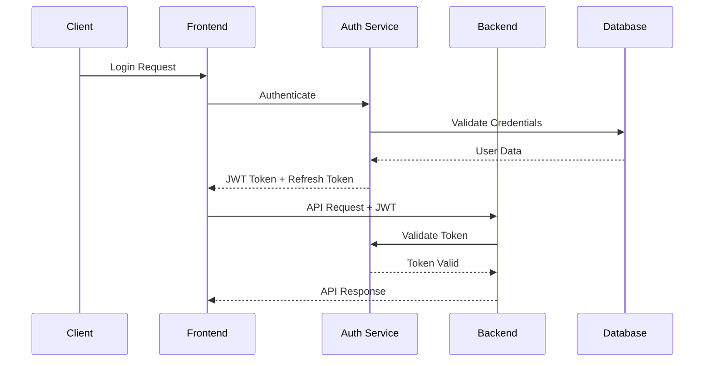

# System Architecture Overview

## Overview

The Prompt Card System is a comprehensive, cloud-native application built with modern microservices architecture, featuring AI-powered prompt management, distributed testing capabilities, and advanced monitoring. This document provides a complete overview of the system architecture, components, and their interactions.

## High-Level Architecture

```mermaid
graph TB
    subgraph "Client Layer"
        WEB[Web Browser]
        CLI[CLI Tools]
        API_CLIENT[API Clients]
    end
    
    subgraph "Load Balancer Layer"
        LB[NGINX Load Balancer]
        SSL[SSL Termination]
    end
    
    subgraph "Application Layer"
        FE[Frontend - Next.js]
        BE[Backend - Node.js]
        AUTH[Auth Service]
        WEBSOCKET[WebSocket Server]
    end
    
    subgraph "AI & Processing Layer"
        SWARM[Claude-Flow Swarm]
        LLM[LLM Services]
        NEURAL[Neural Processing]
    end
    
    subgraph "Data Layer"
        PG[PostgreSQL]
        REDIS[Redis Cache]
        S3[File Storage]
    end
    
    subgraph "Infrastructure Layer"
        DOCKER[Docker Containers]
        K8S[Kubernetes (Optional)]
        MONITORING[Monitoring Stack]
    end
    
    WEB --> LB
    CLI --> LB
    API_CLIENT --> LB
    
    LB --> FE
    LB --> BE
    LB --> AUTH
    
    FE --> BE
    FE --> WEBSOCKET
    BE --> AUTH
    BE --> SWARM
    SWARM --> LLM
    SWARM --> NEURAL
    
    BE --> PG
    BE --> REDIS
    BE --> S3
    AUTH --> PG
    
    DOCKER --> MONITORING
    K8S --> MONITORING
```

## Core Components

### 1. Frontend Application (Next.js)

#### Architecture
```typescript
// Component Architecture
src/
├── app/                    # Next.js 13+ App Router
│   ├── page.tsx           # Main dashboard
│   ├── prompt-cards/      # Prompt card management
│   ├── analytics/         # Analytics dashboard
│   ├── monitoring/        # System monitoring
│   └── api/              # API routes (Edge functions)
├── components/            # Reusable UI components
│   ├── PromptCard/       # Prompt card components
│   ├── Analytics/        # Analytics components
│   ├── Monitoring/       # Monitoring dashboards
│   └── ui/               # Base UI components
├── hooks/                # Custom React hooks
├── lib/                  # Utility libraries
└── types/                # TypeScript definitions
```

#### Key Features
- **Server-Side Rendering (SSR)**: Optimized performance and SEO
- **Static Site Generation (SSG)**: Pre-rendered pages for public content
- **API Routes**: Edge functions for lightweight backend operations
- **Real-time Updates**: WebSocket integration for live data
- **Progressive Web App (PWA)**: Offline capabilities and mobile optimization

#### Technology Stack
```yaml
Framework: Next.js 14
Language: TypeScript
Styling: Tailwind CSS
State Management: Zustand + React Query
Testing: Jest + React Testing Library + Playwright
Build Tool: Webpack (via Next.js)
```

### 2. Backend Application (Node.js)

#### Architecture
```typescript
// Service Architecture
src/
├── routes/               # API route handlers
│   ├── promptCards.ts   # Prompt card operations
│   ├── analytics.ts     # Analytics endpoints
│   ├── testing.ts       # Testing framework
│   └── health.ts        # Health checks
├── services/            # Business logic services
│   ├── PromptCardService.ts
│   ├── AnalyticsService.ts
│   ├── TestingService.ts
│   └── LLMService.ts
├── middleware/          # Express middleware
│   ├── auth.ts         # Authentication
│   ├── validation.ts   # Request validation
│   ├── security.ts     # Security headers
│   └── monitoring.ts   # Request monitoring
├── database/           # Database layer
│   ├── connection.ts   # Database connection
│   ├── migrations/     # Schema migrations
│   └── repositories/   # Data access layer
└── types/              # TypeScript definitions
```

#### Key Features
- **RESTful API**: Well-designed REST endpoints
- **GraphQL Support**: Optional GraphQL layer for complex queries
- **Real-time Communication**: WebSocket server for live updates
- **Caching Layer**: Redis-based caching for performance
- **Background Jobs**: Queue-based task processing
- **Monitoring Integration**: Prometheus metrics and structured logging

#### Technology Stack
```yaml
Framework: Express.js
Language: TypeScript
Database: PostgreSQL with Prisma ORM
Cache: Redis
Message Queue: Bull Queue
Authentication: JWT + Passport.js
Testing: Jest + Supertest
```

### 3. Authentication Service

#### Architecture
```typescript
// Auth Service Structure
src/
├── routes/
│   ├── auth.ts          # Authentication endpoints
│   ├── users.ts         # User management
│   └── rbac.ts          # Role-based access control
├── services/
│   ├── AuthService.ts   # Core authentication logic
│   ├── UserService.ts   # User management
│   ├── TokenService.ts  # JWT token handling
│   └── RBACService.ts   # Permission management
├── middleware/
│   ├── authenticate.ts  # Authentication middleware
│   ├── authorize.ts     # Authorization middleware
│   └── rateLimit.ts     # Rate limiting
└── database/
    ├── models/          # User data models
    └── repositories/    # Data access layer
```

#### Security Features
- **Multi-Factor Authentication (MFA)**: TOTP-based 2FA
- **JWT Token Management**: Secure token generation and validation
- **Role-Based Access Control (RBAC)**: Fine-grained permissions
- **Session Management**: Secure session handling
- **Password Security**: Bcrypt hashing with salt
- **Account Lockout**: Brute force protection

### 4. Claude-Flow Swarm Coordination

#### Architecture Overview
```typescript
// Swarm Coordination Structure
swarm/
├── coordination/
│   ├── SwarmOrchestrator.ts    # Main coordinator
│   ├── TaskDistributor.ts      # Task distribution
│   ├── LoadBalancer.ts         # Load balancing
│   └── HealthMonitor.ts        # Health monitoring
├── agents/
│   ├── ResearchAgent.ts        # Requirement analysis
│   ├── CoderAgent.ts           # Code generation
│   ├── TesterAgent.ts          # Testing automation
│   └── ReviewerAgent.ts        # Code review
├── communication/
│   ├── MessageBus.ts           # Inter-agent messaging
│   ├── EventBroadcaster.ts     # Event distribution
│   └── ConsensusManager.ts     # Consensus protocols
└── memory/
    ├── SharedMemory.ts         # Shared state
    ├── CacheManager.ts         # Distributed caching
    └── PersistenceLayer.ts     # Long-term storage
```

#### Key Capabilities
- **Intelligent Task Distribution**: AI-powered workload allocation
- **Fault Tolerance**: Automatic failure detection and recovery
- **Horizontal Scaling**: Dynamic agent scaling based on load
- **Real-time Coordination**: Live task orchestration and monitoring
- **Memory Management**: Distributed memory and state synchronization

## Data Architecture

### 1. Database Schema

#### Core Tables
```sql
-- Prompt Cards
CREATE TABLE prompt_cards (
    id UUID PRIMARY KEY DEFAULT gen_random_uuid(),
    title VARCHAR(255) NOT NULL,
    description TEXT,
    prompt TEXT NOT NULL,
    category VARCHAR(100),
    tags TEXT[],
    metadata JSONB,
    created_by UUID REFERENCES users(id),
    created_at TIMESTAMP WITH TIME ZONE DEFAULT NOW(),
    updated_at TIMESTAMP WITH TIME ZONE DEFAULT NOW(),
    version INTEGER DEFAULT 1,
    is_public BOOLEAN DEFAULT false
);

-- Test Cases
CREATE TABLE test_cases (
    id UUID PRIMARY KEY DEFAULT gen_random_uuid(),
    prompt_card_id UUID REFERENCES prompt_cards(id) ON DELETE CASCADE,
    name VARCHAR(255) NOT NULL,
    input JSONB NOT NULL,
    expected_output TEXT,
    assertions JSONB,
    created_at TIMESTAMP WITH TIME ZONE DEFAULT NOW()
);

-- Execution Results
CREATE TABLE execution_results (
    id UUID PRIMARY KEY DEFAULT gen_random_uuid(),
    prompt_card_id UUID REFERENCES prompt_cards(id),
    test_case_id UUID REFERENCES test_cases(id),
    input JSONB,
    output TEXT,
    success BOOLEAN,
    execution_time INTEGER,
    metrics JSONB,
    executed_at TIMESTAMP WITH TIME ZONE DEFAULT NOW()
);

-- Analytics Data
CREATE TABLE analytics_events (
    id UUID PRIMARY KEY DEFAULT gen_random_uuid(),
    event_type VARCHAR(100) NOT NULL,
    user_id UUID REFERENCES users(id),
    prompt_card_id UUID REFERENCES prompt_cards(id),
    metadata JSONB,
    created_at TIMESTAMP WITH TIME ZONE DEFAULT NOW()
);
```

#### Indexes and Performance
```sql
-- Performance indexes
CREATE INDEX idx_prompt_cards_category ON prompt_cards(category);
CREATE INDEX idx_prompt_cards_created_at ON prompt_cards(created_at);
CREATE INDEX idx_prompt_cards_tags ON prompt_cards USING gin(tags);
CREATE INDEX idx_test_cases_prompt_card_id ON test_cases(prompt_card_id);
CREATE INDEX idx_execution_results_prompt_card_id ON execution_results(prompt_card_id);
CREATE INDEX idx_analytics_events_created_at ON analytics_events(created_at);

-- Full-text search
CREATE INDEX idx_prompt_cards_search ON prompt_cards 
USING gin(to_tsvector('english', title || ' ' || description || ' ' || prompt));
```

### 2. Caching Strategy

#### Cache Layers
```typescript
interface CacheStrategy {
  // L1: Application Cache (In-Memory)
  applicationCache: {
    type: 'LRU';
    maxSize: 1000;
    ttl: 300; // 5 minutes
    items: ['user-sessions', 'frequent-queries', 'static-data'];
  };
  
  // L2: Distributed Cache (Redis)
  distributedCache: {
    type: 'Redis Cluster';
    maxMemory: '2GB';
    evictionPolicy: 'allkeys-lru';
    items: ['api-responses', 'computed-results', 'shared-state'];
  };
  
  // L3: CDN Cache (External)
  cdnCache: {
    type: 'CloudFlare';
    ttl: 3600; // 1 hour
    items: ['static-assets', 'public-content', 'api-responses'];
  };
}
```

#### Cache Implementation
```typescript
class CacheManager {
  private l1Cache: LRUCache<string, any>;
  private l2Cache: RedisClient;
  
  async get(key: string, options?: CacheOptions): Promise<any> {
    // Try L1 cache first
    let value = this.l1Cache.get(key);
    if (value !== undefined) {
      return value;
    }
    
    // Try L2 cache
    value = await this.l2Cache.get(key);
    if (value !== undefined) {
      // Store in L1 for faster future access
      this.l1Cache.set(key, value);
      return JSON.parse(value);
    }
    
    return undefined;
  }
  
  async set(key: string, value: any, ttl?: number): Promise<void> {
    // Store in both caches
    this.l1Cache.set(key, value);
    
    if (ttl) {
      await this.l2Cache.setex(key, ttl, JSON.stringify(value));
    } else {
      await this.l2Cache.set(key, JSON.stringify(value));
    }
  }
}
```

## Security Architecture

### 1. Authentication & Authorization

#### JWT Token Flow


#### Security Middleware Stack
```typescript
// Security middleware configuration
const securityMiddleware = [
  helmet({
    contentSecurityPolicy: {
      directives: {
        defaultSrc: ["'self'"],
        scriptSrc: ["'self'", "'unsafe-inline'", "trusted-cdn.com"],
        styleSrc: ["'self'", "'unsafe-inline'"],
        imgSrc: ["'self'", "data:", "trusted-images.com"],
        connectSrc: ["'self'", "wss:", "api.trusted.com"]
      }
    },
    hsts: {
      maxAge: 31536000,
      includeSubDomains: true,
      preload: true
    }
  }),
  cors({
    origin: process.env.ALLOWED_ORIGINS?.split(',') || 'http://localhost:3000',
    credentials: true,
    optionsSuccessStatus: 200
  }),
  rateLimit({
    windowMs: 15 * 60 * 1000, // 15 minutes
    max: 100, // limit each IP to 100 requests per windowMs
    message: 'Too many requests from this IP',
    standardHeaders: true,
    legacyHeaders: false
  }),
  compression(),
  express.json({ limit: '10mb' }),
  express.urlencoded({ extended: true, limit: '10mb' })
];
```

### 2. Data Protection

#### Encryption Strategy
```typescript
class DataProtection {
  private encryptionKey: string = process.env.ENCRYPTION_KEY!;
  
  // Encrypt sensitive data at rest
  encryptSensitiveData(data: string): string {
    const cipher = crypto.createCipher('aes-256-gcm', this.encryptionKey);
    let encrypted = cipher.update(data, 'utf8', 'hex');
    encrypted += cipher.final('hex');
    
    const authTag = cipher.getAuthTag();
    return encrypted + ':' + authTag.toString('hex');
  }
  
  // Decrypt sensitive data
  decryptSensitiveData(encryptedData: string): string {
    const [encrypted, authTag] = encryptedData.split(':');
    const decipher = crypto.createDecipher('aes-256-gcm', this.encryptionKey);
    decipher.setAuthTag(Buffer.from(authTag, 'hex'));
    
    let decrypted = decipher.update(encrypted, 'hex', 'utf8');
    decrypted += decipher.final('utf8');
    
    return decrypted;
  }
  
  // Hash passwords with salt
  async hashPassword(password: string): Promise<string> {
    const saltRounds = 12;
    return bcrypt.hash(password, saltRounds);
  }
  
  // Verify password
  async verifyPassword(password: string, hash: string): Promise<boolean> {
    return bcrypt.compare(password, hash);
  }
}
```

## Monitoring & Observability

### 1. Metrics Collection

#### Prometheus Metrics
```typescript
// Custom metrics definitions
const metrics = {
  httpRequestDuration: new Histogram({
    name: 'http_request_duration_seconds',
    help: 'Duration of HTTP requests in seconds',
    labelNames: ['method', 'route', 'status_code'],
    buckets: [0.1, 0.3, 0.5, 0.7, 1, 3, 5, 7, 10]
  }),
  
  promptExecutions: new Counter({
    name: 'prompt_executions_total',
    help: 'Total number of prompt executions',
    labelNames: ['prompt_card_id', 'success']
  }),
  
  activeUsers: new Gauge({
    name: 'active_users',
    help: 'Number of currently active users'
  }),
  
  swarmAgents: new Gauge({
    name: 'swarm_agents_active',
    help: 'Number of active swarm agents',
    labelNames: ['agent_type']
  })
};
```

#### Application Performance Monitoring
```typescript
class APMService {
  private tracer: Tracer;
  
  instrumentRequest(req: Request, res: Response, next: NextFunction): void {
    const span = this.tracer.startSpan(`${req.method} ${req.route?.path || req.path}`);
    
    span.setAttributes({
      'http.method': req.method,
      'http.url': req.url,
      'http.user_agent': req.get('User-Agent') || '',
      'user.id': req.user?.id || 'anonymous'
    });
    
    res.on('finish', () => {
      span.setAttributes({
        'http.status_code': res.statusCode,
        'http.response_size': res.get('content-length') || 0
      });
      
      span.setStatus({
        code: res.statusCode >= 400 ? SpanStatusCode.ERROR : SpanStatusCode.OK
      });
      
      span.end();
    });
    
    next();
  }
}
```

### 2. Logging Strategy

#### Structured Logging
```typescript
class Logger {
  private winston: winston.Logger;
  
  constructor() {
    this.winston = winston.createLogger({
      level: process.env.LOG_LEVEL || 'info',
      format: winston.format.combine(
        winston.format.timestamp(),
        winston.format.errors({ stack: true }),
        winston.format.json()
      ),
      defaultMeta: {
        service: 'prompt-card-system',
        version: process.env.APP_VERSION || '1.0.0'
      },
      transports: [
        new winston.transports.Console({
          format: winston.format.combine(
            winston.format.colorize(),
            winston.format.simple()
          )
        }),
        new winston.transports.File({
          filename: 'logs/error.log',
          level: 'error'
        }),
        new winston.transports.File({
          filename: 'logs/combined.log'
        })
      ]
    });
  }
  
  logRequest(req: Request, res: Response, responseTime: number): void {
    this.winston.info('HTTP Request', {
      method: req.method,
      url: req.url,
      statusCode: res.statusCode,
      responseTime,
      userAgent: req.get('User-Agent'),
      ip: req.ip,
      userId: req.user?.id
    });
  }
  
  logError(error: Error, context?: any): void {
    this.winston.error('Application Error', {
      message: error.message,
      stack: error.stack,
      context
    });
  }
}
```

## Deployment Architecture

### 1. Container Architecture

#### Multi-Stage Dockerfile Strategy
```dockerfile
# Frontend Dockerfile
FROM node:20-alpine AS base
WORKDIR /app

FROM base AS deps
COPY package*.json ./
RUN npm ci --only=production

FROM base AS builder
COPY . .
RUN npm ci
RUN npm run build

FROM base AS runner
COPY --from=deps /app/node_modules ./node_modules
COPY --from=builder /app/.next/standalone ./
COPY --from=builder /app/.next/static ./.next/static

EXPOSE 3000
CMD ["node", "server.js"]
```

#### Docker Compose Production Setup
```yaml
version: '3.8'

services:
  frontend:
    image: prompt-card-frontend:latest
    ports:
      - "3000:3000"
    environment:
      - NODE_ENV=production
      - NEXT_PUBLIC_API_URL=${API_URL}
    restart: unless-stopped
    
  backend:
    image: prompt-card-backend:latest
    ports:
      - "3001:3001"
    environment:
      - NODE_ENV=production
      - DATABASE_URL=${DATABASE_URL}
      - REDIS_URL=${REDIS_URL}
      - JWT_SECRET=${JWT_SECRET}
    restart: unless-stopped
    depends_on:
      - database
      - redis
      
  auth:
    image: prompt-card-auth:latest
    ports:
      - "3002:3002"
    environment:
      - NODE_ENV=production
      - DATABASE_URL=${DATABASE_URL}
      - JWT_SECRET=${JWT_SECRET}
    restart: unless-stopped
    depends_on:
      - database
      
  database:
    image: postgres:15-alpine
    environment:
      - POSTGRES_DB=${DB_NAME}
      - POSTGRES_USER=${DB_USER}
      - POSTGRES_PASSWORD=${DB_PASSWORD}
    volumes:
      - postgres_data:/var/lib/postgresql/data
    restart: unless-stopped
    
  redis:
    image: redis:7-alpine
    command: redis-server --appendonly yes
    volumes:
      - redis_data:/data
    restart: unless-stopped
    
  nginx:
    image: nginx:alpine
    ports:
      - "80:80"
      - "443:443"
    volumes:
      - ./nginx.conf:/etc/nginx/nginx.conf
      - ./ssl:/etc/nginx/ssl
    restart: unless-stopped
    depends_on:
      - frontend
      - backend
      - auth

volumes:
  postgres_data:
  redis_data:
```

### 2. Kubernetes Deployment (Optional)

#### Kubernetes Manifests
```yaml
# Frontend Deployment
apiVersion: apps/v1
kind: Deployment
metadata:
  name: frontend
spec:
  replicas: 3
  selector:
    matchLabels:
      app: frontend
  template:
    metadata:
      labels:
        app: frontend
    spec:
      containers:
      - name: frontend
        image: prompt-card-frontend:latest
        ports:
        - containerPort: 3000
        env:
        - name: NODE_ENV
          value: "production"
        - name: NEXT_PUBLIC_API_URL
          valueFrom:
            configMapKeyRef:
              name: app-config
              key: api-url
        resources:
          requests:
            memory: "256Mi"
            cpu: "250m"
          limits:
            memory: "512Mi"
            cpu: "500m"
        livenessProbe:
          httpGet:
            path: /health
            port: 3000
          initialDelaySeconds: 30
          periodSeconds: 10
        readinessProbe:
          httpGet:
            path: /health
            port: 3000
          initialDelaySeconds: 5
          periodSeconds: 5

---
apiVersion: v1
kind: Service
metadata:
  name: frontend-service
spec:
  selector:
    app: frontend
  ports:
  - protocol: TCP
    port: 80
    targetPort: 3000
  type: ClusterIP
```

## Performance Optimization

### 1. Application Performance

#### Code Splitting and Lazy Loading
```typescript
// Next.js dynamic imports for code splitting
const AnalyticsDashboard = dynamic(() => import('@/components/Analytics/Dashboard'), {
  loading: () => <Loading />,
  ssr: false
});

const MonitoringDashboard = dynamic(() => import('@/components/Monitoring/Dashboard'), {
  loading: () => <Loading />
});

// Route-based code splitting
export default function HomePage() {
  return (
    <div>
      <Suspense fallback={<Loading />}>
        <AnalyticsDashboard />
      </Suspense>
    </div>
  );
}
```

#### Database Query Optimization
```typescript
// Optimized queries with proper indexing
class OptimizedQueries {
  // Use connection pooling
  private pool = new Pool({
    host: process.env.DB_HOST,
    port: parseInt(process.env.DB_PORT || '5432'),
    database: process.env.DB_NAME,
    user: process.env.DB_USER,
    password: process.env.DB_PASSWORD,
    max: 20, // Maximum number of connections
    idleTimeoutMillis: 30000,
    connectionTimeoutMillis: 2000,
  });
  
  // Paginated queries with proper indexing
  async getPromptCards(page: number, limit: number, filters?: any): Promise<any> {
    const offset = (page - 1) * limit;
    
    let query = `
      SELECT 
        pc.*,
        COUNT(tc.id) as test_case_count,
        AVG(er.execution_time) as avg_execution_time
      FROM prompt_cards pc
      LEFT JOIN test_cases tc ON pc.id = tc.prompt_card_id
      LEFT JOIN execution_results er ON pc.id = er.prompt_card_id
    `;
    
    const conditions: string[] = [];
    const params: any[] = [];
    
    if (filters?.category) {
      conditions.push(`pc.category = $${params.length + 1}`);
      params.push(filters.category);
    }
    
    if (filters?.search) {
      conditions.push(`to_tsvector('english', pc.title || ' ' || pc.description) @@ plainto_tsquery($${params.length + 1})`);
      params.push(filters.search);
    }
    
    if (conditions.length > 0) {
      query += ` WHERE ${conditions.join(' AND ')}`;
    }
    
    query += `
      GROUP BY pc.id
      ORDER BY pc.created_at DESC
      LIMIT $${params.length + 1} OFFSET $${params.length + 2}
    `;
    
    params.push(limit, offset);
    
    const result = await this.pool.query(query, params);
    return result.rows;
  }
}
```

### 2. Infrastructure Performance

#### CDN and Edge Optimization
```typescript
// CDN configuration for static assets
const cdnConfig = {
  domains: ['cdn.example.com'],
  images: {
    deviceSizes: [640, 750, 828, 1080, 1200, 1920, 2048, 3840],
    imageSizes: [16, 32, 48, 64, 96, 128, 256, 384],
    formats: ['image/webp', 'image/avif'],
    minimumCacheTTL: 31536000, // 1 year
  },
  headers: [
    {
      source: '/(.*)',
      headers: [
        {
          key: 'Cache-Control',
          value: 'public, max-age=31536000, immutable',
        },
      ],
    },
  ],
};
```

#### Load Balancing Strategy
```nginx
# NGINX load balancing configuration
upstream backend_servers {
    least_conn;
    server backend-1:3001 max_fails=3 fail_timeout=30s;
    server backend-2:3001 max_fails=3 fail_timeout=30s;
    server backend-3:3001 max_fails=3 fail_timeout=30s;
}

upstream frontend_servers {
    ip_hash;
    server frontend-1:3000 max_fails=3 fail_timeout=30s;
    server frontend-2:3000 max_fails=3 fail_timeout=30s;
}

server {
    listen 443 ssl http2;
    server_name example.com;
    
    # SSL configuration
    ssl_certificate /etc/nginx/ssl/cert.pem;
    ssl_certificate_key /etc/nginx/ssl/key.pem;
    
    # Security headers
    add_header Strict-Transport-Security "max-age=31536000; includeSubDomains" always;
    add_header X-Frame-Options DENY always;
    add_header X-Content-Type-Options nosniff always;
    
    # Gzip compression
    gzip on;
    gzip_vary on;
    gzip_min_length 1024;
    gzip_types text/plain text/css application/json application/javascript text/xml application/xml application/xml+rss text/javascript;
    
    # Frontend routing
    location / {
        proxy_pass http://frontend_servers;
        proxy_set_header Host $host;
        proxy_set_header X-Real-IP $remote_addr;
        proxy_set_header X-Forwarded-For $proxy_add_x_forwarded_for;
        proxy_set_header X-Forwarded-Proto $scheme;
    }
    
    # API routing
    location /api/ {
        proxy_pass http://backend_servers;
        proxy_set_header Host $host;
        proxy_set_header X-Real-IP $remote_addr;
        proxy_set_header X-Forwarded-For $proxy_add_x_forwarded_for;
        proxy_set_header X-Forwarded-Proto $scheme;
        
        # API-specific caching
        proxy_cache_valid 200 5m;
        proxy_cache_use_stale error timeout invalid_header updating;
    }
    
    # WebSocket routing
    location /ws/ {
        proxy_pass http://backend_servers;
        proxy_http_version 1.1;
        proxy_set_header Upgrade $http_upgrade;
        proxy_set_header Connection "upgrade";
        proxy_set_header Host $host;
    }
}
```

## Scalability Considerations

### 1. Horizontal Scaling

#### Auto-scaling Configuration
```yaml
# Kubernetes Horizontal Pod Autoscaler
apiVersion: autoscaling/v2
kind: HorizontalPodAutoscaler
metadata:
  name: frontend-hpa
spec:
  scaleTargetRef:
    apiVersion: apps/v1
    kind: Deployment
    name: frontend
  minReplicas: 2
  maxReplicas: 10
  metrics:
  - type: Resource
    resource:
      name: cpu
      target:
        type: Utilization
        averageUtilization: 70
  - type: Resource
    resource:
      name: memory
      target:
        type: Utilization
        averageUtilization: 80
```

### 2. Database Scaling

#### Read Replicas and Connection Pooling
```typescript
class DatabaseManager {
  private masterPool: Pool;
  private replicaPools: Pool[] = [];
  
  constructor() {
    // Master database for writes
    this.masterPool = new Pool({
      host: process.env.DB_MASTER_HOST,
      port: parseInt(process.env.DB_PORT || '5432'),
      database: process.env.DB_NAME,
      user: process.env.DB_USER,
      password: process.env.DB_PASSWORD,
      max: 20,
    });
    
    // Read replicas for reads
    const replicaHosts = process.env.DB_REPLICA_HOSTS?.split(',') || [];
    this.replicaPools = replicaHosts.map(host => new Pool({
      host,
      port: parseInt(process.env.DB_PORT || '5432'),
      database: process.env.DB_NAME,
      user: process.env.DB_READ_USER,
      password: process.env.DB_READ_PASSWORD,
      max: 15,
    }));
  }
  
  async query(sql: string, params?: any[], options?: { readOnly?: boolean }): Promise<any> {
    if (options?.readOnly && this.replicaPools.length > 0) {
      // Use read replica for read-only queries
      const replica = this.replicaPools[Math.floor(Math.random() * this.replicaPools.length)];
      return replica.query(sql, params);
    } else {
      // Use master for writes and critical reads
      return this.masterPool.query(sql, params);
    }
  }
}
```

## Testing Strategy

### 1. Test Architecture

#### Testing Pyramid
```typescript
// Unit Tests (70%)
describe('PromptCardService', () => {
  it('should create prompt card with valid data', async () => {
    const service = new PromptCardService(mockDatabase);
    const result = await service.createPromptCard(validData);
    expect(result).toBeDefined();
  });
});

// Integration Tests (20%)
describe('API Integration', () => {
  it('should handle full prompt card workflow', async () => {
    const response = await request(app)
      .post('/api/prompt-cards')
      .send(testData)
      .expect(201);
    
    expect(response.body).toMatchObject(expectedResult);
  });
});

// End-to-End Tests (10%)
describe('User Workflows', () => {
  it('should complete prompt card creation flow', async () => {
    await page.goto('/prompt-cards/new');
    await page.fill('[data-testid="title"]', 'Test Card');
    await page.click('[data-testid="save"]');
    await expect(page).toHaveURL('/prompt-cards/test-card');
  });
});
```

### 2. Performance Testing

#### Load Testing with K6
```javascript
// Load testing script
import http from 'k6/http';
import { check, sleep } from 'k6';

export let options = {
  stages: [
    { duration: '2m', target: 10 },
    { duration: '5m', target: 10 },
    { duration: '2m', target: 50 },
    { duration: '5m', target: 50 },
    { duration: '10m', target: 0 },
  ],
  thresholds: {
    'http_req_duration': ['p(95)<500'],
    'http_req_failed': ['rate<0.1'],
  },
};

export default function() {
  const response = http.get('https://api.example.com/prompt-cards');
  check(response, {
    'status is 200': (r) => r.status === 200,
    'response time < 200ms': (r) => r.timings.duration < 200,
  });
  
  sleep(1);
}
```

## Disaster Recovery

### 1. Backup Strategy

#### Automated Backup System
```typescript
class BackupManager {
  async createDatabaseBackup(): Promise<string> {
    const timestamp = new Date().toISOString().replace(/[:.]/g, '-');
    const backupName = `backup-${timestamp}`;
    
    // Create database dump
    const dumpCommand = `pg_dump ${process.env.DATABASE_URL} > /backups/${backupName}.sql`;
    await execAsync(dumpCommand);
    
    // Compress backup
    const compressCommand = `gzip /backups/${backupName}.sql`;
    await execAsync(compressCommand);
    
    // Upload to cloud storage
    await this.uploadToS3(`/backups/${backupName}.sql.gz`);
    
    return backupName;
  }
  
  async createFullSystemBackup(): Promise<void> {
    // Database backup
    const dbBackup = await this.createDatabaseBackup();
    
    // Application data backup
    await this.backupApplicationData();
    
    // Configuration backup
    await this.backupConfiguration();
    
    // Container images backup
    await this.backupContainerImages();
    
    // Create restore script
    await this.generateRestoreScript(dbBackup);
  }
}
```

### 2. High Availability Setup

#### Multi-Region Deployment
```yaml
# Multi-region deployment configuration
regions:
  primary:
    region: us-east-1
    services:
      - frontend
      - backend
      - auth
      - database-master
      - redis-master
    
  secondary:
    region: us-west-2
    services:
      - frontend
      - backend
      - auth
      - database-replica
      - redis-replica
    
  disaster_recovery:
    region: eu-west-1
    services:
      - database-backup
      - cold-storage

failover:
  automatic: true
  healthcheck_interval: 30s
  failover_threshold: 3
  recovery_timeout: 300s
```

## Best Practices Summary

### 1. Development Practices
- **Code Quality**: Comprehensive linting, testing, and code review
- **Security First**: Built-in security measures and regular audits
- **Performance**: Optimization at every layer
- **Scalability**: Designed for horizontal scaling
- **Maintainability**: Clean architecture and comprehensive documentation

### 2. Operational Practices
- **Monitoring**: Comprehensive observability and alerting
- **Deployment**: Automated CI/CD with rollback capabilities
- **Security**: Regular security updates and vulnerability scanning
- **Backup**: Automated backup and disaster recovery procedures
- **Documentation**: Up-to-date documentation and runbooks

### 3. Architecture Principles
- **Microservices**: Loosely coupled, independently deployable services
- **Event-Driven**: Asynchronous communication and event sourcing
- **Cloud-Native**: Containerized and cloud-optimized
- **API-First**: Well-designed APIs for all interfaces
- **Data-Driven**: Analytics and metrics driving decisions

## Next Steps

1. Review specific [deployment guides](../deployment/) for environment setup
2. Check [testing documentation](../testing/) for quality assurance
3. See [build guides](../build/) for development and deployment processes