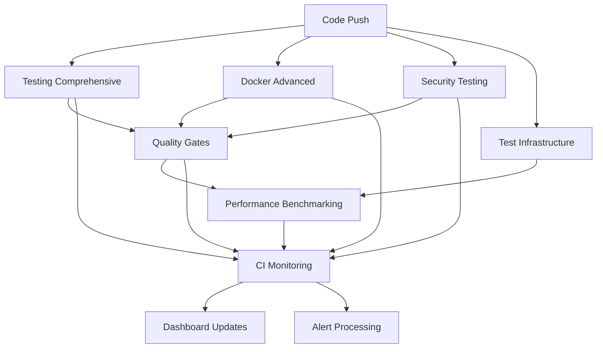

# 🔧 CI Configuration Overview

## System Architecture

The CI/CD system consists of 7 integrated workflows that provide comprehensive testing, security, performance monitoring, and deployment automation for the enterprise vLLM platform.

## 📊 Workflow Matrix

| Workflow | Purpose | Trigger | Duration | Dependencies |
|----------|---------|---------|----------|--------------|
| [Testing Comprehensive](#testing-comprehensive) | London TDD + 100% Coverage | Push/PR | 8-12 min | None |
| [Docker Advanced](#docker-advanced) | Multi-Platform + Security | Push/PR | 10-15 min | None |
| [Quality Gates](#quality-gates) | Dynamic Thresholds | Workflow Completion | 5-8 min | Testing/Docker |
| [Test Infrastructure](#test-infrastructure) | Mock Services + Monitoring | Push/Schedule | 10-15 min | None |
| [Performance Benchmarking](#performance-benchmarking) | Regression Detection | Schedule/Manual | 15-25 min | Infrastructure |
| [Security Testing](#security-testing) | Vulnerability Assessment | Push/Schedule | 12-20 min | None |
| [CI Monitoring](#ci-monitoring) | Real-Time Dashboard | Workflow Events | 3-5 min | All Others |

## 🚀 Quick Start

### 1. Repository Setup

**Required Secrets**:
```bash
# Docker Registry
DOCKER_USERNAME=your-username
DOCKER_PASSWORD=your-token

# Optional
NPM_TOKEN=npm-token-for-private-packages
```

**Branch Protection Rules**:
```yaml
required_status_checks:
  - "London TDD Compliance Check"
  - "Security Gate Compliance"
  - "Quality Gate (PASSED)"
dismiss_stale_reviews: true
require_code_owner_reviews: true
required_approving_review_count: 2
```

### 2. Initial Workflow Execution

**Automatic Triggers**:
```bash
# Push to main/develop triggers:
git push origin main
# → Testing Comprehensive
# → Docker Advanced  
# → Security Testing (if enabled)
# → Quality Gates (after completion)
# → CI Monitoring (real-time)
```

**Manual Triggers**:
```bash
# Comprehensive test run
gh workflow run testing-comprehensive.yml \
  -f test_level=comprehensive \
  -f coverage_threshold=100

# Multi-platform Docker build
gh workflow run docker-advanced.yml \
  -f platforms=linux/amd64,linux/arm64 \
  -f security_scan=true

# Performance benchmarking
gh workflow run performance-benchmarking.yml \
  -f benchmark_suite=comprehensive
```

## 📋 Workflow Configurations

### Testing Comprehensive

**File**: `.github/workflows/testing-comprehensive.yml`

**Key Features**:
- London TDD enforcement with 100% coverage
- Intelligent test selection based on code changes
- Parallel execution across multiple test categories
- Mutation testing for quality validation
- Visual regression testing with Playwright

**Configuration Options**:
```yaml
inputs:
  test_level:
    options: [quick, full, regression, performance]
    default: full
  coverage_threshold:
    default: 100
  enable_mutation_testing:
    default: false
```

**Environment Variables**:
```yaml
env:
  TDD_MODE: london
  TDD_STRICT: true
  COVERAGE_THRESHOLD: 100
  JEST_WORKERS: 75%
```

### Docker Advanced

**File**: `.github/workflows/docker-advanced.yml`

**Key Features**:
- Multi-platform builds (linux/amd64, linux/arm64)
- Advanced BuildKit with cache mounts and secrets
- Comprehensive security scanning (Trivy, Hadolint, Syft)
- Automated registry management and cleanup
- Image optimization and size validation

**Configuration Options**:
```yaml
inputs:
  platforms:
    default: linux/amd64,linux/arm64
  security_scan:
    default: true
  optimize_images:
    default: true
  registry_push:
    default: false
```

**Environment Variables**:
```yaml
env:
  DOCKER_BUILDKIT: 1
  BUILDKIT_PROGRESS: plain
  PLATFORMS: linux/amd64,linux/arm64
```

### Quality Gates

**File**: `.github/workflows/quality-gates.yml`

**Key Features**:
- Dynamic threshold adjustment based on project phase
- Historical trend analysis with 30-day windows
- Multiple enforcement levels (Advisory → Strict)
- Emergency override capabilities
- Intelligent recommendations based on metrics

**Configuration Options**:
```yaml
inputs:
  quality_profile:
    options: [development, testing, staging, production, emergency]
    default: production
  override_thresholds:
    description: JSON threshold overrides
  force_pass:
    default: false
```

**Quality Profiles**:
```yaml
production:
  coverage_threshold: 100
  performance_threshold: 95
  security_threshold: 100
  strict_mode: true
  
development:
  coverage_threshold: 70
  performance_threshold: 80
  security_threshold: 85
  strict_mode: false
```

### Test Infrastructure

**File**: `.github/workflows/test-infrastructure.yml`

**Key Features**:
- Automated deployment of test services (PostgreSQL, Redis, Elasticsearch)
- Comprehensive mock data generation with Faker.js
- Performance monitoring with Prometheus/Grafana
- Service health validation and initialization
- Multi-mode infrastructure deployment

**Configuration Options**:
```yaml
inputs:
  infrastructure_mode:
    options: [minimal, standard, full, performance]
    default: standard
  mock_data_refresh:
    default: true
  performance_baseline:
    default: false
```

**Service Matrix**:
```yaml
services:
  postgresql: postgres:15-alpine
  redis: redis:7-alpine
  elasticsearch: elasticsearch:8.11
  mock-server: mockserver:5.15
```

### Performance Benchmarking

**File**: `.github/workflows/performance-benchmarking.yml`

**Key Features**:
- Comprehensive performance testing (API, UI, Database, Memory)
- Regression detection with statistical analysis
- Automated baseline management and updates
- Performance optimization recommendations
- Multi-level benchmarking suites

**Configuration Options**:
```yaml
inputs:
  benchmark_suite:
    options: [quick, standard, comprehensive, stress, memory, cpu]
    default: standard
  baseline_update:
    default: false
  regression_threshold:
    default: 10
```

**Benchmark Categories**:
```yaml
benchmarks:
  api_performance: response_time, throughput, concurrent_load
  ui_performance: page_load, interaction, rendering
  database_performance: query_execution, connection_pooling
  memory_usage: heap_utilization, gc_pressure
  cpu_performance: algorithm_efficiency, computational_load
```

### Security Testing

**File**: `.github/workflows/security-testing-integration.yml`

**Key Features**:
- Multi-tool security scanning (Semgrep, Trivy, Gitleaks, OWASP ZAP)
- Compliance validation (OWASP Top 10, PCI DSS, SOC 2, GDPR)
- Vulnerability assessment with multiple databases
- Automated remediation suggestions
- Comprehensive security reporting

**Configuration Options**:
```yaml
inputs:
  security_profile:
    options: [quick, standard, comprehensive, penetration, compliance]
    default: comprehensive
  vulnerability_scan:
    default: true
  compliance_check:
    default: true
```

**Security Tools Matrix**:
```yaml
tools:
  semgrep: static_analysis
  npm_audit: dependency_check
  trivy: container_scan
  gitleaks: secrets_detection
  owasp_zap: api_security
  checkov: infrastructure_scan
```

### CI Monitoring

**File**: `.github/workflows/ci-monitoring-dashboard.yml`

**Key Features**:
- Real-time metrics collection every 5 minutes
- Interactive web dashboard with Chart.js visualizations
- Automated alert system with configurable thresholds
- JSON API for programmatic access
- Historical trend analysis and reporting

**Configuration Options**:
```yaml
inputs:
  dashboard_mode:
    options: [minimal, standard, comprehensive, real-time]
    default: standard
  metrics_retention:
    default: 30
  alert_threshold:
    default: 10
```

**Monitoring Metrics**:
```yaml
metrics:
  workflow_success_rates: per workflow
  execution_durations: average, p95, p99
  resource_utilization: CPU, memory, cache
  quality_trends: coverage, security, performance
```

## 🔄 Workflow Dependencies



## ⚡ Performance Optimization

### Parallel Execution Strategy

**Stage 1 - Independent Builds (Parallel)**:
- Testing Comprehensive (8-12 min)
- Docker Advanced (10-15 min) 
- Security Testing (12-20 min)
- Test Infrastructure (10-15 min)

**Stage 2 - Quality Assessment**:
- Quality Gates (5-8 min) - Depends on Stage 1
- Performance Benchmarking (15-25 min) - Depends on Infrastructure

**Stage 3 - Monitoring & Reporting**:
- CI Monitoring (3-5 min) - Continuous updates

### Caching Strategy

**Multi-Level Caching**:
```yaml
caching_layers:
  1_system_dependencies:
    path: /var/cache/apt
    key: system-deps-v1
    
  2_node_modules:
    path: node_modules
    key: node-v1-{{ hashFiles('package-lock.json') }}
    
  3_build_artifacts:
    path: dist/
    key: build-v1-{{ github.sha }}
    
  4_docker_layers:
    type: registry
    scope: multi-platform-builds
```

### Resource Optimization

**Job Resource Allocation**:
```yaml
testing_comprehensive:
  timeout: 12 minutes
  strategy: parallel
  workers: 75%
  
docker_advanced:
  timeout: 15 minutes
  strategy: parallel
  platforms: multi
  
performance_benchmarking:
  timeout: 25 minutes
  strategy: sequential
  resources: high
```

## 🚨 Alert Configuration

### Alert Thresholds

```yaml
alert_levels:
  critical:
    workflow_failure_rate: "> 50%"
    build_duration: "> 20 minutes"
    security_critical: "> 0 vulnerabilities"
    
  warning:
    workflow_failure_rate: "> 10%"
    build_duration: "> 15 minutes"
    test_coverage: "< 95%"
    
  info:
    cache_hit_rate: "< 80%"
    resource_usage: "> 80%"
```

### Notification Channels

```yaml
notifications:
  critical:
    - pagerduty
    - slack_ops
    - email_oncall
    
  warning:
    - slack_dev
    - email_team
    
  info:
    - slack_monitoring
```

## 📊 Quality Metrics

### Success Criteria

```yaml
quality_gates:
  code_coverage: 100%
  test_success_rate: 100%
  build_success_rate: "> 95%"
  security_score: "> 95%"
  performance_regression: "< 10%"
```

### Performance Targets

```yaml
performance_targets:
  total_pipeline_duration: "< 15 minutes"
  testing_duration: "< 8 minutes"
  docker_build_duration: "< 10 minutes"
  security_scan_duration: "< 15 minutes"
  
  cache_hit_rate: "> 80%"
  resource_efficiency: "> 70%"
  parallel_efficiency: "> 85%"
```

## 🔧 Configuration Management

### Environment Variables

**Global Settings**:
```yaml
env:
  NODE_VERSION: 20
  CACHE_VERSION: v5
  DOCKER_BUILDKIT: 1
  CI: true
```

**Workflow-Specific Settings**:
```yaml
testing:
  TDD_MODE: london
  COVERAGE_THRESHOLD: 100
  JEST_WORKERS: 75%
  
docker:
  PLATFORMS: linux/amd64,linux/arm64
  BUILDKIT_PROGRESS: plain
  
security:
  COMPLIANCE_FRAMEWORKS: OWASP-TOP-10,PCI-DSS,SOC2,GDPR
  SCAN_SEVERITY: HIGH,CRITICAL
```

### Secrets Management

**Required Secrets**:
```yaml
secrets:
  DOCKER_USERNAME: Docker Hub username
  DOCKER_PASSWORD: Docker Hub token
  NPM_TOKEN: npm registry token (optional)
  
  # Auto-generated by GitHub
  GITHUB_TOKEN: Repository access token
```

### Branch Configuration

**Branch Protection**:
```yaml
branch_protection:
  main:
    required_status_checks:
      - "London TDD Compliance Check"
      - "Security Gate Compliance" 
      - "Quality Gate (PASSED)"
    dismiss_stale_reviews: true
    require_code_owner_reviews: true
    
  develop:
    required_status_checks:
      - "Testing Comprehensive"
      - "Docker Advanced"
    dismiss_stale_reviews: false
```

## 📈 Monitoring and Observability

### Real-Time Dashboard

**Available Metrics**:
- Workflow success rates and trends
- Build duration analytics
- Resource utilization patterns
- Quality metrics evolution
- Security posture tracking

**Dashboard Features**:
- Interactive Chart.js visualizations
- Real-time updates every 5 minutes
- Historical trend analysis (30 days)
- Automated alert generation
- JSON API for external integrations

### Retention Policies

```yaml
retention:
  metrics_data: 30 days
  build_artifacts: 7 days
  test_results: 14 days
  security_reports: 90 days
  performance_baselines: 6 months
```

## 🚀 Best Practices

### Development Workflow

1. **Local Testing**: Run tests locally before pushing
2. **Small Commits**: Incremental changes for faster CI
3. **Branch Strategy**: Feature branches with PR validation
4. **Code Review**: Mandatory reviews with quality checks

### CI Optimization

1. **Cache Utilization**: Maximize cache hit rates
2. **Parallel Execution**: Run independent jobs concurrently
3. **Fail Fast**: Quick feedback on critical issues
4. **Resource Management**: Optimal job resource allocation

### Security

1. **Shift Left**: Security scanning in development
2. **Continuous Monitoring**: Regular vulnerability assessments
3. **Compliance**: Automated framework validation
4. **Incident Response**: Rapid alert processing

This comprehensive CI configuration provides enterprise-grade automation with security-first principles, performance optimization, and complete observability for the vLLM platform.