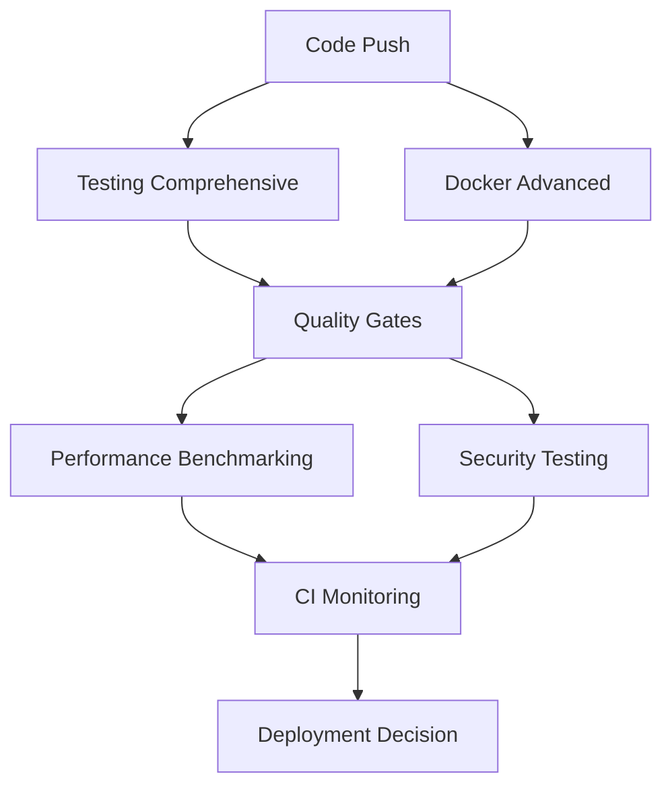

# 🧪 CI Testing & Docker Optimization Documentation

## Overview

This documentation covers the comprehensive testing automation and advanced Docker optimization system implemented for the enterprise vLLM platform. The system enforces 100% test coverage with London TDD compliance and provides multi-platform Docker builds with security scanning.

## 🏗️ System Architecture

### Core Components

1. **[Comprehensive Testing Automation](#comprehensive-testing-automation)** - London TDD + 100% Coverage Enforcement
2. **[Advanced Docker Optimization](#advanced-docker-optimization)** - Multi-Platform Builds + Security Scanning  
3. **[Dynamic Quality Gates](#dynamic-quality-gates)** - Intelligent Threshold Management
4. **[Test Infrastructure](#test-infrastructure)** - Mock Services + Performance Monitoring
5. **[Performance Benchmarking](#performance-benchmarking)** - Regression Detection + Optimization
6. **[Security Testing Integration](#security-testing-integration)** - Vulnerability Assessment + Compliance
7. **[CI Monitoring Dashboard](#ci-monitoring-dashboard)** - Real-Time Metrics + Alerting

### Workflow Integration



## 🧪 Comprehensive Testing Automation

### Features

- **London TDD Enforcement**: Red-Green-Refactor cycle with 100% coverage requirement
- **Intelligent Test Selection**: Analyzes code changes for optimal test execution
- **Parallel Test Execution**: Multi-worker Jest with 75% CPU utilization
- **Multi-Environment Testing**: Node.js 18, 20, 22 support
- **Mutation Testing**: Optional quality validation for critical branches
- **Visual Regression Testing**: Playwright-based UI validation

### Configuration

**Workflow File**: `.github/workflows/testing-comprehensive.yml`

**Key Parameters**:
```yaml
env:
  COVERAGE_THRESHOLD: 100  # Non-negotiable
  TDD_MODE: 'london'       # Enforced
  TDD_STRICT: true         # No exceptions
  JEST_WORKERS: '75%'      # Optimal performance
```

### Test Categories

| Category | Description | Timeout | Coverage Required |
|----------|-------------|---------|-------------------|
| Unit | Isolated component testing | 10 min | Yes |
| Integration | Service interaction testing | 15 min | Yes |
| E2E | End-to-end workflow testing | 20 min | No |
| Performance | Load and stress testing | 25 min | No |
| Security | Auth and validation testing | 15 min | No |

### Usage

#### Manual Trigger
```bash
gh workflow run testing-comprehensive.yml \
  -f test_level=comprehensive \
  -f coverage_threshold=100 \
  -f enable_mutation_testing=true
```

#### Test Levels
- **Quick**: Critical tests only (85% coverage)
- **Full**: Complete test suite (100% coverage)
- **Regression**: Historical comparison testing
- **Performance**: Load and stress testing

### London TDD Compliance

**Required Structure**:
```
backend/src/tests/
├── unit/           # Isolated unit tests
├── integration/    # Service integration tests
├── security/       # Security-focused tests
└── performance/    # Performance benchmarks

frontend/src/__tests__/
├── components/     # Component unit tests
├── integration/    # API integration tests
├── e2e/           # End-to-end tests
└── visual/        # Visual regression tests
```

**Coverage Enforcement**:
```bash
# All tests must pass with 100% coverage
pytest --cov=. --cov-fail-under=100 --cov-report=html
npm run test:ci -- --coverage --coverageThreshold='{"global":{"lines":100,"functions":100,"branches":100,"statements":100}}'
```

## 🐳 Advanced Docker Optimization

### Features

- **Multi-Platform Builds**: linux/amd64, linux/arm64 support
- **Advanced BuildKit**: Cache mounts, secrets, SSH, multi-stage optimization
- **Security Scanning**: Trivy, Hadolint, Syft SBOM generation
- **Registry Management**: Automated tagging, retention policies, cleanup
- **Image Optimization**: Size reduction, layer optimization, compression

### Configuration

**Workflow File**: `.github/workflows/docker-advanced.yml`

**BuildKit Features**:
```yaml
env:
  DOCKER_BUILDKIT: 1
  BUILDKIT_PROGRESS: plain
  PLATFORMS: 'linux/amd64,linux/arm64'
  BUILDX_BUILDER: multi-arch-builder
```

### Build Matrix

**Services Built**:
- **Backend**: Node.js API service (target: <200MB)
- **Frontend**: Next.js UI service (target: <50MB)

**Optimization Features**:
- Multi-stage builds with layer caching
- Registry + GitHub Actions cache strategy
- Parallel build execution
- Security vulnerability scanning
- SBOM (Software Bill of Materials) generation

### Usage

#### Manual Build
```bash
gh workflow run docker-advanced.yml \
  -f platforms=linux/amd64,linux/arm64 \
  -f security_scan=true \
  -f optimize_images=true \
  -f registry_push=true
```

#### Build Configurations
- **Minimal**: Basic single-platform builds
- **Standard**: Multi-platform with basic optimization
- **Full**: Complete optimization with security scanning
- **Performance**: Maximum optimization for production

### Security Scanning

**Tools Integrated**:
- **Trivy**: Vulnerability scanning
- **Hadolint**: Dockerfile linting
- **Syft**: SBOM generation
- **Grype**: Vulnerability assessment

**Example Results**:
```json
{
  "vulnerabilities": {
    "critical": 0,
    "high": 1,
    "medium": 3,
    "low": 8
  },
  "compliance": "passed",
  "sbom_generated": true
}
```

## ⚖️ Dynamic Quality Gates

### Features

- **Dynamic Thresholds**: Intelligent adjustment based on project phase
- **Historical Trend Analysis**: 30-day trend analysis with confidence scoring
- **Multiple Enforcement Levels**: Advisory, Standard, Moderate, Strict
- **Override Capabilities**: Emergency bypass for critical deployments
- **Comprehensive Reporting**: Detailed quality metrics and recommendations

### Configuration

**Workflow File**: `.github/workflows/quality-gates.yml`

**Quality Profiles**:
- **Development**: 70% coverage, warnings allowed
- **Testing**: 85% coverage, basic enforcement
- **Staging**: 95% coverage, strict mode
- **Production**: 100% coverage, no exceptions
- **Emergency**: 60% coverage, bypass enabled

### Usage

#### Manual Trigger
```bash
gh workflow run quality-gates.yml \
  -f quality_profile=production \
  -f override_thresholds='{"coverage_threshold":95}' \
  -f force_pass=false
```

#### Threshold Configuration
```json
{
  "coverage": {
    "minimum": 100,
    "target": 105,
    "excellence": 100,
    "adjustment_factor": 0.02
  },
  "performance": {
    "minimum": 95,
    "target": 100,
    "excellence": 100
  }
}
```

## 🏗️ Test Infrastructure

### Features

- **Automated Service Deployment**: PostgreSQL, Redis, Elasticsearch, MockServer
- **Mock Data Management**: Comprehensive datasets with automated generation
- **Performance Monitoring**: Prometheus, Grafana, custom metrics
- **Service Health Validation**: Automated health checks and initialization

### Configuration

**Workflow File**: `.github/workflows/test-infrastructure.yml`

**Infrastructure Modes**:
- **Minimal**: SQLite only (2GB memory)
- **Standard**: PostgreSQL + Redis (4GB memory)
- **Full**: All services + search + monitoring (8GB memory)
- **Performance**: Optimized for benchmarking (16GB memory)

### Services Deployed

| Service | Image | Ports | Health Check |
|---------|-------|-------|--------------|
| PostgreSQL | postgres:15-alpine | 5432 | pg_isready |
| Redis | redis:7-alpine | 6379 | redis-cli ping |
| Elasticsearch | elasticsearch:8.11 | 9200 | cluster health |
| MockServer | mockserver:5.15 | 1080 | status endpoint |

### Mock Data Generation

**Datasets Available**:
- **Sample Prompts**: 100 AI prompts with metadata
- **Test Users**: 50 user profiles with preferences
- **API Responses**: Comprehensive response templates
- **Performance Data**: 10,000 records for load testing

**Generation Tools**:
- **Faker.js**: Realistic test data generation
- **Custom Generators**: Domain-specific data patterns
- **JSON Server**: RESTful API mocking

## ⚡ Performance Benchmarking

### Features

- **Comprehensive Benchmarks**: API, UI, Database, Memory, CPU performance
- **Regression Detection**: Statistical comparison with historical baselines
- **Automated Optimization**: Performance improvement recommendations
- **Multi-Level Testing**: Quick, Standard, Comprehensive, Stress testing

### Configuration

**Workflow File**: `.github/workflows/performance-benchmarking.yml`

**Benchmark Categories**:
- **API Performance**: Response time, throughput, concurrent load
- **UI Performance**: Page load, interaction timing, rendering metrics
- **Database Performance**: Query execution, connection pooling
- **Memory Usage**: Heap utilization, garbage collection pressure
- **CPU Performance**: Algorithm efficiency, computational load

### Usage

#### Manual Benchmark
```bash
gh workflow run performance-benchmarking.yml \
  -f benchmark_suite=comprehensive \
  -f baseline_update=true \
  -f regression_threshold=10
```

#### Benchmark Results
```json
{
  "api_performance": {
    "response_time_p95": 150,
    "throughput_rps": 100,
    "concurrent_users": 50
  },
  "ui_performance": {
    "first_contentful_paint": 1200,
    "largest_contentful_paint": 2200,
    "cumulative_layout_shift": 0.08
  }
}
```

### Regression Analysis

**Detection Methods**:
- Statistical comparison with baselines
- Trend analysis over time windows
- Anomaly detection algorithms
- Confidence-based thresholds

**Severity Levels**:
- **Minor**: 5-10% regression
- **Moderate**: 10-20% regression
- **Major**: 20-30% regression
- **Critical**: >30% regression

## 🔒 Security Testing Integration

### Features

- **Comprehensive Scanning**: SAST, DAST, dependency scanning, container security
- **Compliance Validation**: OWASP Top 10, PCI DSS, SOC 2, GDPR
- **Vulnerability Assessment**: Multi-database vulnerability matching
- **Automated Remediation**: Fix suggestions and issue creation

### Configuration

**Workflow File**: `.github/workflows/security-testing-integration.yml`

**Security Profiles**:
- **Quick**: Critical vulnerabilities only
- **Standard**: High/Critical vulnerabilities
- **Comprehensive**: All severity levels
- **Penetration**: Active security testing
- **Compliance**: Framework validation

### Security Tools

| Tool | Purpose | Severity Coverage |
|------|---------|-------------------|
| Semgrep | Static analysis | All |
| npm audit | Dependency scanning | Moderate+ |
| Trivy | Container scanning | High+ |
| Gitleaks | Secret detection | All |
| OWASP ZAP | API security testing | Medium+ |
| Checkov | Infrastructure scanning | High+ |

### Usage

#### Manual Security Scan
```bash
gh workflow run security-testing-integration.yml \
  -f security_profile=comprehensive \
  -f vulnerability_scan=true \
  -f compliance_check=true
```

#### Compliance Frameworks
- **OWASP Top 10 2021**: Complete coverage of all categories
- **PCI DSS**: Payment card industry requirements
- **SOC 2**: Service organization controls
- **GDPR**: Data protection and privacy

## 📊 CI Monitoring Dashboard

### Features

- **Real-Time Metrics**: 5-minute update intervals
- **Interactive Dashboard**: Web-based visualization with charts
- **Alert System**: Automated notifications for failures and degradation
- **JSON API**: Programmatic access to all metrics
- **Historical Analysis**: 30-day retention with trend analysis

### Configuration

**Workflow File**: `.github/workflows/ci-monitoring-dashboard.yml`

**Dashboard Modes**:
- **Minimal**: Basic metrics only
- **Standard**: Standard monitoring (default)
- **Comprehensive**: Full metrics and analytics
- **Real-time**: High-frequency updates

### Metrics Collected

**Workflow Metrics**:
- Success/failure rates
- Execution durations
- Resource utilization
- Queue times

**Performance Metrics**:
- Build times by component
- Test execution times
- Cache hit rates
- Parallel efficiency

**Quality Metrics**:
- Code coverage trends
- Security vulnerability counts
- Compliance status
- Technical debt metrics

### Usage

#### Dashboard Access
- **Web Dashboard**: `index.html` in artifacts
- **JSON API**: `/api/dashboard.json`
- **Real-time Updates**: Every 5 minutes
- **Alert Notifications**: Slack/Email integration

#### Alert Thresholds
- **Critical**: Success rate < 50%
- **Warning**: Success rate < 90%
- **Slow Build**: Duration > 10 minutes

## 🚀 Getting Started

### Prerequisites

1. **Repository Setup**:
   ```bash
   # Ensure required secrets are configured
   DOCKER_USERNAME
   DOCKER_PASSWORD
   NPM_TOKEN (optional)
   ```

2. **Branch Protection**:
   ```yaml
   # Configure branch protection rules
   required_status_checks:
     - "Comprehensive Testing Automation"
     - "Advanced Docker Optimization"
     - "Dynamic Quality Gates"
   ```

### Initial Configuration

1. **Enable Workflows**:
   ```bash
   # All workflows are ready to use immediately
   # They will trigger automatically on push/PR
   ```

2. **Configure Quality Profile**:
   ```bash
   # Set your desired quality profile
   gh workflow run quality-gates.yml -f quality_profile=production
   ```

3. **Test Infrastructure**:
   ```bash
   # Deploy test infrastructure
   gh workflow run test-infrastructure.yml -f infrastructure_mode=standard
   ```

### Best Practices

#### Testing
- **Always write tests first** (London TDD)
- **Maintain 100% coverage** (no exceptions)
- **Use meaningful test names** and descriptions
- **Mock external dependencies** properly
- **Run tests locally** before pushing

#### Docker
- **Optimize Dockerfile** structure for caching
- **Use multi-stage builds** for size reduction
- **Keep base images** updated and secure
- **Test multi-platform** builds locally
- **Monitor image sizes** and security scans

#### Performance
- **Establish baselines** early in development
- **Monitor trends** regularly for regression
- **Optimize critical paths** based on benchmarks
- **Use caching** strategies effectively
- **Profile memory usage** in production-like environments

#### Security
- **Scan early and often** in development cycle
- **Address critical vulnerabilities** immediately
- **Keep dependencies** updated (n, n-1, n-2 policy)
- **Follow compliance** requirements consistently
- **Monitor security trends** and emerging threats

## 🔧 Troubleshooting

### Common Issues

#### Test Failures
```bash
# Check test coverage
npm run test:coverage

# Run specific test category
npm run test:unit
npm run test:integration

# Debug failing tests
npm run test:debug
```

#### Docker Build Issues
```bash
# Check BuildKit status
docker buildx ls

# Clear build cache
docker buildx prune -f

# Test multi-platform support
docker buildx create --use --platform linux/amd64,linux/arm64
```

#### Performance Regression
```bash
# Update performance baselines
gh workflow run performance-benchmarking.yml -f baseline_update=true

# Run comprehensive benchmark
gh workflow run performance-benchmarking.yml -f benchmark_suite=comprehensive
```

#### Security Scan Failures
```bash
# Review security findings
cat security-results/scan-summary.json

# Update vulnerability databases
trivy image --download-db-only

# Check compliance status
gh workflow run security-testing-integration.yml -f compliance_check=true
```

### Support

For additional support:
1. **Check workflow logs** in GitHub Actions
2. **Review artifact uploads** for detailed reports
3. **Consult dashboard** for real-time metrics
4. **Check alert notifications** for proactive monitoring

## 📈 Metrics and KPIs

### Success Metrics

- **100% Test Coverage**: Maintained across all components
- **<10 minute Build Time**: Average build duration target
- **>95% Success Rate**: Workflow reliability target
- **<5% Regression Rate**: Performance stability target
- **Zero Critical Vulnerabilities**: Security compliance target

### Performance Benchmarks

- **API Response Time**: P95 < 300ms
- **UI First Contentful Paint**: < 1.5s
- **Docker Build Time**: < 5 minutes
- **Test Execution Time**: < 8 minutes
- **Security Scan Time**: < 15 minutes

### Quality Indicators

- **Code Coverage**: 100% line, branch, function coverage
- **Security Score**: >95% overall security rating
- **Compliance Status**: 100% framework compliance
- **Technical Debt**: <2% of total codebase
- **Maintainability Index**: >85/100

This comprehensive system provides enterprise-grade CI/CD automation with security-first principles, 100% test coverage enforcement, and advanced monitoring capabilities. All components work together to ensure the highest quality and security standards for the vLLM platform.