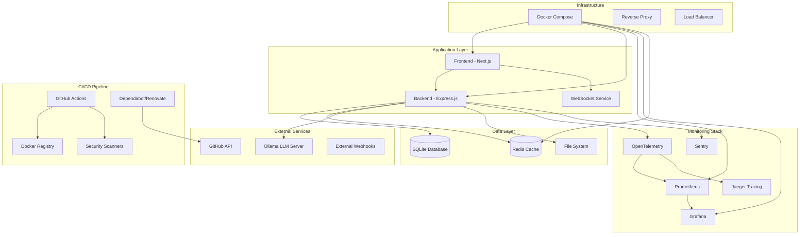

# System Integrations Documentation

This directory contains comprehensive documentation for all external integrations and third-party services used in the Prompt Card System.

## Available Integration Guides

### Monitoring & Observability
- [Prometheus & Grafana Setup](./monitoring/prometheus-grafana.md) - Metrics collection and visualization
- [OpenTelemetry Configuration](./monitoring/opentelemetry.md) - Distributed tracing and instrumentation
- [Error Monitoring with Sentry](./monitoring/sentry.md) - Error tracking and performance monitoring
- [Custom Metrics Dashboard](./monitoring/custom-metrics.md) - Application-specific metrics

### CI/CD & Automation
- [GitHub Actions Integration](./cicd/github-actions.md) - Continuous integration and deployment
- [Dependabot & Renovate Configuration](./cicd/dependency-management.md) - Automated dependency updates
- [Security Scanning Integration](./cicd/security-scanning.md) - Automated vulnerability detection
- [Docker Integration](./cicd/docker-integration.md) - Container orchestration and deployment

### Data Storage & Caching
- [SQLite Configuration](./database/sqlite.md) - Primary database setup
- [Redis Integration](./caching/redis.md) - Caching and session management
- [Data Migration Guides](./database/migrations.md) - Database schema management

### External APIs & Services
- [Ollama Integration](./external-apis/ollama.md) - Local LLM server integration
- [WebSocket Services](./external-apis/websockets.md) - Real-time communication
- [API Rate Limiting](./external-apis/rate-limiting.md) - Traffic management

### Development & Testing
- [Test Infrastructure](./development/testing.md) - Automated testing setup
- [Development Environment](./development/dev-environment.md) - Local development configuration
- [Performance Testing](./development/performance-testing.md) - Load testing and benchmarking

### Cloud & Infrastructure
- [Docker Compose Setup](./infrastructure/docker-compose.md) - Multi-service orchestration
- [Environment Configuration](./infrastructure/environment-config.md) - Environment variables and secrets
- [Health Monitoring](./infrastructure/health-monitoring.md) - Service health checks

### Notifications & Alerting
- [Webhook Configuration](./notifications/webhooks.md) - External notification systems
- [Alerting Rules](./notifications/alerting.md) - Monitoring alerts and notifications
- [Slack/Discord Integration](./notifications/chat-integrations.md) - Team communication

## Quick Start Guides

### For Developers
1. [Setting up the Development Environment](./quick-start/dev-setup.md)
2. [Running Services Locally](./quick-start/local-services.md)
3. [Integration Testing](./quick-start/integration-testing.md)

### For DevOps
1. [Production Deployment](./quick-start/production-deployment.md)
2. [Monitoring Setup](./quick-start/monitoring-setup.md)
3. [Backup and Recovery](./quick-start/backup-recovery.md)

## Integration Architecture

## Environment-Specific Configurations

### Development
- Local services with hot reloading
- In-memory caching
- Debug logging enabled
- Development OAuth apps

### Staging
- Production-like environment
- Shared databases
- Integration testing
- Performance monitoring

### Production
- High availability setup
- Distributed caching
- Comprehensive monitoring
- Security hardening

## Security Considerations

All integrations follow security best practices:

- **Authentication**: OAuth 2.0, JWT tokens, API keys
- **Authorization**: Role-based access control
- **Encryption**: TLS for all communications
- **Secrets Management**: Environment variables, secure vaults
- **Monitoring**: Security event logging and alerting
- **Compliance**: Data protection and privacy compliance

## Troubleshooting

Common integration issues and solutions:

1. **Service Discovery**: Check network connectivity and DNS resolution
2. **Authentication Failures**: Verify credentials and token expiration
3. **Rate Limiting**: Monitor API usage and implement backoff strategies
4. **Performance Issues**: Check monitoring dashboards and logs
5. **Data Consistency**: Verify database transactions and cache invalidation

## Contributing

When adding new integrations:

1. Create comprehensive documentation
2. Add monitoring and health checks
3. Include error handling and fallbacks
4. Update the integration tests
5. Document security implications

For questions or support, see our [Support Guide](../support/README.md).