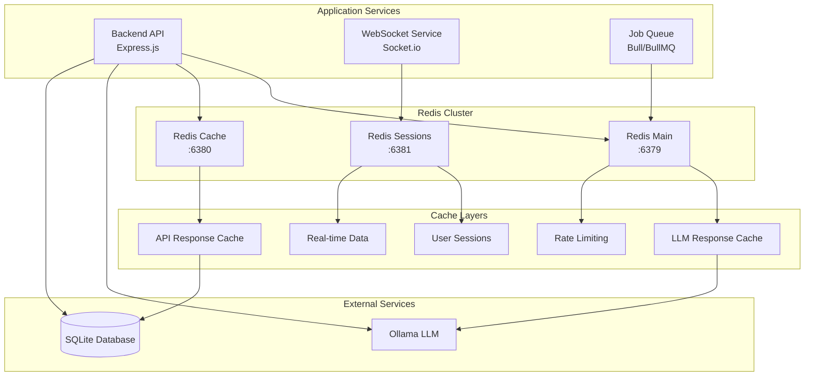

# Redis Integration Guide

Comprehensive guide for Redis integration in the Prompt Card System, covering caching, session management, real-time features, and performance optimization.

## Overview

Redis is used throughout the system for:
- **Response Caching**: LLM response and API result caching
- **Session Management**: User session storage
- **Real-time Features**: WebSocket session management
- **Rate Limiting**: API rate limit enforcement
- **Queue Management**: Background job processing
- **Performance Analytics**: Metrics and monitoring data

## Architecture



## Configuration

### Environment Variables

```bash
# Redis Connection
REDIS_HOST=localhost
REDIS_PORT=6379
REDIS_PASSWORD=your_redis_password
REDIS_DB=0

# Redis Cluster (if using multiple instances)
REDIS_CACHE_HOST=localhost
REDIS_CACHE_PORT=6380
REDIS_SESSIONS_HOST=localhost  
REDIS_SESSIONS_PORT=6381

# Connection Pool Settings
REDIS_MAX_RETRIES=3
REDIS_RETRY_DELAY=1000
REDIS_CONNECTION_TIMEOUT=5000
REDIS_COMMAND_TIMEOUT=3000
REDIS_MAX_REDIS_MEMORY_USAGE_MB=512

# Cache Settings
CACHE_TTL_SECONDS=3600
CACHE_LLM_RESPONSES=true
CACHE_API_RESPONSES=true
CACHE_MAX_MEMORY_POLICY=allkeys-lru

# Session Settings
SESSION_TTL_SECONDS=86400
SESSION_STORE_PREFIX=sess:

# Rate Limiting
RATE_LIMIT_WINDOW_MS=60000
RATE_LIMIT_MAX_REQUESTS=100
RATE_LIMIT_REDIS_PREFIX=rl:

# Development Settings
REDIS_LOG_LEVEL=info
REDIS_ENABLE_METRICS=true
```

### Redis Configuration File

```yaml
# docker-compose.yml - Redis service configuration
services:
  redis:
    image: redis:7-alpine
    container_name: prompt-redis
    ports:
      - "6379:6379"
    environment:
      - REDIS_PASSWORD=${REDIS_PASSWORD}
    command: >
      redis-server 
      --requirepass ${REDIS_PASSWORD}
      --maxmemory 512mb
      --maxmemory-policy allkeys-lru
      --save 900 1
      --save 300 10
      --save 60 10000
      --appendonly yes
      --appendfsync everysec
    volumes:
      - redis_data:/data
      - ./redis/redis.conf:/etc/redis/redis.conf
    networks:
      - app-network
    restart: unless-stopped
    healthcheck:
      test: ["CMD", "redis-cli", "--raw", "incr", "ping"]
      interval: 30s
      timeout: 10s
      retries: 3

  # Redis for caching (separate instance)
  redis-cache:
    image: redis:7-alpine
    container_name: prompt-redis-cache
    ports:
      - "6380:6379"
    command: >
      redis-server 
      --maxmemory 256mb
      --maxmemory-policy allkeys-lru
      --save ""
    volumes:
      - redis_cache_data:/data
    networks:
      - app-network
    restart: unless-stopped

  # Redis Sentinel for high availability (optional)
  redis-sentinel:
    image: redis:7-alpine
    container_name: prompt-redis-sentinel
    command: redis-sentinel /etc/redis/sentinel.conf
    volumes:
      - ./redis/sentinel.conf:/etc/redis/sentinel.conf
    networks:
      - app-network
    restart: unless-stopped
    depends_on:
      - redis

volumes:
  redis_data:
  redis_cache_data:
```

## Implementation

### Redis Client Setup

```typescript
// backend/src/config/redis.ts
import Redis from 'ioredis';
import { trace } from '@opentelemetry/api';

export interface RedisConfig {
  host: string;
  port: number;
  password?: string;
  db: number;
  maxRetriesPerRequest: number;
  retryDelayOnFailover: number;
  connectTimeout: number;
  commandTimeout: number;
  lazyConnect: boolean;
}

class RedisManager {
  private static instance: RedisManager;
  private mainClient: Redis;
  private cacheClient: Redis;
  private sessionClient: Redis;
  private tracer = trace.getTracer('redis-manager', '1.0.0');

  private constructor() {
    this.initializeClients();
  }

  public static getInstance(): RedisManager {
    if (!RedisManager.instance) {
      RedisManager.instance = new RedisManager();
    }
    return RedisManager.instance;
  }

  private initializeClients(): void {
    const baseConfig: Partial<RedisConfig> = {
      maxRetriesPerRequest: parseInt(process.env.REDIS_MAX_RETRIES || '3'),
      retryDelayOnFailover: parseInt(process.env.REDIS_RETRY_DELAY || '1000'),
      connectTimeout: parseInt(process.env.REDIS_CONNECTION_TIMEOUT || '5000'),
      commandTimeout: parseInt(process.env.REDIS_COMMAND_TIMEOUT || '3000'),
      lazyConnect: true,
    };

    // Main Redis client
    this.mainClient = new Redis({
      ...baseConfig,
      host: process.env.REDIS_HOST || 'localhost',
      port: parseInt(process.env.REDIS_PORT || '6379'),
      password: process.env.REDIS_PASSWORD,
      db: parseInt(process.env.REDIS_DB || '0'),
      keyPrefix: 'prompt-card:',
    });

    // Cache-specific client
    this.cacheClient = new Redis({
      ...baseConfig,
      host: process.env.REDIS_CACHE_HOST || process.env.REDIS_HOST || 'localhost',
      port: parseInt(process.env.REDIS_CACHE_PORT || process.env.REDIS_PORT || '6380'),
      password: process.env.REDIS_PASSWORD,
      db: 1,
      keyPrefix: 'cache:',
    });

    // Session-specific client
    this.sessionClient = new Redis({
      ...baseConfig,
      host: process.env.REDIS_SESSIONS_HOST || process.env.REDIS_HOST || 'localhost',
      port: parseInt(process.env.REDIS_SESSIONS_PORT || process.env.REDIS_PORT || '6381'),
      password: process.env.REDIS_PASSWORD,
      db: 2,
      keyPrefix: 'sess:',
    });

    this.setupEventListeners();
  }

  private setupEventListeners(): void {
    const clients = [
      { name: 'main', client: this.mainClient },
      { name: 'cache', client: this.cacheClient },
      { name: 'session', client: this.sessionClient },
    ];

    clients.forEach(({ name, client }) => {
      client.on('connect', () => {
        console.log(`✅ Redis ${name} client connected`);
      });

      client.on('error', (error) => {
        console.error(`❌ Redis ${name} client error:`, error);
        this.tracer.startSpan('redis.error').setAttributes({
          'redis.client': name,
          'error.message': error.message,
        }).end();
      });

      client.on('reconnecting', () => {
        console.log(`🔄 Redis ${name} client reconnecting...`);
      });

      client.on('close', () => {
        console.log(`❌ Redis ${name} client connection closed`);
      });
    });
  }

  public getMainClient(): Redis {
    return this.mainClient;
  }

  public getCacheClient(): Redis {
    return this.cacheClient;
  }

  public getSessionClient(): Redis {
    return this.sessionClient;
  }

  public async healthCheck(): Promise<{
    main: boolean;
    cache: boolean;
    sessions: boolean;
  }> {
    const span = this.tracer.startSpan('redis.health.check');
    
    try {
      const [mainHealth, cacheHealth, sessionHealth] = await Promise.all([
        this.checkClientHealth(this.mainClient),
        this.checkClientHealth(this.cacheClient),
        this.checkClientHealth(this.sessionClient),
      ]);

      const health = {
        main: mainHealth,
        cache: cacheHealth,
        sessions: sessionHealth,
      };

      span.setAttributes({
        'redis.health.main': mainHealth,
        'redis.health.cache': cacheHealth,
        'redis.health.sessions': sessionHealth,
      });

      return health;
    } finally {
      span.end();
    }
  }

  private async checkClientHealth(client: Redis): Promise<boolean> {
    try {
      const result = await client.ping();
      return result === 'PONG';
    } catch (error) {
      return false;
    }
  }

  public async disconnect(): Promise<void> {
    await Promise.all([
      this.mainClient.disconnect(),
      this.cacheClient.disconnect(),
      this.sessionClient.disconnect(),
    ]);
  }
}

export const redisManager = RedisManager.getInstance();
export default redisManager;
```

### LLM Response Caching

```typescript
// backend/src/services/cache/LLMCacheService.ts
import { Redis } from 'ioredis';
import { createHash } from 'crypto';
import { trace } from '@opentelemetry/api';
import { redisManager } from '../../config/redis';

export interface CacheEntry {
  response: string;
  metadata: {
    model: string;
    temperature: number;
    maxTokens: number;
    timestamp: number;
    responseTime: number;
  };
}

export class LLMCacheService {
  private redis: Redis;
  private tracer = trace.getTracer('llm-cache-service', '1.0.0');
  private defaultTTL = parseInt(process.env.CACHE_TTL_SECONDS || '3600');

  constructor() {
    this.redis = redisManager.getCacheClient();
  }

  /**
   * Generate cache key for LLM request
   */
  private generateCacheKey(prompt: string, model: string, temperature: number, maxTokens: number): string {
    const content = `${prompt}:${model}:${temperature}:${maxTokens}`;
    const hash = createHash('sha256').update(content).digest('hex');
    return `llm:response:${hash.substring(0, 16)}`;
  }

  /**
   * Get cached LLM response
   */
  async getCachedResponse(
    prompt: string,
    model: string,
    temperature: number = 0.7,
    maxTokens: number = 2048
  ): Promise<CacheEntry | null> {
    const span = this.tracer.startSpan('llm.cache.get');
    
    try {
      const cacheKey = this.generateCacheKey(prompt, model, temperature, maxTokens);
      const cached = await this.redis.get(cacheKey);

      if (!cached) {
        span.setAttributes({
          'cache.hit': false,
          'cache.key': cacheKey,
        });
        return null;
      }

      const entry: CacheEntry = JSON.parse(cached);
      
      span.setAttributes({
        'cache.hit': true,
        'cache.key': cacheKey,
        'cache.age': Date.now() - entry.metadata.timestamp,
      });

      return entry;
    } catch (error) {
      span.recordException(error as Error);
      console.error('Error getting cached LLM response:', error);
      return null;
    } finally {
      span.end();
    }
  }

  /**
   * Cache LLM response
   */
  async setCachedResponse(
    prompt: string,
    response: string,
    model: string,
    temperature: number = 0.7,
    maxTokens: number = 2048,
    responseTime: number,
    ttl: number = this.defaultTTL
  ): Promise<void> {
    const span = this.tracer.startSpan('llm.cache.set');
    
    try {
      const cacheKey = this.generateCacheKey(prompt, model, temperature, maxTokens);
      const entry: CacheEntry = {
        response,
        metadata: {
          model,
          temperature,
          maxTokens,
          timestamp: Date.now(),
          responseTime,
        },
      };

      await this.redis.setex(cacheKey, ttl, JSON.stringify(entry));

      span.setAttributes({
        'cache.key': cacheKey,
        'cache.ttl': ttl,
        'response.length': response.length,
        'metadata.model': model,
      });
    } catch (error) {
      span.recordException(error as Error);
      console.error('Error caching LLM response:', error);
    } finally {
      span.end();
    }
  }

  /**
   * Get cache statistics
   */
  async getCacheStats(): Promise<{
    totalKeys: number;
    hitRate: number;
    memoryUsage: string;
    averageResponseTime: number;
  }> {
    const span = this.tracer.startSpan('llm.cache.stats');
    
    try {
      const [keyCount, info] = await Promise.all([
        this.redis.eval(
          "return #redis.call('keys', ARGV[1])",
          0,
          'llm:response:*'
        ) as Promise<number>,
        this.redis.info('memory'),
      ]);

      // Parse memory info (simplified)
      const memoryMatch = info.match(/used_memory_human:(.+)/);
      const memoryUsage = memoryMatch ? memoryMatch[1].trim() : 'unknown';

      // In production, you'd track hit rates and response times
      const hitRate = 0.85; // Placeholder
      const averageResponseTime = 150; // Placeholder

      span.setAttributes({
        'cache.stats.total_keys': keyCount,
        'cache.stats.hit_rate': hitRate,
        'cache.stats.memory_usage': memoryUsage,
      });

      return {
        totalKeys: keyCount,
        hitRate,
        memoryUsage,
        averageResponseTime,
      };
    } finally {
      span.end();
    }
  }

  /**
   * Clear expired cache entries
   */
  async clearExpired(): Promise<number> {
    const span = this.tracer.startSpan('llm.cache.clear_expired');
    
    try {
      // This is handled automatically by Redis TTL, but we can track it
      const keys = await this.redis.keys('llm:response:*');
      let expiredCount = 0;

      for (const key of keys) {
        const ttl = await this.redis.ttl(key);
        if (ttl === -2) { // Key doesn't exist (expired)
          expiredCount++;
        }
      }

      span.setAttributes({
        'cache.expired.count': expiredCount,
        'cache.total.scanned': keys.length,
      });

      return expiredCount;
    } finally {
      span.end();
    }
  }
}

export default LLMCacheService;
```

### Session Management

```typescript
// backend/src/middleware/session.ts
import session from 'express-session';
import connectRedis from 'connect-redis';
import { redisManager } from '../config/redis';
import { trace } from '@opentelemetry/api';

const RedisStore = connectRedis(session);
const tracer = trace.getTracer('session-middleware', '1.0.0');

export const sessionMiddleware = session({
  store: new RedisStore({
    client: redisManager.getSessionClient(),
    prefix: process.env.SESSION_STORE_PREFIX || 'sess:',
    ttl: parseInt(process.env.SESSION_TTL_SECONDS || '86400'), // 24 hours
    disableTouch: false,
  }),
  secret: process.env.SESSION_SECRET || 'your-secret-key',
  resave: false,
  saveUninitialized: false,
  rolling: true, // Reset TTL on each request
  cookie: {
    secure: process.env.NODE_ENV === 'production',
    httpOnly: true,
    maxAge: parseInt(process.env.SESSION_TTL_SECONDS || '86400') * 1000,
    sameSite: 'strict',
  },
  name: 'prompt-card-session',
});

// Session analytics middleware
export const sessionAnalytics = (req: any, res: any, next: any) => {
  const span = tracer.startSpan('session.analytics');
  
  const originalSave = req.session.save;
  req.session.save = function(callback: Function) {
    span.setAttributes({
      'session.id': req.sessionID,
      'session.user_id': req.session.userId || 'anonymous',
      'session.new': req.session.isNew,
    });
    
    return originalSave.call(this, callback);
  };

  span.end();
  next();
};
```

### Rate Limiting

```typescript
// backend/src/middleware/rateLimiting.ts
import rateLimit from 'express-rate-limit';
import RedisStore from 'rate-limit-redis';
import { redisManager } from '../config/redis';
import { trace } from '@opentelemetry/api';

const tracer = trace.getTracer('rate-limiting', '1.0.0');

// General API rate limiting
export const generalRateLimit = rateLimit({
  store: new RedisStore({
    client: redisManager.getMainClient(),
    prefix: process.env.RATE_LIMIT_REDIS_PREFIX || 'rl:',
  }),
  windowMs: parseInt(process.env.RATE_LIMIT_WINDOW_MS || '60000'), // 1 minute
  max: parseInt(process.env.RATE_LIMIT_MAX_REQUESTS || '100'), // 100 requests per minute
  message: {
    error: 'Too many requests from this IP, please try again later.',
    retryAfter: Math.ceil(parseInt(process.env.RATE_LIMIT_WINDOW_MS || '60000') / 1000),
  },
  standardHeaders: true,
  legacyHeaders: false,
  handler: (req, res) => {
    const span = tracer.startSpan('rate_limit.exceeded');
    span.setAttributes({
      'rate_limit.ip': req.ip,
      'rate_limit.endpoint': req.originalUrl,
      'rate_limit.user_agent': req.get('User-Agent') || '',
    });
    span.end();

    res.status(429).json({
      error: 'Too many requests from this IP, please try again later.',
      retryAfter: Math.ceil(parseInt(process.env.RATE_LIMIT_WINDOW_MS || '60000') / 1000),
    });
  },
});

// LLM-specific rate limiting (more restrictive)
export const llmRateLimit = rateLimit({
  store: new RedisStore({
    client: redisManager.getMainClient(),
    prefix: 'rl:llm:',
  }),
  windowMs: 60000, // 1 minute
  max: 10, // 10 LLM requests per minute
  message: {
    error: 'Too many LLM requests, please try again later.',
    retryAfter: 60,
  },
  keyGenerator: (req) => {
    // Rate limit per user if authenticated, otherwise per IP
    return req.session?.userId || req.ip;
  },
});

// Burst rate limiting for expensive operations
export const burstRateLimit = rateLimit({
  store: new RedisStore({
    client: redisManager.getMainClient(),
    prefix: 'rl:burst:',
  }),
  windowMs: 1000, // 1 second
  max: 5, // 5 requests per second
  message: {
    error: 'Request rate too high, please slow down.',
    retryAfter: 1,
  },
});
```

### Real-time Features with WebSocket

```typescript
// backend/src/services/websocket/RedisAdapter.ts
import { Server as SocketIOServer } from 'socket.io';
import { createAdapter } from '@socket.io/redis-adapter';
import { redisManager } from '../../config/redis';
import { trace } from '@opentelemetry/api';

export class RedisWebSocketAdapter {
  private io: SocketIOServer;
  private redis = redisManager.getSessionClient();
  private tracer = trace.getTracer('websocket-redis-adapter', '1.0.0');

  constructor(io: SocketIOServer) {
    this.io = io;
    this.setupRedisAdapter();
    this.setupPresenceTracking();
  }

  private setupRedisAdapter(): void {
    // Create Redis adapter for Socket.IO clustering
    const pubClient = redisManager.getMainClient();
    const subClient = pubClient.duplicate();

    this.io.adapter(createAdapter(pubClient, subClient));
    console.log('✅ Redis adapter configured for Socket.IO');
  }

  private setupPresenceTracking(): void {
    this.io.on('connection', (socket) => {
      const span = this.tracer.startSpan('websocket.connection');
      
      // Track user presence
      socket.on('user:online', async (userId: string) => {
        await this.setUserOnline(userId, socket.id);
        socket.broadcast.emit('user:status', { userId, status: 'online' });
        
        span.setAttributes({
          'websocket.event': 'user:online',
          'user.id': userId,
          'socket.id': socket.id,
        });
      });

      socket.on('disconnect', async () => {
        const userId = await this.getUserBySocketId(socket.id);
        if (userId) {
          await this.setUserOffline(userId, socket.id);
          socket.broadcast.emit('user:status', { userId, status: 'offline' });
        }
        
        span.setAttributes({
          'websocket.event': 'disconnect',
          'socket.id': socket.id,
        });
      });

      span.end();
    });
  }

  async setUserOnline(userId: string, socketId: string): Promise<void> {
    const span = this.tracer.startSpan('websocket.user.set_online');
    
    try {
      const multi = this.redis.multi();
      
      // Store user's socket ID with TTL
      multi.setex(`presence:user:${userId}`, 300, socketId); // 5 minutes TTL
      
      // Add to online users set
      multi.sadd('presence:online_users', userId);
      
      // Track socket to user mapping
      multi.setex(`presence:socket:${socketId}`, 300, userId);
      
      await multi.exec();
      
      span.setAttributes({
        'user.id': userId,
        'socket.id': socketId,
        'operation': 'set_online',
      });
    } finally {
      span.end();
    }
  }

  async setUserOffline(userId: string, socketId: string): Promise<void> {
    const span = this.tracer.startSpan('websocket.user.set_offline');
    
    try {
      const multi = this.redis.multi();
      
      // Remove user presence
      multi.del(`presence:user:${userId}`);
      
      // Remove from online users set
      multi.srem('presence:online_users', userId);
      
      // Remove socket mapping
      multi.del(`presence:socket:${socketId}`);
      
      await multi.exec();
      
      span.setAttributes({
        'user.id': userId,
        'socket.id': socketId,
        'operation': 'set_offline',
      });
    } finally {
      span.end();
    }
  }

  async getUserBySocketId(socketId: string): Promise<string | null> {
    return await this.redis.get(`presence:socket:${socketId}`);
  }

  async getOnlineUsers(): Promise<string[]> {
    return await this.redis.smembers('presence:online_users');
  }

  async isUserOnline(userId: string): Promise<boolean> {
    const exists = await this.redis.exists(`presence:user:${userId}`);
    return exists === 1;
  }
}
```

### Queue Management

```typescript
// backend/src/services/queue/JobQueue.ts
import Bull, { Queue, Job } from 'bull';
import { redisManager } from '../../config/redis';
import { trace } from '@opentelemetry/api';

export interface JobData {
  type: string;
  payload: any;
  userId?: string;
  priority?: number;
  delay?: number;
  attempts?: number;
}

export class JobQueueManager {
  private queues: Map<string, Queue> = new Map();
  private redis = redisManager.getMainClient();
  private tracer = trace.getTracer('job-queue-manager', '1.0.0');

  constructor() {
    this.setupQueues();
  }

  private setupQueues(): void {
    // LLM processing queue
    const llmQueue = new Bull('llm-processing', {
      redis: {
        host: process.env.REDIS_HOST || 'localhost',
        port: parseInt(process.env.REDIS_PORT || '6379'),
        password: process.env.REDIS_PASSWORD,
      },
      defaultJobOptions: {
        removeOnComplete: 10,
        removeOnFail: 5,
        attempts: 3,
        backoff: 'exponential',
      },
    });

    llmQueue.process('generate-response', 5, this.processLLMJob.bind(this));
    this.queues.set('llm-processing', llmQueue);

    // Email notification queue
    const emailQueue = new Bull('email-notifications', {
      redis: {
        host: process.env.REDIS_HOST || 'localhost',
        port: parseInt(process.env.REDIS_PORT || '6379'),
        password: process.env.REDIS_PASSWORD,
      },
      defaultJobOptions: {
        removeOnComplete: 20,
        removeOnFail: 10,
        attempts: 5,
      },
    });

    emailQueue.process('send-email', 3, this.processEmailJob.bind(this));
    this.queues.set('email-notifications', emailQueue);

    console.log('✅ Job queues initialized');
  }

  async addJob(
    queueName: string,
    jobType: string,
    data: any,
    options: {
      priority?: number;
      delay?: number;
      attempts?: number;
    } = {}
  ): Promise<Job> {
    const span = this.tracer.startSpan('job.queue.add');
    
    try {
      const queue = this.queues.get(queueName);
      if (!queue) {
        throw new Error(`Queue ${queueName} not found`);
      }

      const job = await queue.add(jobType, data, {
        priority: options.priority || 0,
        delay: options.delay || 0,
        attempts: options.attempts || 3,
      });

      span.setAttributes({
        'job.queue': queueName,
        'job.type': jobType,
        'job.id': job.id?.toString() || 'unknown',
        'job.priority': options.priority || 0,
      });

      return job;
    } finally {
      span.end();
    }
  }

  private async processLLMJob(job: Job): Promise<any> {
    const span = this.tracer.startSpan('job.process.llm');
    
    try {
      const { prompt, model, userId } = job.data;
      
      span.setAttributes({
        'job.id': job.id?.toString() || 'unknown',
        'job.type': 'llm-processing',
        'llm.model': model,
        'user.id': userId || 'anonymous',
      });

      // Process LLM request (implementation would go here)
      const response = await this.callLLMService(prompt, model);
      
      span.setAttributes({
        'job.success': true,
        'response.length': response.length,
      });

      return response;
    } catch (error) {
      span.recordException(error as Error);
      throw error;
    } finally {
      span.end();
    }
  }

  private async processEmailJob(job: Job): Promise<void> {
    const span = this.tracer.startSpan('job.process.email');
    
    try {
      const { to, subject, body, userId } = job.data;
      
      span.setAttributes({
        'job.id': job.id?.toString() || 'unknown',
        'job.type': 'email-notification',
        'email.to': to,
        'user.id': userId || 'system',
      });

      // Send email (implementation would go here)
      await this.sendEmailService(to, subject, body);
      
      span.setAttributes({
        'job.success': true,
      });
    } catch (error) {
      span.recordException(error as Error);
      throw error;
    } finally {
      span.end();
    }
  }

  private async callLLMService(prompt: string, model: string): Promise<string> {
    // Placeholder - implement actual LLM service call
    await new Promise(resolve => setTimeout(resolve, 1000));
    return `Response to: ${prompt}`;
  }

  private async sendEmailService(to: string, subject: string, body: string): Promise<void> {
    // Placeholder - implement actual email service
    console.log(`Sending email to ${to}: ${subject}`);
  }

  async getQueueStats(queueName: string): Promise<{
    waiting: number;
    active: number;
    completed: number;
    failed: number;
    delayed: number;
  }> {
    const queue = this.queues.get(queueName);
    if (!queue) {
      throw new Error(`Queue ${queueName} not found`);
    }

    const [waiting, active, completed, failed, delayed] = await Promise.all([
      queue.getWaiting(),
      queue.getActive(),
      queue.getCompleted(),
      queue.getFailed(),
      queue.getDelayed(),
    ]);

    return {
      waiting: waiting.length,
      active: active.length,
      completed: completed.length,
      failed: failed.length,
      delayed: delayed.length,
    };
  }
}

export const jobQueueManager = new JobQueueManager();
```

## Monitoring and Metrics

### Redis Monitoring

```typescript
// backend/src/services/monitoring/RedisMonitor.ts
import { redisManager } from '../../config/redis';
import { trace, metrics } from '@opentelemetry/api';

export class RedisMonitor {
  private tracer = trace.getTracer('redis-monitor', '1.0.0');
  private meter = metrics.getMeter('redis-monitor', '1.0.0');
  
  // Metrics
  private connectionGauge = this.meter.createUpDownCounter('redis_connections', {
    description: 'Number of Redis connections',
  });
  
  private commandCounter = this.meter.createCounter('redis_commands_total', {
    description: 'Total Redis commands executed',
  });
  
  private commandDurationHistogram = this.meter.createHistogram('redis_command_duration', {
    description: 'Redis command execution duration',
    unit: 'ms',
  });

  async collectMetrics(): Promise<{
    info: any;
    stats: any;
    health: any;
  }> {
    const span = this.tracer.startSpan('redis.monitor.collect_metrics');
    
    try {
      const redis = redisManager.getMainClient();
      
      const [info, stats, health] = await Promise.all([
        redis.info(),
        this.getRedisStats(),
        redisManager.healthCheck(),
      ]);

      // Parse info string into object
      const infoObj = this.parseRedisInfo(info);
      
      // Update metrics
      this.connectionGauge.add(1, {
        client: 'main',
        status: 'connected',
      });

      span.setAttributes({
        'redis.connected_clients': infoObj.connected_clients || 0,
        'redis.used_memory': infoObj.used_memory || 0,
        'redis.commands_processed': infoObj.total_commands_processed || 0,
      });

      return { info: infoObj, stats, health };
    } finally {
      span.end();
    }
  }

  private parseRedisInfo(info: string): any {
    const result: any = {};
    const lines = info.split('\r\n');
    
    for (const line of lines) {
      if (line.includes(':')) {
        const [key, value] = line.split(':');
        result[key] = isNaN(Number(value)) ? value : Number(value);
      }
    }
    
    return result;
  }

  private async getRedisStats(): Promise<{
    keyCount: number;
    memoryUsage: string;
    hitRate: number;
    avgTTL: number;
  }> {
    const redis = redisManager.getCacheClient();
    
    const [keyCount, memoryInfo] = await Promise.all([
      redis.dbsize(),
      redis.info('memory'),
    ]);

    // Parse memory usage
    const memoryMatch = memoryInfo.match(/used_memory_human:(.+)/);
    const memoryUsage = memoryMatch ? memoryMatch[1].trim() : 'unknown';

    // Calculate hit rate (simplified)
    const hitRate = 0.85; // Placeholder - implement actual hit rate calculation
    const avgTTL = 3600; // Placeholder - implement actual average TTL

    return {
      keyCount,
      memoryUsage,
      hitRate,
      avgTTL,
    };
  }

  startPeriodicCollection(intervalMs: number = 60000): void {
    setInterval(async () => {
      try {
        await this.collectMetrics();
      } catch (error) {
        console.error('Error collecting Redis metrics:', error);
      }
    }, intervalMs);
    
    console.log(`✅ Redis metrics collection started (interval: ${intervalMs}ms)`);
  }
}

export const redisMonitor = new RedisMonitor();
```

## Performance Optimization

### Connection Pooling

```typescript
// backend/src/config/redis-cluster.ts
import Redis from 'ioredis';

export class RedisCluster {
  private cluster: Redis.Cluster;

  constructor() {
    this.cluster = new Redis.Cluster([
      { host: 'redis-node-1', port: 6379 },
      { host: 'redis-node-2', port: 6379 },
      { host: 'redis-node-3', port: 6379 },
    ], {
      redisOptions: {
        password: process.env.REDIS_PASSWORD,
      },
      enableOfflineQueue: false,
      maxRetriesPerRequest: 3,
      retryDelayOnFailover: 100,
    });
  }

  getClient(): Redis.Cluster {
    return this.cluster;
  }
}
```

### Cache Warming

```typescript
// backend/src/services/cache/CacheWarmer.ts
import { LLMCacheService } from './LLMCacheService';
import { trace } from '@opentelemetry/api';

export class CacheWarmer {
  private llmCache = new LLMCacheService();
  private tracer = trace.getTracer('cache-warmer', '1.0.0');

  async warmupCache(): Promise<void> {
    const span = this.tracer.startSpan('cache.warmup');
    
    try {
      const commonPrompts = [
        'Explain machine learning basics',
        'Write a simple REST API',
        'Create a React component',
        'SQL query optimization tips',
      ];

      const models = ['llama2:7b', 'llama2:13b'];
      
      for (const prompt of commonPrompts) {
        for (const model of models) {
          // Pre-populate cache with common requests
          await this.preloadResponse(prompt, model);
        }
      }

      span.setAttributes({
        'cache.warmup.prompts': commonPrompts.length,
        'cache.warmup.models': models.length,
      });
    } finally {
      span.end();
    }
  }

  private async preloadResponse(prompt: string, model: string): Promise<void> {
    // Check if already cached
    const cached = await this.llmCache.getCachedResponse(prompt, model);
    
    if (!cached) {
      // Generate and cache response
      const response = await this.generateResponse(prompt, model);
      await this.llmCache.setCachedResponse(
        prompt,
        response,
        model,
        0.7,
        2048,
        150 // responseTime
      );
    }
  }

  private async generateResponse(prompt: string, model: string): Promise<string> {
    // Placeholder for actual LLM call
    return `Cached response for "${prompt}" using ${model}`;
  }
}
```

## Troubleshooting

### Common Issues

#### 1. Connection Issues
```bash
# Check Redis connectivity
redis-cli -h localhost -p 6379 ping

# Monitor Redis logs
docker logs prompt-redis -f

# Check memory usage
redis-cli info memory
```

#### 2. Performance Issues
```bash
# Monitor slow queries
redis-cli config set slowlog-log-slower-than 1000
redis-cli slowlog get 10

# Check key distribution
redis-cli --bigkeys

# Monitor real-time commands
redis-cli monitor
```

#### 3. Memory Issues
```bash
# Check memory usage
redis-cli info memory

# Check key expiration
redis-cli --scan | xargs -I {} sh -c 'echo "Key: {}, TTL: $(redis-cli ttl {})"'

# Force expire keys
redis-cli eval "return redis.call('del', unpack(redis.call('keys', ARGV[1])))" 0 'pattern:*'
```

### Debugging Commands

```bash
# Redis health check
redis-cli ping

# Get Redis info
redis-cli info all

# Check specific database
redis-cli -n 0 keys "*"

# Monitor memory usage
redis-cli --latency-history -i 1

# Check replication status
redis-cli info replication
```

## Best Practices

### 1. Key Design
- Use consistent naming conventions
- Include TTL in key design
- Avoid long key names
- Use appropriate data structures

### 2. Memory Management
- Set appropriate TTL values
- Use memory-efficient data structures
- Monitor memory usage regularly
- Implement cache eviction policies

### 3. Performance Optimization
- Use connection pooling
- Implement circuit breakers
- Monitor slow queries
- Use pipelining for bulk operations

### 4. Security
- Use authentication
- Implement network security
- Regular security audits
- Encrypt sensitive data

For advanced Redis clustering and high availability setup, see our [Infrastructure Guide](../infrastructure/redis-cluster.md).