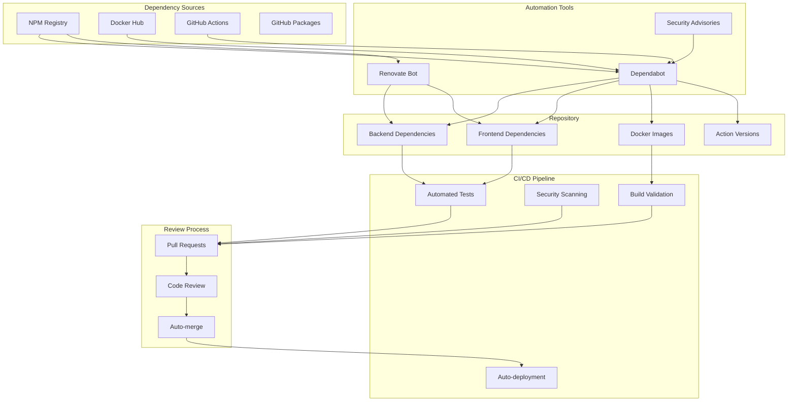

# Dependency Management Integration

Comprehensive guide for automated dependency management using Dependabot and Renovate in the Prompt Card System. This setup provides security-focused dependency updates with intelligent automation.

## Overview

The dependency management system includes:
- **Dependabot**: GitHub-native dependency updates and security alerts
- **Renovate**: Advanced dependency management with custom rules
- **Security Scanning**: Automated vulnerability detection
- **Smart Merging**: Automated merging for safe updates
- **Dashboard Integration**: Visual dependency tracking

## Architecture



## Dependabot Configuration

Location: `.github/dependabot.yml`

### Key Features

- **Multi-ecosystem Support**: NPM, Docker, GitHub Actions
- **Security-first Approach**: Immediate updates for vulnerabilities
- **Smart Scheduling**: Coordinated update timing
- **Auto-assignment**: Automatic reviewers and assignees
- **Custom Labels**: Organized categorization

### Configuration Details

```yaml
version: 2
updates:
  # Backend NPM dependencies
  - package-ecosystem: "npm"
    directory: "/backend"
    schedule:
      interval: "weekly"
      day: "monday"
      time: "09:00"
    reviewers:
      - "prompt-card-system-maintainers"
    assignees:
      - "prompt-card-system-maintainers"
    open-pull-requests-limit: 5
    commit-message:
      prefix: "chore(deps)"
      include: "scope"
    labels:
      - "dependencies"
      - "backend"
      - "security"
    # Automatic security updates
    allow:
      - dependency-type: "direct"
        update-type: "security"
      - dependency-type: "indirect"
        update-type: "security"

  # Frontend NPM dependencies
  - package-ecosystem: "npm"
    directory: "/frontend"
    schedule:
      interval: "weekly"
      day: "monday"
      time: "09:00"
    reviewers:
      - "prompt-card-system-maintainers"
    assignees:
      - "prompt-card-system-maintainers"
    open-pull-requests-limit: 5
    commit-message:
      prefix: "chore(deps)"
      include: "scope"
    labels:
      - "dependencies"
      - "frontend"
      - "security"

  # GitHub Actions dependencies
  - package-ecosystem: "github-actions"
    directory: "/.github/workflows"
    schedule:
      interval: "weekly"
      day: "monday"
      time: "09:00"
    reviewers:
      - "prompt-card-system-maintainers"
    assignees:
      - "prompt-card-system-maintainers"
    open-pull-requests-limit: 3
    commit-message:
      prefix: "chore(ci)"
      include: "scope"
    labels:
      - "dependencies"
      - "github-actions"
      - "security"

  # Docker dependencies
  - package-ecosystem: "docker"
    directory: "/"
    schedule:
      interval: "weekly"
      day: "monday"
      time: "09:00"
    reviewers:
      - "prompt-card-system-maintainers"
    assignees:
      - "prompt-card-system-maintainers"
    open-pull-requests-limit: 2
    commit-message:
      prefix: "chore(docker)"
      include: "scope"
    labels:
      - "dependencies"
      - "docker"
      - "security"
```

## Renovate Configuration

Location: `renovate.json`

### Advanced Features

- **Intelligent Scheduling**: Different schedules for different dependency types
- **Security-first Updates**: Immediate security patches
- **Grouped Updates**: Related dependencies updated together
- **Smart Auto-merging**: Safe automatic merging for patches and minors
- **Custom Package Rules**: Specialized handling for different ecosystems

### Comprehensive Configuration

```json
{
  "$schema": "https://docs.renovatebot.com/renovate-schema.json",
  "extends": [
    "config:recommended",
    ":dependencyDashboard",
    ":semanticPrefixFixDepsChoreOthers"
  ],
  "schedule": ["before 9am on monday and thursday"],
  "timezone": "America/New_York",
  "dependencyDashboard": true,
  "dependencyDashboardTitle": "🔧 Dependency Dashboard",
  "prConcurrentLimit": 10,
  "prHourlyLimit": 2,
  "automerge": true,
  "platformAutomerge": true,
  "labels": ["dependencies", "automated"],
  "assignees": ["@tbowman01"],
  "reviewers": ["@tbowman01"],
  
  "packageRules": [
    {
      "description": "Security updates - highest priority, auto-merge patches and minors",
      "matchDatasources": ["npm"],
      "matchUpdateTypes": ["patch", "minor"],
      "matchCategories": ["security"],
      "labels": ["security", "high-priority"],
      "automerge": true,
      "schedule": ["at any time"],
      "prPriority": 10
    },
    {
      "description": "Critical security updates - immediate merge",
      "matchDatasources": ["npm"],
      "matchCategories": ["security"],
      "matchCurrentVersion": "!/^0\\./",
      "labels": ["security", "critical"],
      "automerge": true,
      "schedule": ["at any time"],
      "prPriority": 20
    },
    {
      "description": "React ecosystem updates",
      "matchPackagePatterns": ["^react", "^@types/react"],
      "groupName": "React ecosystem",
      "automerge": false,
      "labels": ["react", "frontend"],
      "reviewers": ["@tbowman01"]
    },
    {
      "description": "Node.js and Express ecosystem",
      "matchPackagePatterns": ["^express", "^@types/express", "^node"],
      "groupName": "Node.js ecosystem",
      "labels": ["nodejs", "backend"],
      "automerge": false,
      "reviewers": ["@tbowman01"]
    },
    {
      "description": "OpenTelemetry monitoring stack",
      "matchPackagePatterns": ["^@opentelemetry"],
      "groupName": "OpenTelemetry",
      "labels": ["monitoring", "telemetry"],
      "automerge": false,
      "reviewers": ["@tbowman01"]
    },
    {
      "description": "Testing framework updates",
      "matchPackagePatterns": ["jest", "playwright", "@testing-library"],
      "groupName": "Testing frameworks",
      "labels": ["testing"],
      "automerge": true,
      "matchUpdateTypes": ["patch", "minor"]
    },
    {
      "description": "Docker base images",
      "matchDatasources": ["docker"],
      "matchUpdateTypes": ["major"],
      "automerge": false,
      "labels": ["docker", "infrastructure"],
      "reviewers": ["@tbowman01"]
    }
  ],
  
  "vulnerabilityAlerts": {
    "labels": ["security", "vulnerability"],
    "assignees": ["@tbowman01"],
    "schedule": ["at any time"],
    "prPriority": 20
  },
  
  "lockFileMaintenance": {
    "enabled": true,
    "schedule": ["before 6am on monday"],
    "automerge": true,
    "labels": ["lockfile-maintenance"]
  },
  
  "osvVulnerabilityAlerts": true,
  "transitiveRemediation": true,
  "rangeStrategy": "bump",
  "semanticCommits": "enabled",
  "separateMajorMinor": true,
  "separateMultipleMajor": true,
  "postUpdateOptions": ["npmDedupe"],
  "npm": {
    "minimumReleaseAge": "3 days"
  }
}
```

## Security Integration

### Vulnerability Scanning

```yaml
# .github/workflows/dependency-security.yml
name: Dependency Security Scan

on:
  push:
    branches: [ main, develop ]
  pull_request:
    branches: [ main, develop ]
  schedule:
    - cron: '0 6 * * 1' # Weekly Monday 6 AM

jobs:
  security-audit:
    name: Security Audit
    runs-on: ubuntu-latest
    steps:
      - name: Checkout code
        uses: actions/checkout@v4

      - name: Setup Node.js
        uses: actions/setup-node@v4
        with:
          node-version: '20'
          cache: 'npm'

      # Backend security audit
      - name: Audit backend dependencies
        run: |
          cd backend
          npm audit --audit-level high
          npm audit --audit-level critical --production

      # Frontend security audit
      - name: Audit frontend dependencies
        run: |
          cd frontend
          npm audit --audit-level high
          npm audit --audit-level critical --production

      # Advanced vulnerability scanning with Snyk
      - name: Run Snyk to check for vulnerabilities
        uses: snyk/actions/node@master
        env:
          SNYK_TOKEN: ${{ secrets.SNYK_TOKEN }}
        with:
          args: --severity-threshold=high

      # License compliance check
      - name: License compliance check
        run: |
          npx license-checker --production --onlyAllow 'MIT;ISC;Apache-2.0;BSD-2-Clause;BSD-3-Clause'
```

### Automated Security Updates

```yaml
# .github/workflows/auto-security-update.yml
name: Auto Security Update

on:
  schedule:
    - cron: '0 */6 * * *' # Every 6 hours
  repository_dispatch:
    types: [security-advisory]

jobs:
  security-update:
    name: Automated Security Update
    runs-on: ubuntu-latest
    permissions:
      contents: write
      pull-requests: write
    steps:
      - name: Checkout code
        uses: actions/checkout@v4
        with:
          token: ${{ secrets.GITHUB_TOKEN }}

      - name: Setup Node.js
        uses: actions/setup-node@v4
        with:
          node-version: '20'

      - name: Check for security updates
        run: |
          cd backend
          npm audit --audit-level high --json > audit-backend.json
          cd ../frontend  
          npm audit --audit-level high --json > audit-frontend.json

      - name: Apply security fixes
        run: |
          cd backend
          if [ -s audit-backend.json ]; then
            npm audit fix --force
          fi
          
          cd ../frontend
          if [ -s audit-frontend.json ]; then
            npm audit fix --force
          fi

      - name: Create pull request
        uses: peter-evans/create-pull-request@v5
        with:
          token: ${{ secrets.GITHUB_TOKEN }}
          commit-message: 'fix(security): automated security dependency updates'
          title: '🔒 Automated Security Updates'
          body: |
            Automated security updates applied to resolve vulnerabilities.
            
            **Backend Changes:**
            - Security fixes applied to backend dependencies
            
            **Frontend Changes:**
            - Security fixes applied to frontend dependencies
            
            This PR was automatically generated by the security update workflow.
          branch: security/automated-updates
          labels: |
            security
            dependencies
            automated
```

## Dependency Dashboard

### Custom Dashboard Integration

```yaml
# .github/workflows/dependency-dashboard.yml
name: Dependency Dashboard Update

on:
  schedule:
    - cron: '0 8 * * 1' # Monday 8 AM
  workflow_dispatch:

jobs:
  update-dashboard:
    name: Update Dependency Dashboard
    runs-on: ubuntu-latest
    steps:
      - name: Checkout code
        uses: actions/checkout@v4

      - name: Generate dependency report
        run: |
          echo "# Dependency Status Report" > dependency-report.md
          echo "Generated: $(date)" >> dependency-report.md
          echo "" >> dependency-report.md
          
          # Backend dependencies analysis
          echo "## Backend Dependencies" >> dependency-report.md
          cd backend
          outdated_backend=$(npm outdated --json 2>/dev/null || echo '{}')
          echo "### Outdated Dependencies" >> dependency-report.md
          echo '```json' >> ../dependency-report.md
          echo "$outdated_backend" | jq '.' >> ../dependency-report.md
          echo '```' >> ../dependency-report.md
          
          # Frontend dependencies analysis  
          cd ../frontend
          echo "" >> ../dependency-report.md
          echo "## Frontend Dependencies" >> ../dependency-report.md
          outdated_frontend=$(npm outdated --json 2>/dev/null || echo '{}')
          echo "### Outdated Dependencies" >> ../dependency-report.md
          echo '```json' >> ../dependency-report.md
          echo "$outdated_frontend" | jq '.' >> ../dependency-report.md
          echo '```' >> ../dependency-report.md

      - name: Update dashboard issue
        uses: actions/github-script@v7
        with:
          script: |
            const fs = require('fs');
            const content = fs.readFileSync('dependency-report.md', 'utf8');
            
            const issues = await github.rest.issues.listForRepo({
              owner: context.repo.owner,
              repo: context.repo.repo,
              state: 'open',
              labels: 'dependency-dashboard'
            });
            
            const dashboardIssue = issues.data.find(issue => 
              issue.title.includes('Dependency Dashboard')
            );
            
            if (dashboardIssue) {
              await github.rest.issues.update({
                owner: context.repo.owner,
                repo: context.repo.repo,
                issue_number: dashboardIssue.number,
                body: content
              });
            } else {
              await github.rest.issues.create({
                owner: context.repo.owner,
                repo: context.repo.repo,
                title: '📋 Dependency Dashboard',
                body: content,
                labels: ['dependency-dashboard', 'maintenance']
              });
            }
```

## Monitoring and Alerting

### Dependency Health Monitoring

```typescript
// backend/src/services/monitoring/DependencyMonitor.ts
import { readFileSync } from 'fs';
import { join } from 'path';
import { trace } from '@opentelemetry/api';

export class DependencyHealthMonitor {
  private tracer = trace.getTracer('dependency-monitor', '1.0.0');

  async checkDependencyHealth(): Promise<{
    outdated: number;
    vulnerable: number;
    total: number;
    healthScore: number;
  }> {
    const span = this.tracer.startSpan('dependency.health.check');

    try {
      const [backendHealth, frontendHealth] = await Promise.all([
        this.checkPackageHealth('./backend/package.json'),
        this.checkPackageHealth('./frontend/package.json'),
      ]);

      const totalOutdated = backendHealth.outdated + frontendHealth.outdated;
      const totalVulnerable = backendHealth.vulnerable + frontendHealth.vulnerable;
      const totalDependencies = backendHealth.total + frontendHealth.total;
      
      const healthScore = Math.max(0, 
        100 - (totalOutdated * 2) - (totalVulnerable * 10)
      );

      span.setAttributes({
        'dependency.outdated.count': totalOutdated,
        'dependency.vulnerable.count': totalVulnerable,
        'dependency.total.count': totalDependencies,
        'dependency.health.score': healthScore,
      });

      return {
        outdated: totalOutdated,
        vulnerable: totalVulnerable,
        total: totalDependencies,
        healthScore,
      };
    } finally {
      span.end();
    }
  }

  private async checkPackageHealth(packagePath: string): Promise<{
    outdated: number;
    vulnerable: number;
    total: number;
  }> {
    try {
      const packageJson = JSON.parse(readFileSync(packagePath, 'utf8'));
      const dependencies = {
        ...packageJson.dependencies,
        ...packageJson.devDependencies,
      };
      
      const total = Object.keys(dependencies).length;
      
      // In a real implementation, you'd check against npm registry
      // and security advisories
      const outdated = 0; // Placeholder
      const vulnerable = 0; // Placeholder
      
      return { outdated, vulnerable, total };
    } catch (error) {
      console.error('Error checking package health:', error);
      return { outdated: 0, vulnerable: 0, total: 0 };
    }
  }
}
```

### Slack Notifications

```yaml
# .github/workflows/dependency-notifications.yml
name: Dependency Notifications

on:
  pull_request:
    types: [opened, synchronize]
    paths:
      - '**/package.json'
      - '**/package-lock.json'
  issues:
    types: [opened]
  schedule:
    - cron: '0 9 * * 1' # Weekly summary

jobs:
  notify-dependency-changes:
    name: Notify Dependency Changes
    runs-on: ubuntu-latest
    if: github.event_name == 'pull_request'
    steps:
      - name: Checkout code
        uses: actions/checkout@v4
        with:
          fetch-depth: 0

      - name: Analyze dependency changes
        run: |
          # Get changed package files
          changed_files=$(git diff --name-only HEAD^ HEAD | grep -E "package(-lock)?.json$" || true)
          
          if [ -n "$changed_files" ]; then
            echo "dependency_changes=true" >> $GITHUB_OUTPUT
            echo "changed_files=$changed_files" >> $GITHUB_OUTPUT
          else
            echo "dependency_changes=false" >> $GITHUB_OUTPUT
          fi

      - name: Send Slack notification
        if: steps.analyze.outputs.dependency_changes == 'true'
        uses: ./.github/actions/action-slack-v3
        with:
          webhook-url: ${{ secrets.SLACK_WEBHOOK_URL }}
          channel: '#dependency-updates'
          status: 'info'
          message: |
            🔄 Dependency changes detected in PR #${{ github.event.pull_request.number }}
            
            **Changed files:**
            ${{ steps.analyze.outputs.changed_files }}
            
            **PR:** ${{ github.event.pull_request.html_url }}
            **Author:** ${{ github.event.pull_request.user.login }}

  weekly-dependency-summary:
    name: Weekly Dependency Summary
    runs-on: ubuntu-latest
    if: github.event_name == 'schedule'
    steps:
      - name: Generate weekly summary
        run: |
          # Collect dependency metrics for the week
          echo "Generating weekly dependency summary..."
          
          # Get PRs from last week
          week_ago=$(date -d '7 days ago' --iso-8601)
          dependency_prs=$(gh pr list --repo ${{ github.repository }} \
            --state merged \
            --search "created:>$week_ago label:dependencies" \
            --json number,title,mergedAt \
            --jq '.[] | "- PR #\(.number): \(.title) (merged \(.mergedAt | split("T")[0]))"')
          
          echo "dependency_prs<<EOF" >> $GITHUB_OUTPUT
          echo "$dependency_prs" >> $GITHUB_OUTPUT
          echo "EOF" >> $GITHUB_OUTPUT
        env:
          GITHUB_TOKEN: ${{ secrets.GITHUB_TOKEN }}

      - name: Send weekly summary
        uses: ./.github/actions/action-slack-v3
        with:
          webhook-url: ${{ secrets.SLACK_WEBHOOK_URL }}
          channel: '#dependency-updates'
          status: 'info'
          message: |
            📊 Weekly Dependency Summary
            
            **Dependency PRs merged this week:**
            ${{ steps.summary.outputs.dependency_prs }}
            
            View full dashboard: [Dependency Dashboard](${{ github.server_url }}/${{ github.repository }}/issues?q=is%3Aissue+is%3Aopen+label%3Adependency-dashboard)
```

## Testing Integration

### Dependency Update Testing

```yaml
# .github/workflows/dependency-testing.yml
name: Dependency Update Testing

on:
  pull_request:
    paths:
      - '**/package.json'
      - '**/package-lock.json'

jobs:
  dependency-impact-test:
    name: Test Dependency Impact
    runs-on: ubuntu-latest
    steps:
      - name: Checkout code
        uses: actions/checkout@v4

      - name: Setup Node.js
        uses: actions/setup-node@v4
        with:
          node-version: '20'
          cache: 'npm'

      - name: Install dependencies
        run: |
          cd backend && npm ci
          cd ../frontend && npm ci

      # Run comprehensive tests after dependency updates
      - name: Run full test suite
        run: |
          # Backend tests with coverage
          cd backend
          npm run test:coverage
          
          # Frontend tests with coverage
          cd ../frontend
          npm run test:coverage
          
          # Integration tests
          cd ../
          npm run test:integration

      - name: Performance regression test
        run: |
          # Run performance tests to ensure no regressions
          cd backend
          npm run test:performance

      - name: Bundle size analysis
        if: contains(github.head_ref, 'frontend')
        run: |
          cd frontend
          npm run build
          
          # Analyze bundle size impact
          if [ -f ".next/analyze/bundle.json" ]; then
            echo "Bundle analysis available"
            # Compare with baseline (implementation depends on your setup)
          fi

      - name: Security validation
        run: |
          # Ensure no new vulnerabilities introduced
          cd backend && npm audit --audit-level high
          cd ../frontend && npm audit --audit-level high
```

## Custom Scripts and Automation

### Dependency Cleanup Script

```bash
#!/bin/bash
# scripts/cleanup-dependencies.sh

set -e

echo "🧹 Cleaning up dependencies..."

# Remove unused dependencies
echo "Checking for unused dependencies..."
npx depcheck --ignore-bin-package --ignore-path .next

# Update package-lock files
echo "Updating lock files..."
cd backend && npm update && cd ..
cd frontend && npm update && cd ..

# Dedupe dependencies
echo "Deduplicating dependencies..."
cd backend && npm dedupe && cd ..
cd frontend && npm dedupe && cd ..

# Audit and fix
echo "Running security audit..."
cd backend && npm audit fix --force && cd ..
cd frontend && npm audit fix --force && cd ..

echo "✅ Dependency cleanup complete!"
```

### Dependency Report Generator

```typescript
// scripts/generate-dependency-report.ts
import { exec } from 'child_process';
import { writeFileSync } from 'fs';
import { promisify } from 'util';

const execAsync = promisify(exec);

interface DependencyInfo {
  name: string;
  current: string;
  wanted: string;
  latest: string;
  location: string;
  dependent: string;
}

class DependencyReportGenerator {
  async generateReport(): Promise<void> {
    console.log('📊 Generating dependency report...');

    const [backendOutdated, frontendOutdated] = await Promise.all([
      this.getOutdatedDependencies('backend'),
      this.getOutdatedDependencies('frontend'),
    ]);

    const report = this.buildReport(backendOutdated, frontendOutdated);
    writeFileSync('dependency-report.md', report);

    console.log('✅ Dependency report generated: dependency-report.md');
  }

  private async getOutdatedDependencies(directory: string): Promise<DependencyInfo[]> {
    try {
      const { stdout } = await execAsync(`cd ${directory} && npm outdated --json`);
      const outdated = JSON.parse(stdout);
      
      return Object.entries(outdated).map(([name, info]: [string, any]) => ({
        name,
        current: info.current,
        wanted: info.wanted,
        latest: info.latest,
        location: info.location,
        dependent: info.dependent,
      }));
    } catch (error) {
      // npm outdated exits with code 1 when outdated packages exist
      if (error.stdout) {
        try {
          const outdated = JSON.parse(error.stdout);
          return Object.entries(outdated).map(([name, info]: [string, any]) => ({
            name,
            current: info.current,
            wanted: info.wanted,
            latest: info.latest,
            location: info.location,
            dependent: info.dependent,
          }));
        } catch (parseError) {
          console.error('Error parsing outdated dependencies:', parseError);
        }
      }
      return [];
    }
  }

  private buildReport(backend: DependencyInfo[], frontend: DependencyInfo[]): string {
    const now = new Date().toISOString().split('T')[0];
    
    let report = `# Dependency Report\n\n`;
    report += `**Generated:** ${now}\n\n`;
    
    report += `## Summary\n\n`;
    report += `- Backend outdated dependencies: ${backend.length}\n`;
    report += `- Frontend outdated dependencies: ${frontend.length}\n`;
    report += `- Total outdated dependencies: ${backend.length + frontend.length}\n\n`;

    if (backend.length > 0) {
      report += `## Backend Dependencies\n\n`;
      report += `| Package | Current | Wanted | Latest |\n`;
      report += `|---------|---------|--------|---------|\n`;
      
      backend.forEach(dep => {
        report += `| ${dep.name} | ${dep.current} | ${dep.wanted} | ${dep.latest} |\n`;
      });
      report += `\n`;
    }

    if (frontend.length > 0) {
      report += `## Frontend Dependencies\n\n`;
      report += `| Package | Current | Wanted | Latest |\n`;
      report += `|---------|---------|--------|---------|\n`;
      
      frontend.forEach(dep => {
        report += `| ${dep.name} | ${dep.current} | ${dep.wanted} | ${dep.latest} |\n`;
      });
      report += `\n`;
    }

    report += `## Recommendations\n\n`;
    report += `1. Review major version updates carefully\n`;
    report += `2. Test thoroughly before merging dependency updates\n`;
    report += `3. Monitor for breaking changes in changelog\n`;
    report += `4. Consider security implications of updates\n\n`;

    return report;
  }
}

// Run the report generator
new DependencyReportGenerator().generateReport().catch(console.error);
```

## Best Practices

### 1. Security-First Approach
- Prioritize security updates over feature updates
- Implement automated security scanning
- Use trusted sources for dependencies
- Regular security audits

### 2. Testing Strategy
- Comprehensive test suite for dependency updates
- Performance regression testing
- Security validation after updates
- Bundle size monitoring

### 3. Update Strategy
- Staged rollout for major updates
- Group related dependencies together
- Test in staging before production
- Monitor application health after updates

### 4. Monitoring and Alerting
- Track dependency health metrics
- Set up alerts for vulnerabilities
- Monitor update success rates
- Regular dependency audits

For more information on security scanning integration, see our [Security Integration Guide](./security-scanning.md).