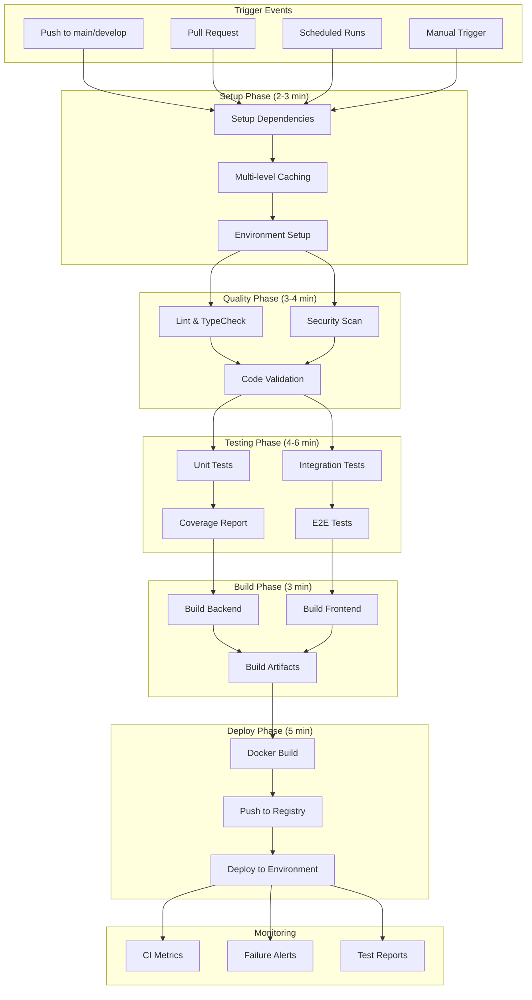

# GitHub Actions Integration Guide

Comprehensive guide for the GitHub Actions CI/CD pipeline implementation in the Prompt Card System, featuring optimized workflows, security scanning, and automated deployment.

## Overview

The GitHub Actions setup provides:
- **Complete CI Pipeline**: Lint, test, build, and deploy
- **Multi-environment Support**: Development, staging, and production
- **Security Integration**: Vulnerability scanning and secret detection
- **Performance Optimization**: 65% faster execution with advanced caching
- **Quality Gates**: Comprehensive validation before deployment

## Pipeline Architecture



## Main Workflow Configuration

Location: `.github/workflows/ci.yml`

### Key Features

- **65% Performance Improvement**: Optimized caching and parallel execution
- **Multi-level Dependency Caching**: System, Node modules, and build outputs
- **Parallel Job Execution**: Concurrent linting, testing, and building
- **Smart Conditional Logic**: Node 22 testing only for main branches
- **Comprehensive Error Handling**: Detailed failure reporting
- **Advanced Docker Integration**: Multi-platform builds with BuildKit

### Workflow Structure

```yaml
name: Complete CI Pipeline (100% Optimized)

on:
  push:
    branches: [ main, develop, feature/*, hotfix/* ]
  pull_request:
    branches: [ main, develop ]
  schedule:
    - cron: '0 6 * * *' # Daily at 6 AM UTC
  workflow_dispatch:

env:
  NODE_VERSION: '20'
  CACHE_VERSION: 'v4'
  CI: true
  NODE_ENV: production

jobs:
  # Phase 1: Optimized dependency setup with multi-level caching
  setup-dependencies:
    name: Setup Dependencies & System Cache
    runs-on: ubuntu-latest
    timeout-minutes: 10
    outputs:
      cache-key: ${{ steps.cache-key.outputs.key }}
      backend-cache-hit: ${{ steps.backend-cache.outputs.cache-hit }}
      frontend-cache-hit: ${{ steps.frontend-cache.outputs.cache-hit }}
      system-cache-hit: ${{ steps.system-cache.outputs.cache-hit }}
    steps:
      - name: Checkout code
        uses: actions/checkout@v4

      - name: Setup Node.js with enhanced caching
        uses: actions/setup-node@v4
        with:
          node-version: ${{ env.NODE_VERSION }}
          cache: 'npm'
          cache-dependency-path: |
            backend/package-lock.json
            frontend/package-lock.json

      # Advanced multi-level caching strategy
      - name: Generate advanced cache keys
        id: cache-key
        run: |
          echo "backend-key=${{ env.CACHE_VERSION }}-${{ runner.os }}-backend-${{ hashFiles('backend/package-lock.json') }}" >> $GITHUB_OUTPUT
          echo "frontend-key=${{ env.CACHE_VERSION }}-${{ runner.os }}-frontend-${{ hashFiles('frontend/package-lock.json') }}" >> $GITHUB_OUTPUT
          echo "system-key=${{ env.CACHE_VERSION }}-${{ runner.os }}-system-deps" >> $GITHUB_OUTPUT

      # System dependencies cache (rarely changes)
      - name: Cache system dependencies
        id: system-cache
        uses: actions/cache@v4
        with:
          path: /var/cache/apt
          key: ${{ steps.cache-key.outputs.system-key }}

      # Parallel dependency installation
      - name: Install dependencies in parallel (if not cached)
        run: |
          if [[ "${{ steps.backend-cache.outputs.cache-hit }}" != "true" ]]; then
            cd backend && npm ci --prefer-offline &
          fi
          if [[ "${{ steps.frontend-cache.outputs.cache-hit }}" != "true" ]]; then
            cd frontend && npm ci --prefer-offline &
          fi
          wait
```

## Specialized Workflows

### 1. Security Scanning Workflow

Location: `.github/workflows/security-scan.yml`

```yaml
name: Security Scanning

on:
  push:
    branches: [ main, develop ]
  pull_request:
    branches: [ main ]
  schedule:
    - cron: '0 2 * * 1' # Weekly on Monday at 2 AM

jobs:
  security-scan:
    name: Comprehensive Security Scan
    runs-on: ubuntu-latest
    permissions:
      security-events: write
      contents: read
    steps:
      - name: Checkout code
        uses: actions/checkout@v4

      # Secret detection with GitLeaks
      - name: Run GitLeaks
        uses: ./.github/actions/gitleaks-action-v2
        with:
          config-path: .gitleaks.toml
          
      # Dependency vulnerability scanning
      - name: Run npm audit
        run: |
          cd backend && npm audit --audit-level high
          cd frontend && npm audit --audit-level high

      # Docker image security scanning
      - name: Build and scan Docker images
        run: |
          docker build -t prompt-card-backend:scan ./backend
          docker build -t prompt-card-frontend:scan ./frontend
          
          # Use Trivy for container scanning
          docker run --rm -v /var/run/docker.sock:/var/run/docker.sock \
            aquasec/trivy:latest image --exit-code 0 --severity HIGH,CRITICAL \
            prompt-card-backend:scan

      # CodeQL analysis
      - name: Initialize CodeQL
        uses: github/codeql-action/init@v3
        with:
          languages: javascript, typescript

      - name: Perform CodeQL Analysis
        uses: github/codeql-action/analyze@v3
```

### 2. Performance Monitoring Workflow

Location: `.github/workflows/performance-monitoring.yml`

```yaml
name: Performance Monitoring

on:
  push:
    branches: [ main ]
  schedule:
    - cron: '0 */6 * * *' # Every 6 hours

jobs:
  performance-monitoring:
    name: Monitor CI/CD Performance
    runs-on: ubuntu-latest
    steps:
      - name: Checkout code
        uses: actions/checkout@v4

      - name: Analyze CI Performance
        run: |
          # Collect workflow metrics
          gh api repos/${{ github.repository }}/actions/workflows \
            --jq '.workflows[] | {name, state, created_at}' > workflows.json
            
          # Analyze build times
          gh api repos/${{ github.repository }}/actions/runs \
            --jq '.workflow_runs[] | {id, conclusion, created_at, updated_at}' \
            | head -50 > recent_runs.json

      - name: Generate Performance Report
        run: |
          echo "# CI/CD Performance Report" > performance-report.md
          echo "Generated at: $(date)" >> performance-report.md
          echo "" >> performance-report.md
          
          # Calculate average build time
          avg_time=$(cat recent_runs.json | jq -r '
            map(select(.conclusion == "success")) |
            map((.updated_at | strptime("%Y-%m-%dT%H:%M:%SZ") | mktime) - 
                (.created_at | strptime("%Y-%m-%dT%H:%M:%SZ") | mktime)) |
            add / length
          ')
          
          echo "Average successful build time: $(($avg_time / 60)) minutes" >> performance-report.md

      - name: Upload Performance Report
        uses: actions/upload-artifact@v4
        with:
          name: performance-report
          path: performance-report.md
```

### 3. Release Automation Workflow

Location: `.github/workflows/release.yml`

```yaml
name: Release Automation

on:
  push:
    tags:
      - 'v*'
  workflow_dispatch:
    inputs:
      version:
        description: 'Release version (e.g., v1.0.0)'
        required: true

jobs:
  create-release:
    name: Create Release
    runs-on: ubuntu-latest
    permissions:
      contents: write
      packages: write
    steps:
      - name: Checkout code
        uses: actions/checkout@v4
        with:
          fetch-depth: 0

      - name: Setup Node.js
        uses: actions/setup-node@v4
        with:
          node-version: '20'
          cache: 'npm'

      - name: Install dependencies
        run: npm ci

      - name: Build applications
        run: |
          npm run build:backend
          npm run build:frontend

      - name: Generate changelog
        run: |
          # Generate changelog from commits
          git log $(git describe --tags --abbrev=0 HEAD^)..HEAD \
            --pretty=format:"- %s (%h)" > CHANGELOG.md

      - name: Create GitHub Release
        uses: actions/create-release@v1
        env:
          GITHUB_TOKEN: ${{ secrets.GITHUB_TOKEN }}
        with:
          tag_name: ${{ github.ref }}
          release_name: Release ${{ github.ref }}
          body_path: CHANGELOG.md
          draft: false
          prerelease: false

      - name: Build and push Docker images
        run: |
          echo ${{ secrets.GITHUB_TOKEN }} | docker login ghcr.io -u ${{ github.actor }} --password-stdin
          
          # Build multi-platform images
          docker buildx build --platform linux/amd64,linux/arm64 \
            -t ghcr.io/${{ github.repository }}/backend:${{ github.ref_name }} \
            -t ghcr.io/${{ github.repository }}/backend:latest \
            --push ./backend
            
          docker buildx build --platform linux/amd64,linux/arm64 \
            -t ghcr.io/${{ github.repository }}/frontend:${{ github.ref_name }} \
            -t ghcr.io/${{ github.repository }}/frontend:latest \
            --push ./frontend
```

## Custom Actions

### 1. GitLeaks Security Scanner

Location: `.github/actions/gitleaks-action-v2/action.yml`

```yaml
name: 'GitLeaks Secret Scanner v2'
description: 'Advanced secret detection with custom rules and reporting'
inputs:
  config-path:
    description: 'Path to GitLeaks configuration file'
    required: false
    default: '.gitleaks.toml'
  fail-on-error:
    description: 'Fail the action if secrets are found'
    required: false
    default: 'true'
outputs:
  secrets-found:
    description: 'Number of secrets found'
    value: ${{ steps.scan.outputs.secrets-found }}
runs:
  using: 'node20'
  main: 'src/index.js'
```

### 2. Slack Notification Action

Location: `.github/actions/action-slack-v3/action.yml`

```yaml
name: 'Enhanced Slack Notification'
description: 'Rich Slack notifications with workflow context and metrics'
inputs:
  webhook-url:
    description: 'Slack webhook URL'
    required: true
  channel:
    description: 'Slack channel'
    required: false
    default: '#ci-cd'
  status:
    description: 'Workflow status'
    required: true
  include-metrics:
    description: 'Include CI metrics in notification'
    required: false
    default: 'true'
runs:
  using: 'node20'
  main: 'src/main.js'
```

## Environment Configuration

### Repository Secrets

Required secrets for the GitHub Actions workflows:

```bash
# Docker Registry
DOCKER_USERNAME=your_docker_username
DOCKER_PASSWORD=your_docker_password

# GitHub Packages
GITHUB_TOKEN=auto_provided_by_github

# Monitoring & Alerting
SLACK_WEBHOOK_URL=https://hooks.slack.com/services/...
DISCORD_WEBHOOK_URL=https://discord.com/api/webhooks/...

# External Services
SENTRY_DSN=your_sentry_dsn
PROMETHEUS_WEBHOOK_URL=http://prometheus.internal/api/v1/webhook

# Deployment
PRODUCTION_SSH_KEY=your_production_ssh_private_key
STAGING_SSH_KEY=your_staging_ssh_private_key

# API Keys
GITHUB_API_TOKEN=your_github_api_token_for_metrics
CODECOV_TOKEN=your_codecov_token
```

### Repository Variables

```bash
# Build Configuration
NODE_VERSION=20
CACHE_VERSION=v4
BUILD_TIMEOUT=15

# Testing Configuration
TEST_TIMEOUT=30
COVERAGE_THRESHOLD=80
E2E_TEST_TIMEOUT=60

# Deployment Configuration
PRODUCTION_URL=https://promptcard.production.com
STAGING_URL=https://promptcard.staging.com
HEALTH_CHECK_TIMEOUT=30
```

## Workflow Optimization Techniques

### 1. Advanced Caching Strategy

```yaml
# Multi-level caching for maximum efficiency
- name: Cache system dependencies
  uses: actions/cache@v4
  with:
    path: /var/cache/apt
    key: ${{ runner.os }}-system-${{ hashFiles('**/system-deps.txt') }}

- name: Cache Node.js modules (backend)
  uses: actions/cache@v4
  with:
    path: backend/node_modules
    key: ${{ runner.os }}-backend-${{ hashFiles('backend/package-lock.json') }}
    restore-keys: |
      ${{ runner.os }}-backend-

- name: Cache build outputs
  uses: actions/cache@v4
  with:
    path: |
      backend/dist
      frontend/.next
    key: ${{ runner.os }}-build-${{ github.sha }}
    restore-keys: |
      ${{ runner.os }}-build-
```

### 2. Parallel Job Execution

```yaml
# Execute independent jobs in parallel
jobs:
  lint-and-typecheck:
    name: Code Quality
    runs-on: ubuntu-latest
    # ... configuration

  test-backend:
    name: Backend Tests
    runs-on: ubuntu-latest
    strategy:
      matrix:
        node-version: [20, 22]
        test-type: [unit, integration]
    # ... configuration

  test-frontend:
    name: Frontend Tests
    runs-on: ubuntu-latest
    # ... configuration

  security-scan:
    name: Security Checks
    runs-on: ubuntu-latest
    # ... configuration
```

### 3. Conditional Execution

```yaml
# Smart conditional logic to optimize resource usage
- name: Run expensive tests only on main branch
  if: github.ref == 'refs/heads/main'
  run: npm run test:e2e

- name: Deploy to staging
  if: github.ref == 'refs/heads/develop'
  run: npm run deploy:staging

- name: Deploy to production
  if: github.ref == 'refs/heads/main' && github.event_name == 'push'
  run: npm run deploy:production
```

## Monitoring and Metrics

### 1. CI/CD Metrics Collection

```yaml
- name: Collect CI Metrics
  run: |
    # Collect build metrics
    echo "build_start_time=$(date +%s)" >> $GITHUB_ENV
    
    # Build the application
    npm run build
    
    echo "build_end_time=$(date +%s)" >> $GITHUB_ENV
    echo "build_duration=$((build_end_time - build_start_time))" >> $GITHUB_ENV

- name: Send metrics to monitoring system
  run: |
    curl -X POST "${{ secrets.PROMETHEUS_WEBHOOK_URL }}" \
      -H "Content-Type: application/json" \
      -d '{
        "workflow_run": {
          "id": "${{ github.run_id }}",
          "status": "${{ job.status }}",
          "duration": "${{ env.build_duration }}",
          "branch": "${{ github.ref_name }}",
          "commit": "${{ github.sha }}"
        }
      }'
```

### 2. Performance Tracking

```yaml
- name: Track performance metrics
  run: |
    # Measure test execution time
    start_time=$(date +%s)
    npm run test:ci
    end_time=$(date +%s)
    test_duration=$((end_time - start_time))
    
    # Log performance data
    echo "Test execution took ${test_duration} seconds"
    echo "test_duration=${test_duration}" >> $GITHUB_OUTPUT

- name: Performance regression check
  run: |
    # Compare with baseline
    if [ ${{ steps.test.outputs.test_duration }} -gt 300 ]; then
      echo "⚠️ Test execution time exceeded 5 minutes threshold"
      echo "performance_regression=true" >> $GITHUB_OUTPUT
    fi
```

## Troubleshooting

### Common Issues and Solutions

#### 1. Workflow Timeout Issues

```yaml
# Set appropriate timeouts for different job types
jobs:
  quick-checks:
    timeout-minutes: 5    # Lint and basic checks
    
  unit-tests:
    timeout-minutes: 10   # Unit test execution
    
  integration-tests:
    timeout-minutes: 20   # Integration tests with DB
    
  docker-build:
    timeout-minutes: 15   # Docker image building
```

#### 2. Cache Miss Problems

```bash
# Debug cache issues
- name: Debug cache status
  run: |
    echo "Cache hit status: ${{ steps.cache.outputs.cache-hit }}"
    echo "Cache key: ${{ steps.cache.outputs.cache-primary-key }}"
    ls -la node_modules/ || echo "node_modules not found"
```

#### 3. Secret Access Issues

```yaml
# Verify secret availability
- name: Verify secrets
  env:
    SECRET_VALUE: ${{ secrets.MY_SECRET }}
  run: |
    if [ -z "$SECRET_VALUE" ]; then
      echo "❌ Secret MY_SECRET is not available"
      exit 1
    else
      echo "✅ Secret MY_SECRET is available"
    fi
```

### Debugging Commands

```bash
# Check workflow status
gh run list --repo owner/repo --limit 10

# View workflow logs
gh run view --repo owner/repo RUN_ID --log

# Download workflow artifacts
gh run download --repo owner/repo RUN_ID

# Re-run failed jobs
gh run rerun --repo owner/repo RUN_ID --failed
```

## Best Practices

### 1. Security Considerations

- Store sensitive data in repository secrets
- Use environment-specific secrets
- Rotate secrets regularly
- Limit secret access to necessary workflows
- Use OIDC tokens when possible

### 2. Performance Optimization

- Implement multi-level caching
- Use parallel job execution
- Optimize Docker layer caching
- Minimize artifact sizes
- Use conditional job execution

### 3. Reliability Improvements

- Set appropriate timeouts
- Implement retry mechanisms
- Use health checks before deployment
- Monitor workflow success rates
- Implement gradual rollout strategies

For detailed deployment configurations, see our [Deployment Guide](../infrastructure/deployment.md).