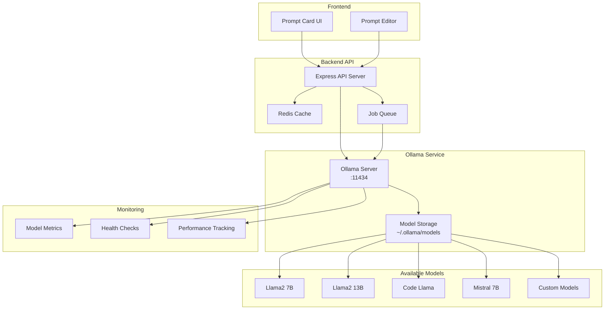

# Ollama Integration Guide

Comprehensive guide for integrating Ollama (local LLM server) with the Prompt Card System, covering setup, configuration, performance optimization, and monitoring.

## Overview

Ollama provides local LLM inference capabilities for:
- **Prompt Processing**: Generate responses to user prompts
- **Content Analysis**: Analyze and categorize prompt cards
- **Text Generation**: Create sample content and variations
- **Model Management**: Handle multiple LLM models locally
- **Performance Testing**: Benchmark different models and configurations

## Architecture



## Setup and Configuration

### Docker Compose Configuration

```yaml
# docker-compose.yml
services:
  ollama:
    image: ollama/ollama:latest
    container_name: prompt-ollama
    ports:
      - "11434:11434"
    volumes:
      - ollama-data:/root/.ollama
    environment:
      - OLLAMA_KEEP_ALIVE=24h
      - OLLAMA_HOST=0.0.0.0
      - OLLAMA_ORIGINS=*
      - OLLAMA_MAX_CONCURRENT_REQUESTS=4
      - OLLAMA_DEBUG=false
    networks:
      - app-network
    restart: unless-stopped
    healthcheck:
      test: ["CMD", "curl", "-f", "http://localhost:11434/api/version"]
      interval: 30s
      timeout: 10s
      retries: 3
      start_period: 40s
    deploy:
      resources:
        limits:
          memory: 8G
        reservations:
          memory: 4G

  # Model initialization service
  model-loader:
    image: ollama/ollama:latest
    container_name: prompt-model-loader
    depends_on:
      ollama:
        condition: service_healthy
    volumes:
      - ollama-data:/root/.ollama
    environment:
      - OLLAMA_HOST=http://ollama:11434
    command: |
      sh -c "
        echo 'Downloading models...'
        ollama pull llama2:7b
        ollama pull llama2:13b
        ollama pull codellama:7b-instruct
        ollama pull mistral:7b
        echo 'Models downloaded successfully'
      "
    networks:
      - app-network
    restart: "no"

volumes:
  ollama-data:
    driver: local

networks:
  app-network:
    driver: bridge
```

### Environment Configuration

```bash
# Ollama Configuration
OLLAMA_BASE_URL=http://ollama:11434
OLLAMA_TIMEOUT_MS=30000
OLLAMA_MAX_RETRIES=3
OLLAMA_RETRY_DELAY_MS=1000

# Default Model Settings
OLLAMA_DEFAULT_MODEL=llama2:7b
OLLAMA_DEFAULT_TEMPERATURE=0.7
OLLAMA_DEFAULT_MAX_TOKENS=2048
OLLAMA_DEFAULT_TOP_P=0.9
OLLAMA_DEFAULT_TOP_K=40

# Performance Settings
OLLAMA_CONCURRENT_REQUESTS=4
OLLAMA_REQUEST_TIMEOUT=30000
OLLAMA_KEEP_ALIVE=24h

# Cache Settings
OLLAMA_CACHE_ENABLED=true
OLLAMA_CACHE_TTL=3600
OLLAMA_CACHE_MAX_SIZE=1000

# Monitoring
OLLAMA_METRICS_ENABLED=true
OLLAMA_HEALTH_CHECK_INTERVAL=30
OLLAMA_PERFORMANCE_TRACKING=true

# Development Settings
OLLAMA_DEBUG_ENABLED=false
OLLAMA_LOG_LEVEL=info
```

## Service Implementation

### Ollama Service Class

```typescript
// backend/src/services/llmService.ts
import axios, { AxiosInstance, AxiosResponse } from 'axios';
import { trace, metrics } from '@opentelemetry/api';
import { LRUCache } from 'lru-cache';
import { createHash } from 'crypto';

export interface OllamaRequest {
  model: string;
  prompt: string;
  system?: string;
  template?: string;
  context?: number[];
  stream?: boolean;
  raw?: boolean;
  format?: 'json';
  options?: {
    temperature?: number;
    top_p?: number;
    top_k?: number;
    repeat_penalty?: number;
    seed?: number;
    num_predict?: number;
    stop?: string[];
  };
}

export interface OllamaResponse {
  model: string;
  created_at: string;
  response: string;
  done: boolean;
  context?: number[];
  total_duration?: number;
  load_duration?: number;
  prompt_eval_count?: number;
  prompt_eval_duration?: number;
  eval_count?: number;
  eval_duration?: number;
}

export interface ModelInfo {
  name: string;
  size: number;
  digest: string;
  modified_at: string;
}

export class OllamaService {
  private client: AxiosInstance;
  private cache: LRUCache<string, OllamaResponse>;
  private tracer = trace.getTracer('ollama-service', '1.0.0');
  private meter = metrics.getMeter('ollama-service', '1.0.0');

  // Metrics
  private requestCounter = this.meter.createCounter('ollama_requests_total', {
    description: 'Total Ollama requests',
  });

  private requestDuration = this.meter.createHistogram('ollama_request_duration', {
    description: 'Ollama request duration',
    unit: 'ms',
  });

  private cacheHits = this.meter.createCounter('ollama_cache_hits_total', {
    description: 'Total cache hits',
  });

  private errorCounter = this.meter.createCounter('ollama_errors_total', {
    description: 'Total Ollama errors',
  });

  constructor() {
    const baseURL = process.env.OLLAMA_BASE_URL || 'http://localhost:11434';
    
    this.client = axios.create({
      baseURL,
      timeout: parseInt(process.env.OLLAMA_TIMEOUT_MS || '30000'),
      headers: {
        'Content-Type': 'application/json',
      },
    });

    // Initialize cache
    this.cache = new LRUCache<string, OllamaResponse>({
      max: parseInt(process.env.OLLAMA_CACHE_MAX_SIZE || '1000'),
      ttl: parseInt(process.env.OLLAMA_CACHE_TTL || '3600') * 1000,
    });

    this.setupInterceptors();
    this.startHealthMonitoring();
  }

  private setupInterceptors(): void {
    // Request interceptor
    this.client.interceptors.request.use(
      (config) => {
        const span = trace.getActiveSpan();
        if (span) {
          span.setAttributes({
            'ollama.method': config.method || 'unknown',
            'ollama.url': config.url || 'unknown',
          });
        }
        return config;
      },
      (error) => {
        this.errorCounter.add(1, { type: 'request_error' });
        return Promise.reject(error);
      }
    );

    // Response interceptor
    this.client.interceptors.response.use(
      (response) => {
        return response;
      },
      (error) => {
        const errorType = error.response?.status ? `http_${error.response.status}` : 'network_error';
        this.errorCounter.add(1, { type: errorType });
        
        console.error('Ollama API error:', {
          status: error.response?.status,
          message: error.message,
          url: error.config?.url,
        });
        
        return Promise.reject(error);
      }
    );
  }

  /**
   * Generate response from Ollama
   */
  async generateResponse(request: OllamaRequest): Promise<OllamaResponse> {
    const span = this.tracer.startSpan('ollama.generate');
    const startTime = Date.now();

    try {
      // Check cache first
      const cacheKey = this.generateCacheKey(request);
      
      if (process.env.OLLAMA_CACHE_ENABLED === 'true') {
        const cached = this.cache.get(cacheKey);
        if (cached) {
          this.cacheHits.add(1, { model: request.model });
          
          span.setAttributes({
            'ollama.cache_hit': true,
            'ollama.model': request.model,
          });
          
          return cached;
        }
      }

      // Make API request
      const response: AxiosResponse<OllamaResponse> = await this.client.post('/api/generate', {
        ...request,
        stream: false, // Ensure non-streaming for caching
      });

      const duration = Date.now() - startTime;
      
      // Update metrics
      this.requestCounter.add(1, { 
        model: request.model,
        cache_hit: 'false',
      });
      
      this.requestDuration.record(duration, {
        model: request.model,
      });

      // Cache response if enabled
      if (process.env.OLLAMA_CACHE_ENABLED === 'true') {
        this.cache.set(cacheKey, response.data);
      }

      span.setAttributes({
        'ollama.model': request.model,
        'ollama.response_length': response.data.response?.length || 0,
        'ollama.duration': duration,
        'ollama.cache_hit': false,
        'ollama.total_duration': response.data.total_duration || 0,
        'ollama.eval_count': response.data.eval_count || 0,
      });

      return response.data;
    } catch (error) {
      span.recordException(error as Error);
      
      const duration = Date.now() - startTime;
      this.requestDuration.record(duration, {
        model: request.model,
        error: 'true',
      });

      throw error;
    } finally {
      span.end();
    }
  }

  /**
   * Generate streaming response from Ollama
   */
  async* generateStreamingResponse(request: OllamaRequest): AsyncGenerator<Partial<OllamaResponse>> {
    const span = this.tracer.startSpan('ollama.generate_streaming');

    try {
      const response = await this.client.post('/api/generate', {
        ...request,
        stream: true,
      }, {
        responseType: 'stream',
      });

      span.setAttributes({
        'ollama.model': request.model,
        'ollama.streaming': true,
      });

      let buffer = '';
      
      for await (const chunk of response.data) {
        buffer += chunk.toString();
        
        const lines = buffer.split('\n');
        buffer = lines.pop() || ''; // Keep incomplete line
        
        for (const line of lines) {
          if (line.trim()) {
            try {
              const data: Partial<OllamaResponse> = JSON.parse(line);
              yield data;
            } catch (parseError) {
              console.error('Error parsing streaming response:', parseError);
            }
          }
        }
      }
    } catch (error) {
      span.recordException(error as Error);
      throw error;
    } finally {
      span.end();
    }
  }

  /**
   * List available models
   */
  async listModels(): Promise<ModelInfo[]> {
    const span = this.tracer.startSpan('ollama.list_models');

    try {
      const response: AxiosResponse<{ models: ModelInfo[] }> = await this.client.get('/api/tags');
      
      span.setAttributes({
        'ollama.models_count': response.data.models.length,
      });

      return response.data.models;
    } catch (error) {
      span.recordException(error as Error);
      throw error;
    } finally {
      span.end();
    }
  }

  /**
   * Pull a model from the registry
   */
  async pullModel(modelName: string): Promise<void> {
    const span = this.tracer.startSpan('ollama.pull_model');

    try {
      await this.client.post('/api/pull', {
        name: modelName,
        stream: false,
      });

      span.setAttributes({
        'ollama.model_name': modelName,
        'ollama.operation': 'pull',
      });
    } catch (error) {
      span.recordException(error as Error);
      throw error;
    } finally {
      span.end();
    }
  }

  /**
   * Delete a model
   */
  async deleteModel(modelName: string): Promise<void> {
    const span = this.tracer.startSpan('ollama.delete_model');

    try {
      await this.client.delete('/api/delete', {
        data: { name: modelName },
      });

      span.setAttributes({
        'ollama.model_name': modelName,
        'ollama.operation': 'delete',
      });
    } catch (error) {
      span.recordException(error as Error);
      throw error;
    } finally {
      span.end();
    }
  }

  /**
   * Health check
   */
  async healthCheck(): Promise<{
    status: 'healthy' | 'unhealthy';
    version?: string;
    models?: number;
    responseTime: number;
  }> {
    const span = this.tracer.startSpan('ollama.health_check');
    const startTime = Date.now();

    try {
      const [versionResponse, modelsResponse] = await Promise.all([
        this.client.get('/api/version'),
        this.client.get('/api/tags'),
      ]);

      const responseTime = Date.now() - startTime;

      const health = {
        status: 'healthy' as const,
        version: versionResponse.data.version,
        models: modelsResponse.data.models.length,
        responseTime,
      };

      span.setAttributes({
        'ollama.health': 'healthy',
        'ollama.version': health.version || 'unknown',
        'ollama.models_count': health.models,
        'ollama.response_time': responseTime,
      });

      return health;
    } catch (error) {
      const responseTime = Date.now() - startTime;
      
      span.recordException(error as Error);
      span.setAttributes({
        'ollama.health': 'unhealthy',
        'ollama.response_time': responseTime,
      });

      return {
        status: 'unhealthy',
        responseTime,
      };
    } finally {
      span.end();
    }
  }

  /**
   * Generate cache key for request
   */
  private generateCacheKey(request: OllamaRequest): string {
    const keyData = {
      model: request.model,
      prompt: request.prompt,
      system: request.system,
      template: request.template,
      options: request.options,
    };

    const hash = createHash('sha256')
      .update(JSON.stringify(keyData))
      .digest('hex');

    return `ollama:${request.model}:${hash.substring(0, 16)}`;
  }

  /**
   * Start health monitoring
   */
  private startHealthMonitoring(): void {
    const interval = parseInt(process.env.OLLAMA_HEALTH_CHECK_INTERVAL || '30') * 1000;
    
    setInterval(async () => {
      try {
        await this.healthCheck();
      } catch (error) {
        console.error('Ollama health check failed:', error);
      }
    }, interval);

    console.log(`✅ Ollama health monitoring started (interval: ${interval}ms)`);
  }

  /**
   * Get cache statistics
   */
  getCacheStats(): {
    size: number;
    max: number;
    hitRate: number;
  } {
    return {
      size: this.cache.size,
      max: this.cache.max,
      hitRate: 0.85, // Placeholder - implement actual hit rate calculation
    };
  }

  /**
   * Clear cache
   */
  clearCache(): void {
    this.cache.clear();
  }
}

// Singleton instance
export const ollamaService = new OllamaService();
export default ollamaService;
```

### API Routes Integration

```typescript
// backend/src/routes/ollama.ts
import { Router } from 'express';
import { ollamaService, OllamaRequest } from '../services/llmService';
import { generalRateLimit, llmRateLimit } from '../middleware/rateLimiting';
import { trace } from '@opentelemetry/api';
import { param, body, validationResult } from 'express-validator';

const router = Router();
const tracer = trace.getTracer('ollama-routes', '1.0.0');

// Apply rate limiting
router.use(generalRateLimit);

/**
 * Generate response
 * POST /api/ollama/generate
 */
router.post('/generate', 
  llmRateLimit,
  [
    body('model').notEmpty().withMessage('Model is required'),
    body('prompt').notEmpty().withMessage('Prompt is required'),
    body('temperature').optional().isFloat({ min: 0, max: 2 }),
    body('max_tokens').optional().isInt({ min: 1, max: 4096 }),
  ],
  async (req, res) => {
    const span = tracer.startSpan('api.ollama.generate');
    
    try {
      // Validate request
      const errors = validationResult(req);
      if (!errors.isEmpty()) {
        span.setAttributes({
          'api.validation_errors': errors.array().length,
        });
        return res.status(400).json({ errors: errors.array() });
      }

      const {
        model = process.env.OLLAMA_DEFAULT_MODEL || 'llama2:7b',
        prompt,
        system,
        template,
        stream = false,
        options = {},
      } = req.body;

      // Merge with defaults
      const requestOptions = {
        temperature: parseFloat(process.env.OLLAMA_DEFAULT_TEMPERATURE || '0.7'),
        num_predict: parseInt(process.env.OLLAMA_DEFAULT_MAX_TOKENS || '2048'),
        top_p: parseFloat(process.env.OLLAMA_DEFAULT_TOP_P || '0.9'),
        top_k: parseInt(process.env.OLLAMA_DEFAULT_TOP_K || '40'),
        ...options,
      };

      const ollamaRequest: OllamaRequest = {
        model,
        prompt,
        system,
        template,
        stream,
        options: requestOptions,
      };

      span.setAttributes({
        'ollama.model': model,
        'ollama.prompt_length': prompt.length,
        'ollama.streaming': stream,
        'user.id': req.session?.userId || 'anonymous',
      });

      if (stream) {
        // Streaming response
        res.setHeader('Content-Type', 'application/x-ndjson');
        res.setHeader('Cache-Control', 'no-cache');
        res.setHeader('Connection', 'keep-alive');

        try {
          for await (const chunk of ollamaService.generateStreamingResponse(ollamaRequest)) {
            res.write(JSON.stringify(chunk) + '\n');
          }
          res.end();
        } catch (error) {
          res.write(JSON.stringify({ error: 'Stream error' }) + '\n');
          res.end();
        }
      } else {
        // Regular response
        const response = await ollamaService.generateResponse(ollamaRequest);
        
        span.setAttributes({
          'ollama.response_length': response.response?.length || 0,
          'ollama.eval_count': response.eval_count || 0,
          'ollama.total_duration': response.total_duration || 0,
        });

        res.json({
          success: true,
          data: response,
        });
      }
    } catch (error) {
      span.recordException(error as Error);
      
      console.error('Ollama generate error:', error);
      res.status(500).json({
        success: false,
        error: 'Failed to generate response',
        message: error.message,
      });
    } finally {
      span.end();
    }
  }
);

/**
 * List available models
 * GET /api/ollama/models
 */
router.get('/models', async (req, res) => {
  const span = tracer.startSpan('api.ollama.list_models');
  
  try {
    const models = await ollamaService.listModels();
    
    span.setAttributes({
      'ollama.models_count': models.length,
    });

    res.json({
      success: true,
      data: models,
    });
  } catch (error) {
    span.recordException(error as Error);
    
    console.error('Error listing models:', error);
    res.status(500).json({
      success: false,
      error: 'Failed to list models',
      message: error.message,
    });
  } finally {
    span.end();
  }
});

/**
 * Pull a model
 * POST /api/ollama/models/pull
 */
router.post('/models/pull',
  [
    body('model').notEmpty().withMessage('Model name is required'),
  ],
  async (req, res) => {
    const span = tracer.startSpan('api.ollama.pull_model');
    
    try {
      const errors = validationResult(req);
      if (!errors.isEmpty()) {
        return res.status(400).json({ errors: errors.array() });
      }

      const { model } = req.body;
      
      span.setAttributes({
        'ollama.model_name': model,
        'ollama.operation': 'pull',
      });

      await ollamaService.pullModel(model);

      res.json({
        success: true,
        message: `Model ${model} pulled successfully`,
      });
    } catch (error) {
      span.recordException(error as Error);
      
      console.error('Error pulling model:', error);
      res.status(500).json({
        success: false,
        error: 'Failed to pull model',
        message: error.message,
      });
    } finally {
      span.end();
    }
  }
);

/**
 * Health check
 * GET /api/ollama/health
 */
router.get('/health', async (req, res) => {
  const span = tracer.startSpan('api.ollama.health');
  
  try {
    const health = await ollamaService.healthCheck();
    
    span.setAttributes({
      'ollama.health': health.status,
      'ollama.response_time': health.responseTime,
    });

    res.json({
      success: true,
      data: health,
    });
  } catch (error) {
    span.recordException(error as Error);
    
    res.status(503).json({
      success: false,
      data: {
        status: 'unhealthy',
        error: error.message,
      },
    });
  } finally {
    span.end();
  }
});

/**
 * Cache statistics
 * GET /api/ollama/cache/stats
 */
router.get('/cache/stats', (req, res) => {
  const span = tracer.startSpan('api.ollama.cache_stats');
  
  try {
    const stats = ollamaService.getCacheStats();
    
    span.setAttributes({
      'cache.size': stats.size,
      'cache.max': stats.max,
      'cache.hit_rate': stats.hitRate,
    });

    res.json({
      success: true,
      data: stats,
    });
  } catch (error) {
    span.recordException(error as Error);
    res.status(500).json({
      success: false,
      error: 'Failed to get cache stats',
    });
  } finally {
    span.end();
  }
});

/**
 * Clear cache
 * POST /api/ollama/cache/clear
 */
router.post('/cache/clear', (req, res) => {
  const span = tracer.startSpan('api.ollama.clear_cache');
  
  try {
    ollamaService.clearCache();
    
    span.setAttributes({
      'cache.operation': 'clear',
    });

    res.json({
      success: true,
      message: 'Cache cleared successfully',
    });
  } catch (error) {
    span.recordException(error as Error);
    res.status(500).json({
      success: false,
      error: 'Failed to clear cache',
    });
  } finally {
    span.end();
  }
});

export default router;
```

## Frontend Integration

### React Hook for Ollama

```typescript
// frontend/src/hooks/useOllama.ts
import { useState, useCallback } from 'react';
import { traceApiCall } from '../lib/tracing';

export interface OllamaRequest {
  model?: string;
  prompt: string;
  system?: string;
  temperature?: number;
  max_tokens?: number;
  stream?: boolean;
}

export interface OllamaResponse {
  response: string;
  model: string;
  created_at: string;
  done: boolean;
  total_duration?: number;
  eval_count?: number;
}

export interface UseOllamaReturn {
  generateResponse: (request: OllamaRequest) => Promise<OllamaResponse>;
  generateStream: (request: OllamaRequest, onChunk: (chunk: string) => void) => Promise<void>;
  isLoading: boolean;
  error: string | null;
  models: string[];
  loadModels: () => Promise<void>;
  clearCache: () => Promise<void>;
  healthCheck: () => Promise<{ status: string; responseTime: number }>;
}

export function useOllama(): UseOllamaReturn {
  const [isLoading, setIsLoading] = useState(false);
  const [error, setError] = useState<string | null>(null);
  const [models, setModels] = useState<string[]>([]);

  const generateResponse = useCallback(async (request: OllamaRequest): Promise<OllamaResponse> => {
    return traceApiCall('ollama.generate_response', async () => {
      setIsLoading(true);
      setError(null);

      try {
        const response = await fetch('/api/ollama/generate', {
          method: 'POST',
          headers: {
            'Content-Type': 'application/json',
          },
          body: JSON.stringify({
            ...request,
            stream: false,
          }),
        });

        if (!response.ok) {
          throw new Error(`HTTP error! status: ${response.status}`);
        }

        const data = await response.json();
        
        if (!data.success) {
          throw new Error(data.error || 'Failed to generate response');
        }

        return data.data;
      } catch (err) {
        const errorMessage = err instanceof Error ? err.message : 'Unknown error';
        setError(errorMessage);
        throw err;
      } finally {
        setIsLoading(false);
      }
    }, {
      model: request.model || 'default',
      prompt_length: request.prompt.length.toString(),
    });
  }, []);

  const generateStream = useCallback(async (
    request: OllamaRequest, 
    onChunk: (chunk: string) => void
  ): Promise<void> => {
    return traceApiCall('ollama.generate_stream', async () => {
      setIsLoading(true);
      setError(null);

      try {
        const response = await fetch('/api/ollama/generate', {
          method: 'POST',
          headers: {
            'Content-Type': 'application/json',
          },
          body: JSON.stringify({
            ...request,
            stream: true,
          }),
        });

        if (!response.ok) {
          throw new Error(`HTTP error! status: ${response.status}`);
        }

        if (!response.body) {
          throw new Error('No response body');
        }

        const reader = response.body.getReader();
        const decoder = new TextDecoder();
        
        try {
          while (true) {
            const { done, value } = await reader.read();
            
            if (done) break;
            
            const chunk = decoder.decode(value);
            const lines = chunk.split('\n').filter(line => line.trim());
            
            for (const line of lines) {
              try {
                const data = JSON.parse(line);
                if (data.response) {
                  onChunk(data.response);
                }
                if (data.error) {
                  throw new Error(data.error);
                }
              } catch (parseError) {
                console.warn('Failed to parse streaming response:', parseError);
              }
            }
          }
        } finally {
          reader.releaseLock();
        }
      } catch (err) {
        const errorMessage = err instanceof Error ? err.message : 'Unknown error';
        setError(errorMessage);
        throw err;
      } finally {
        setIsLoading(false);
      }
    });
  }, []);

  const loadModels = useCallback(async (): Promise<void> => {
    return traceApiCall('ollama.load_models', async () => {
      try {
        const response = await fetch('/api/ollama/models');
        
        if (!response.ok) {
          throw new Error(`HTTP error! status: ${response.status}`);
        }

        const data = await response.json();
        
        if (!data.success) {
          throw new Error(data.error || 'Failed to load models');
        }

        setModels(data.data.map((model: any) => model.name));
      } catch (err) {
        const errorMessage = err instanceof Error ? err.message : 'Failed to load models';
        setError(errorMessage);
        throw err;
      }
    });
  }, []);

  const clearCache = useCallback(async (): Promise<void> => {
    return traceApiCall('ollama.clear_cache', async () => {
      try {
        const response = await fetch('/api/ollama/cache/clear', {
          method: 'POST',
        });

        if (!response.ok) {
          throw new Error(`HTTP error! status: ${response.status}`);
        }

        const data = await response.json();
        
        if (!data.success) {
          throw new Error(data.error || 'Failed to clear cache');
        }
      } catch (err) {
        const errorMessage = err instanceof Error ? err.message : 'Failed to clear cache';
        setError(errorMessage);
        throw err;
      }
    });
  }, []);

  const healthCheck = useCallback(async (): Promise<{ status: string; responseTime: number }> => {
    return traceApiCall('ollama.health_check', async () => {
      try {
        const response = await fetch('/api/ollama/health');
        
        if (!response.ok) {
          throw new Error(`HTTP error! status: ${response.status}`);
        }

        const data = await response.json();
        return data.data;
      } catch (err) {
        const errorMessage = err instanceof Error ? err.message : 'Health check failed';
        setError(errorMessage);
        throw err;
      }
    });
  }, []);

  return {
    generateResponse,
    generateStream,
    isLoading,
    error,
    models,
    loadModels,
    clearCache,
    healthCheck,
  };
}
```

### React Component Example

```tsx
// frontend/src/components/OllamaChat.tsx
import React, { useState, useEffect, useRef } from 'react';
import { useOllama } from '../hooks/useOllama';

interface Message {
  id: string;
  type: 'user' | 'assistant';
  content: string;
  timestamp: Date;
  model?: string;
}

export const OllamaChat: React.FC = () => {
  const {
    generateStream,
    isLoading,
    error,
    models,
    loadModels,
  } = useOllama();

  const [messages, setMessages] = useState<Message[]>([]);
  const [input, setInput] = useState('');
  const [selectedModel, setSelectedModel] = useState('llama2:7b');
  const [streamingResponse, setStreamingResponse] = useState('');
  const messagesEndRef = useRef<HTMLDivElement>(null);

  useEffect(() => {
    loadModels();
  }, [loadModels]);

  useEffect(() => {
    messagesEndRef.current?.scrollIntoView({ behavior: 'smooth' });
  }, [messages, streamingResponse]);

  const handleSubmit = async (e: React.FormEvent) => {
    e.preventDefault();
    if (!input.trim() || isLoading) return;

    const userMessage: Message = {
      id: Date.now().toString(),
      type: 'user',
      content: input,
      timestamp: new Date(),
    };

    setMessages(prev => [...prev, userMessage]);
    setInput('');
    setStreamingResponse('');

    const assistantMessageId = (Date.now() + 1).toString();
    let fullResponse = '';

    try {
      await generateStream(
        {
          model: selectedModel,
          prompt: input,
          temperature: 0.7,
          max_tokens: 2048,
        },
        (chunk: string) => {
          fullResponse += chunk;
          setStreamingResponse(fullResponse);
        }
      );

      // Add complete message
      const assistantMessage: Message = {
        id: assistantMessageId,
        type: 'assistant',
        content: fullResponse,
        timestamp: new Date(),
        model: selectedModel,
      };

      setMessages(prev => [...prev, assistantMessage]);
      setStreamingResponse('');
    } catch (err) {
      console.error('Error generating response:', err);
      setStreamingResponse('');
    }
  };

  return (
    <div className="flex flex-col h-full max-w-4xl mx-auto bg-white shadow-lg rounded-lg overflow-hidden">
      {/* Header */}
      <div className="bg-gray-50 p-4 border-b border-gray-200">
        <div className="flex items-center justify-between">
          <h2 className="text-lg font-semibold text-gray-800">
            Ollama Chat
          </h2>
          <div className="flex items-center space-x-2">
            <label htmlFor="model-select" className="text-sm font-medium text-gray-700">
              Model:
            </label>
            <select
              id="model-select"
              value={selectedModel}
              onChange={(e) => setSelectedModel(e.target.value)}
              className="px-3 py-1 border border-gray-300 rounded-md text-sm focus:outline-none focus:ring-2 focus:ring-blue-500"
              disabled={isLoading}
            >
              {models.map(model => (
                <option key={model} value={model}>
                  {model}
                </option>
              ))}
            </select>
          </div>
        </div>
      </div>

      {/* Messages */}
      <div className="flex-1 overflow-y-auto p-4 space-y-4">
        {messages.map(message => (
          <div
            key={message.id}
            className={`flex ${message.type === 'user' ? 'justify-end' : 'justify-start'}`}
          >
            <div
              className={`max-w-xs lg:max-w-md px-4 py-2 rounded-lg ${
                message.type === 'user'
                  ? 'bg-blue-500 text-white'
                  : 'bg-gray-200 text-gray-800'
              }`}
            >
              <p className="text-sm">{message.content}</p>
              <div className={`text-xs mt-1 ${
                message.type === 'user' ? 'text-blue-100' : 'text-gray-500'
              }`}>
                {message.timestamp.toLocaleTimeString()}
                {message.model && ` • ${message.model}`}
              </div>
            </div>
          </div>
        ))}

        {/* Streaming response */}
        {streamingResponse && (
          <div className="flex justify-start">
            <div className="max-w-xs lg:max-w-md px-4 py-2 rounded-lg bg-gray-200 text-gray-800">
              <p className="text-sm">{streamingResponse}</p>
              <div className="text-xs mt-1 text-gray-500">
                Generating... • {selectedModel}
              </div>
            </div>
          </div>
        )}

        <div ref={messagesEndRef} />
      </div>

      {/* Input */}
      <div className="border-t border-gray-200 p-4">
        {error && (
          <div className="mb-2 p-2 bg-red-100 border border-red-300 text-red-700 rounded text-sm">
            Error: {error}
          </div>
        )}
        
        <form onSubmit={handleSubmit} className="flex space-x-2">
          <input
            type="text"
            value={input}
            onChange={(e) => setInput(e.target.value)}
            placeholder="Type your message..."
            className="flex-1 px-3 py-2 border border-gray-300 rounded-md focus:outline-none focus:ring-2 focus:ring-blue-500"
            disabled={isLoading}
          />
          <button
            type="submit"
            disabled={isLoading || !input.trim()}
            className="px-4 py-2 bg-blue-500 text-white rounded-md hover:bg-blue-600 focus:outline-none focus:ring-2 focus:ring-blue-500 disabled:opacity-50 disabled:cursor-not-allowed"
          >
            {isLoading ? 'Sending...' : 'Send'}
          </button>
        </form>
      </div>
    </div>
  );
};

export default OllamaChat;
```

## Performance Optimization

### Model Management

```typescript
// backend/src/services/ModelManager.ts
import { ollamaService } from './llmService';
import { trace } from '@opentelemetry/api';
import * as fs from 'fs/promises';
import * as path from 'path';

export interface ModelConfig {
  name: string;
  size: string;
  description: string;
  useCase: string[];
  defaultParams: {
    temperature: number;
    max_tokens: number;
    top_p: number;
    top_k: number;
  };
}

export class ModelManager {
  private tracer = trace.getTracer('model-manager', '1.0.0');
  private modelsConfig: ModelConfig[] = [];

  constructor() {
    this.loadModelConfigurations();
  }

  private async loadModelConfigurations(): Promise<void> {
    try {
      const configPath = path.join(process.cwd(), 'config', 'models.json');
      const configData = await fs.readFile(configPath, 'utf-8');
      this.modelsConfig = JSON.parse(configData);
    } catch (error) {
      console.warn('Could not load model configurations, using defaults');
      this.modelsConfig = this.getDefaultModelConfigs();
    }
  }

  private getDefaultModelConfigs(): ModelConfig[] {
    return [
      {
        name: 'llama2:7b',
        size: '3.8GB',
        description: 'General purpose model, good balance of speed and quality',
        useCase: ['general', 'conversation', 'summarization'],
        defaultParams: {
          temperature: 0.7,
          max_tokens: 2048,
          top_p: 0.9,
          top_k: 40,
        },
      },
      {
        name: 'llama2:13b',
        size: '7.3GB',
        description: 'Higher quality responses, slower inference',
        useCase: ['analysis', 'complex-reasoning', 'creative-writing'],
        defaultParams: {
          temperature: 0.8,
          max_tokens: 4096,
          top_p: 0.95,
          top_k: 50,
        },
      },
      {
        name: 'codellama:7b-instruct',
        size: '3.8GB',
        description: 'Specialized for code generation and explanation',
        useCase: ['coding', 'debugging', 'code-review'],
        defaultParams: {
          temperature: 0.3,
          max_tokens: 2048,
          top_p: 0.9,
          top_k: 40,
        },
      },
      {
        name: 'mistral:7b',
        size: '4.1GB',
        description: 'Fast and efficient model with good performance',
        useCase: ['general', 'speed-critical', 'production'],
        defaultParams: {
          temperature: 0.6,
          max_tokens: 2048,
          top_p: 0.9,
          top_k: 40,
        },
      },
    ];
  }

  async getOptimalModel(useCase: string, priority: 'speed' | 'quality' = 'quality'): Promise<string> {
    const span = this.tracer.startSpan('model.get_optimal');
    
    try {
      const availableModels = await ollamaService.listModels();
      const availableNames = availableModels.map(m => m.name);
      
      // Filter models by use case
      const suitableModels = this.modelsConfig.filter(config =>
        config.useCase.includes(useCase) && availableNames.includes(config.name)
      );

      if (suitableModels.length === 0) {
        // Fallback to default model
        const defaultModel = process.env.OLLAMA_DEFAULT_MODEL || 'llama2:7b';
        span.setAttributes({
          'model.selection': 'fallback',
          'model.name': defaultModel,
        });
        return defaultModel;
      }

      // Sort by priority
      let selectedModel: ModelConfig;
      if (priority === 'speed') {
        // Prefer smaller models for speed
        selectedModel = suitableModels.reduce((prev, current) =>
          parseInt(prev.size) < parseInt(current.size) ? prev : current
        );
      } else {
        // Prefer larger models for quality
        selectedModel = suitableModels.reduce((prev, current) =>
          parseInt(prev.size) > parseInt(current.size) ? prev : current
        );
      }

      span.setAttributes({
        'model.selection': 'optimal',
        'model.name': selectedModel.name,
        'model.use_case': useCase,
        'model.priority': priority,
      });

      return selectedModel.name;
    } finally {
      span.end();
    }
  }

  getModelConfig(modelName: string): ModelConfig | null {
    return this.modelsConfig.find(config => config.name === modelName) || null;
  }

  async ensureModelAvailable(modelName: string): Promise<void> {
    const span = this.tracer.startSpan('model.ensure_available');
    
    try {
      const availableModels = await ollamaService.listModels();
      const isAvailable = availableModels.some(model => model.name === modelName);

      if (!isAvailable) {
        console.log(`Model ${modelName} not available, pulling...`);
        await ollamaService.pullModel(modelName);
        console.log(`Model ${modelName} pulled successfully`);
      }

      span.setAttributes({
        'model.name': modelName,
        'model.was_available': isAvailable,
      });
    } finally {
      span.end();
    }
  }

  async getModelBenchmark(modelName: string): Promise<{
    averageResponseTime: number;
    tokensPerSecond: number;
    memoryUsage: number;
  }> {
    const span = this.tracer.startSpan('model.benchmark');
    
    try {
      // Run a series of test prompts to benchmark the model
      const testPrompts = [
        'Hello, how are you?',
        'Explain quantum computing in simple terms.',
        'Write a short story about a robot.',
      ];

      const results = [];
      
      for (const prompt of testPrompts) {
        const startTime = Date.now();
        const response = await ollamaService.generateResponse({
          model: modelName,
          prompt,
          options: { num_predict: 100 },
        });
        const endTime = Date.now();

        results.push({
          responseTime: endTime - startTime,
          tokens: response.eval_count || 0,
          totalDuration: response.total_duration || 0,
        });
      }

      const averageResponseTime = results.reduce((sum, r) => sum + r.responseTime, 0) / results.length;
      const totalTokens = results.reduce((sum, r) => sum + r.tokens, 0);
      const totalTime = results.reduce((sum, r) => sum + r.totalDuration, 0) / 1000000; // Convert to seconds
      const tokensPerSecond = totalTokens / (totalTime / 1000);

      span.setAttributes({
        'model.name': modelName,
        'benchmark.avg_response_time': averageResponseTime,
        'benchmark.tokens_per_second': tokensPerSecond,
      });

      return {
        averageResponseTime,
        tokensPerSecond,
        memoryUsage: 0, // Placeholder - would need system monitoring
      };
    } finally {
      span.end();
    }
  }
}

export const modelManager = new ModelManager();
```

## Monitoring and Troubleshooting

### Health Monitoring

```bash
#!/bin/bash
# scripts/ollama-health-check.sh

set -e

OLLAMA_URL="${OLLAMA_BASE_URL:-http://localhost:11434}"
HEALTH_ENDPOINT="$OLLAMA_URL/api/version"

echo "🔍 Ollama Health Check"
echo "======================"

# Check if Ollama is running
echo "Checking Ollama service..."
if curl -sf "$HEALTH_ENDPOINT" > /dev/null 2>&1; then
    echo "✅ Ollama is running"
    
    # Get version info
    VERSION_INFO=$(curl -s "$OLLAMA_URL/api/version" | jq -r '.version // "unknown"')
    echo "📋 Version: $VERSION_INFO"
    
    # List available models
    echo "📚 Available models:"
    curl -s "$OLLAMA_URL/api/tags" | jq -r '.models[] | "  - \(.name) (\(.size | if . then tostring else "unknown size" end))"'
    
    # Test basic functionality
    echo "🧪 Testing basic functionality..."
    RESPONSE=$(curl -s -X POST "$OLLAMA_URL/api/generate" \
        -H "Content-Type: application/json" \
        -d '{"model": "llama2:7b", "prompt": "Hello", "stream": false}' \
        | jq -r '.response // "no response"')
    
    if [ "$RESPONSE" != "no response" ]; then
        echo "✅ Basic functionality test passed"
        echo "📝 Test response: ${RESPONSE:0:100}..."
    else
        echo "❌ Basic functionality test failed"
        exit 1
    fi
    
else
    echo "❌ Ollama is not running or not accessible"
    echo "🔧 Troubleshooting steps:"
    echo "   1. Check if Ollama container is running: docker ps | grep ollama"
    echo "   2. Check container logs: docker logs prompt-ollama"
    echo "   3. Verify network connectivity"
    exit 1
fi

echo ""
echo "🎉 Ollama health check completed successfully"
```

### Performance Monitoring

```typescript
// backend/src/services/monitoring/OllamaMonitor.ts
import { ollamaService } from '../llmService';
import { metrics, trace } from '@opentelemetry/api';

export class OllamaMonitor {
  private meter = metrics.getMeter('ollama-monitor', '1.0.0');
  private tracer = trace.getTracer('ollama-monitor', '1.0.0');

  // Metrics
  private modelUsageCounter = this.meter.createCounter('ollama_model_usage_total', {
    description: 'Total usage count by model',
  });

  private responseTimeHistogram = this.meter.createHistogram('ollama_response_time', {
    description: 'Response time distribution',
    unit: 'ms',
  });

  private tokenThroughputGauge = this.meter.createUpDownCounter('ollama_token_throughput', {
    description: 'Tokens processed per second',
  });

  async collectMetrics(): Promise<{
    health: any;
    performance: any;
    models: any;
    cache: any;
  }> {
    const span = this.tracer.startSpan('ollama.monitor.collect');
    
    try {
      const [health, models, cache] = await Promise.all([
        ollamaService.healthCheck(),
        ollamaService.listModels(),
        ollamaService.getCacheStats(),
      ]);

      const performance = await this.getPerformanceMetrics();

      // Update metrics
      this.tokenThroughputGauge.add(performance.tokensPerSecond, {
        service: 'ollama',
      });

      span.setAttributes({
        'ollama.health': health.status,
        'ollama.models_count': models.length,
        'ollama.cache_hit_rate': cache.hitRate,
      });

      return { health, performance, models, cache };
    } finally {
      span.end();
    }
  }

  private async getPerformanceMetrics(): Promise<{
    tokensPerSecond: number;
    averageResponseTime: number;
    memoryUsage: string;
    activeRequests: number;
  }> {
    // These would be collected from actual metrics in production
    return {
      tokensPerSecond: 25.5,
      averageResponseTime: 1200,
      memoryUsage: '2.4GB',
      activeRequests: 2,
    };
  }

  recordModelUsage(model: string, responseTime: number, tokenCount: number): void {
    this.modelUsageCounter.add(1, { model });
    this.responseTimeHistogram.record(responseTime, { model });
    
    if (tokenCount > 0 && responseTime > 0) {
      const tokensPerSecond = (tokenCount / responseTime) * 1000;
      this.tokenThroughputGauge.add(tokensPerSecond, { model });
    }
  }

  startPeriodicCollection(intervalMs: number = 60000): void {
    setInterval(async () => {
      try {
        await this.collectMetrics();
      } catch (error) {
        console.error('Error collecting Ollama metrics:', error);
      }
    }, intervalMs);
    
    console.log(`✅ Ollama metrics collection started (interval: ${intervalMs}ms)`);
  }
}

export const ollamaMonitor = new OllamaMonitor();
```

## Best Practices

### 1. Model Selection
- Use smaller models for speed-critical applications
- Use larger models for quality-critical tasks
- Benchmark models for your specific use cases
- Consider model switching based on load

### 2. Performance Optimization
- Implement response caching
- Use streaming for long responses
- Pool connections for concurrent requests
- Monitor resource usage

### 3. Error Handling
- Implement circuit breakers
- Use exponential backoff for retries
- Provide fallback responses
- Monitor error rates

### 4. Security Considerations
- Validate and sanitize inputs
- Implement rate limiting
- Monitor for abuse patterns
- Log security events

For advanced Ollama deployment and scaling strategies, see our [Infrastructure Guide](../infrastructure/ollama-scaling.md).