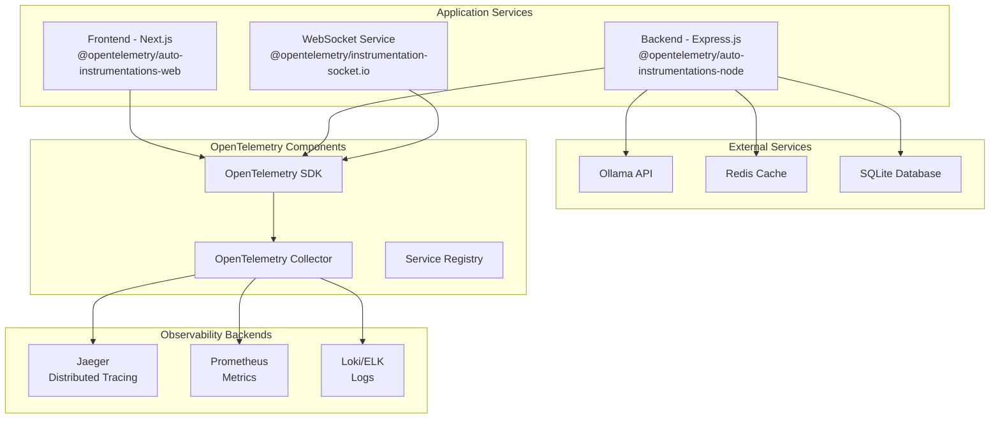

# OpenTelemetry Configuration Guide

Complete setup and configuration guide for OpenTelemetry instrumentation in the Prompt Card System, providing distributed tracing, metrics, and logs.

## Overview

OpenTelemetry provides observability for the entire system through:
- **Distributed Tracing**: End-to-end request tracing
- **Metrics**: Application and business metrics
- **Logs**: Structured logging with correlation
- **Context Propagation**: Cross-service trace correlation

## Architecture



## Installation and Setup

### Backend Configuration

The backend already includes comprehensive OpenTelemetry packages:

```typescript
// backend/src/telemetry/tracer.ts
import { NodeSDK } from '@opentelemetry/sdk-node';
import { auto } from '@opentelemetry/auto-instrumentations-node';
import { Resource } from '@opentelemetry/resources';
import { SemanticResourceAttributes } from '@opentelemetry/semantic-conventions';
import { JaegerExporter } from '@opentelemetry/exporter-jaeger';
import { PrometheusExporter } from '@opentelemetry/exporter-prometheus';

const sdk = new NodeSDK({
  resource: new Resource({
    [SemanticResourceAttributes.SERVICE_NAME]: 'prompt-card-backend',
    [SemanticResourceAttributes.SERVICE_VERSION]: process.env.npm_package_version || '1.0.0',
    [SemanticResourceAttributes.DEPLOYMENT_ENVIRONMENT]: process.env.NODE_ENV || 'development',
  }),
  traceExporter: new JaegerExporter({
    endpoint: process.env.JAEGER_ENDPOINT || 'http://localhost:14268/api/traces',
  }),
  metricReader: new PrometheusExporter({
    port: 9090,
    endpoint: '/metrics',
  }),
  instrumentations: [auto()],
});

sdk.start();
```

### Environment Variables

```bash
# OpenTelemetry Configuration
OTEL_SERVICE_NAME=prompt-card-backend
OTEL_SERVICE_VERSION=1.0.0
OTEL_RESOURCE_ATTRIBUTES=service.name=prompt-card-backend,service.version=1.0.0,deployment.environment=production

# Tracing Configuration
OTEL_TRACES_EXPORTER=jaeger
JAEGER_ENDPOINT=http://jaeger:14268/api/traces
OTEL_EXPORTER_JAEGER_AGENT_HOST=jaeger
OTEL_EXPORTER_JAEGER_AGENT_PORT=6832

# Metrics Configuration
OTEL_METRICS_EXPORTER=prometheus
PROMETHEUS_ENDPOINT=http://prometheus:9090/api/v1/write

# Sampling Configuration
OTEL_TRACES_SAMPLER=traceidratio
OTEL_TRACES_SAMPLER_ARG=0.1

# Instrumentation Configuration
OTEL_NODE_ENABLED_INSTRUMENTATIONS=http,express,fs,dns,net,redis,winston
OTEL_NODE_DISABLED_INSTRUMENTATIONS=@opentelemetry/instrumentation-fs

# Performance Configuration
OTEL_BSP_MAX_EXPORT_BATCH_SIZE=512
OTEL_BSP_EXPORT_BATCH_TIMEOUT=5000
OTEL_BSP_MAX_QUEUE_SIZE=2048
```

## Instrumentations

### Automatic Instrumentations

The system uses automatic instrumentation for common libraries:

```typescript
import { auto } from '@opentelemetry/auto-instrumentations-node';

// Automatically instruments:
// - HTTP/HTTPS requests and responses
// - Express.js routes and middleware
// - Database queries (SQLite)
// - Redis operations
// - File system operations
// - DNS lookups
// - WebSocket connections
// - Winston logging
```

### Custom Instrumentations

```typescript
// Custom business logic instrumentation
import { trace, SpanStatusCode, SpanKind } from '@opentelemetry/api';

const tracer = trace.getTracer('prompt-card-backend', '1.0.0');

export class PromptCardService {
  async generateResponse(prompt: string): Promise<string> {
    const span = tracer.startSpan('prompt-card.generate-response', {
      kind: SpanKind.INTERNAL,
      attributes: {
        'prompt.length': prompt.length,
        'prompt.type': this.classifyPrompt(prompt),
        'user.id': this.getCurrentUserId(),
      },
    });

    try {
      // Add custom events
      span.addEvent('prompt.validation.start');
      
      const validatedPrompt = await this.validatePrompt(prompt);
      span.setAttributes({
        'prompt.validated': true,
        'prompt.clean_length': validatedPrompt.length,
      });

      span.addEvent('ollama.request.start');
      const response = await this.callOllama(validatedPrompt);
      
      span.addEvent('response.processing.start');
      const processedResponse = await this.processResponse(response);

      span.setAttributes({
        'response.length': processedResponse.length,
        'response.tokens': this.countTokens(processedResponse),
        'operation.success': true,
      });

      return processedResponse;
    } catch (error) {
      span.recordException(error);
      span.setStatus({
        code: SpanStatusCode.ERROR,
        message: error.message,
      });
      throw error;
    } finally {
      span.end();
    }
  }
}
```

### Database Instrumentation

```typescript
// Custom SQLite instrumentation
import { trace } from '@opentelemetry/api';

export class DatabaseService {
  async executeQuery(sql: string, params: any[] = []): Promise<any> {
    const span = trace.getActiveSpan();
    
    if (span) {
      span.setAttributes({
        'db.system': 'sqlite',
        'db.statement': sql,
        'db.operation': sql.split(' ')[0].toUpperCase(),
        'db.sql.table': this.extractTableName(sql),
      });
    }

    const startTime = Date.now();
    
    try {
      const result = await this.db.prepare(sql).all(params);
      
      if (span) {
        span.setAttributes({
          'db.rows_affected': result.length,
          'db.duration_ms': Date.now() - startTime,
        });
      }

      return result;
    } catch (error) {
      if (span) {
        span.recordException(error);
        span.setAttributes({
          'db.error': true,
          'db.error.message': error.message,
        });
      }
      throw error;
    }
  }
}
```

## Trace Context Propagation

### HTTP Headers

OpenTelemetry automatically propagates trace context through HTTP headers:

```http
traceparent: 00-4bf92f3577b34da6a3ce929d0e0e4736-00f067aa0ba902b7-01
tracestate: rojo=00f067aa0ba902b7,congo=t61rcWkgMzE
```

### Cross-Service Correlation

```typescript
// Frontend to Backend correlation
import { trace, propagation, context } from '@opentelemetry/api';

// Frontend - Next.js API Route
export default async function handler(req: NextApiRequest, res: NextApiResponse) {
  const span = trace.getActiveSpan();
  
  // Inject trace context into backend request
  const headers: Record<string, string> = {};
  propagation.inject(context.active(), headers);

  const response = await fetch('http://backend:3001/api/prompt-cards', {
    method: 'POST',
    headers: {
      ...headers,
      'Content-Type': 'application/json',
    },
    body: JSON.stringify(req.body),
  });

  return res.json(await response.json());
}
```

### WebSocket Tracing

```typescript
// WebSocket connection tracing
import { trace, context, propagation } from '@opentelemetry/api';

export class WebSocketService {
  handleConnection(socket: Socket) {
    const span = tracer.startSpan('websocket.connection', {
      attributes: {
        'websocket.connection_id': socket.id,
        'websocket.client_ip': socket.handshake.address,
        'websocket.user_agent': socket.handshake.headers['user-agent'],
      },
    });

    // Propagate context to all socket events
    socket.use((packet, next) => {
      context.with(trace.setSpan(context.active(), span), () => {
        next();
      });
    });

    socket.on('prompt:generate', async (data) => {
      const eventSpan = tracer.startSpan('websocket.prompt.generate', {
        parent: span,
        attributes: {
          'prompt.id': data.id,
          'prompt.length': data.prompt?.length || 0,
        },
      });

      try {
        const result = await this.generatePromptResponse(data);
        socket.emit('prompt:result', result);
        
        eventSpan.setAttributes({
          'operation.success': true,
          'response.length': result.response?.length || 0,
        });
      } catch (error) {
        eventSpan.recordException(error);
        socket.emit('prompt:error', { error: error.message });
      } finally {
        eventSpan.end();
      }
    });
  }
}
```

## Metrics Collection

### Custom Metrics

```typescript
import { metrics } from '@opentelemetry/api';

const meter = metrics.getMeter('prompt-card-backend', '1.0.0');

// Create custom metrics
const promptRequestsCounter = meter.createCounter('prompt_requests_total', {
  description: 'Total number of prompt requests',
});

const promptProcessingHistogram = meter.createHistogram('prompt_processing_duration', {
  description: 'Time spent processing prompts',
  unit: 'ms',
});

const activePromptsGauge = meter.createUpDownCounter('active_prompts', {
  description: 'Number of currently active prompts',
});

// Usage in service methods
export class MetricsService {
  recordPromptRequest(type: string, userId: string) {
    promptRequestsCounter.add(1, {
      prompt_type: type,
      user_id: userId,
      service: 'prompt-card-backend',
    });
  }

  recordPromptProcessingTime(duration: number, success: boolean) {
    promptProcessingHistogram.record(duration, {
      success: success.toString(),
      service: 'prompt-card-backend',
    });
  }

  updateActivePrompts(delta: number) {
    activePromptsGauge.add(delta);
  }
}
```

### Business Metrics

```typescript
// Business-specific metrics
const businessMetrics = {
  userEngagementCounter: meter.createCounter('user_engagement_total', {
    description: 'User engagement events',
  }),
  
  revenueGauge: meter.createUpDownCounter('revenue_impact', {
    description: 'Revenue impact of features',
  }),
  
  featureUsageHistogram: meter.createHistogram('feature_usage_distribution', {
    description: 'Distribution of feature usage',
  }),
};

export class BusinessMetricsCollector {
  recordUserEngagement(event: string, userId: string, features: string[]) {
    businessMetrics.userEngagementCounter.add(1, {
      event_type: event,
      user_id: userId,
      features: features.join(','),
    });
  }

  updateRevenueImpact(amount: number, feature: string) {
    businessMetrics.revenueGauge.add(amount, {
      feature,
      currency: 'USD',
    });
  }

  recordFeatureUsage(feature: string, duration: number) {
    businessMetrics.featureUsageHistogram.record(duration, {
      feature,
      session_type: 'interactive',
    });
  }
}
```

## Structured Logging

### Log Correlation

```typescript
import { trace, context } from '@opentelemetry/api';
import winston from 'winston';

// Winston logger with trace correlation
const logger = winston.createLogger({
  format: winston.format.combine(
    winston.format.timestamp(),
    winston.format.errors({ stack: true }),
    winston.format.json(),
    winston.format.printf((info) => {
      const span = trace.getActiveSpan();
      if (span) {
        const spanContext = span.spanContext();
        info.traceId = spanContext.traceId;
        info.spanId = spanContext.spanId;
        info.traceFlags = spanContext.traceFlags;
      }
      return JSON.stringify(info);
    })
  ),
  transports: [
    new winston.transports.Console(),
    new winston.transports.File({ filename: 'app.log' }),
  ],
});

// Usage in services
export class LoggingService {
  logPromptGeneration(promptId: string, userId: string, success: boolean) {
    logger.info('Prompt generation completed', {
      prompt_id: promptId,
      user_id: userId,
      success,
      operation: 'prompt.generate',
      service: 'prompt-card-backend',
    });
  }

  logError(error: Error, context: Record<string, any>) {
    logger.error('Operation failed', {
      error: {
        message: error.message,
        stack: error.stack,
        name: error.name,
      },
      ...context,
      service: 'prompt-card-backend',
    });
  }
}
```

## Jaeger Setup

### Docker Compose Configuration

```yaml
# docker-compose.monitoring.yml
services:
  jaeger:
    image: jaegertracing/all-in-one:1.42
    container_name: prompt-jaeger
    ports:
      - "14268:14268"  # jaeger.thrift over HTTP
      - "16686:16686"  # Jaeger UI
      - "14250:14250"  # model.proto over gRPC
      - "6831:6831/udp"  # jaeger.thrift over UDP
      - "6832:6832/udp"  # jaeger.thrift over UDP
    environment:
      - COLLECTOR_OTLP_ENABLED=true
      - COLLECTOR_ZIPKIN_HOST_PORT=9411
    networks:
      - monitoring-network
    restart: unless-stopped

  # OpenTelemetry Collector (optional)
  otel-collector:
    image: otel/opentelemetry-collector-contrib:0.91.0
    container_name: prompt-otel-collector
    command: ["--config=/etc/otel-collector-config.yaml"]
    volumes:
      - ./monitoring/otel-collector-config.yaml:/etc/otel-collector-config.yaml
    ports:
      - "4317:4317"   # OTLP gRPC receiver
      - "4318:4318"   # OTLP HTTP receiver
      - "8889:8889"   # Prometheus metrics
    depends_on:
      - jaeger
      - prometheus
    networks:
      - monitoring-network
    restart: unless-stopped
```

### OpenTelemetry Collector Configuration

```yaml
# monitoring/otel-collector-config.yaml
receivers:
  otlp:
    protocols:
      grpc:
        endpoint: 0.0.0.0:4317
      http:
        endpoint: 0.0.0.0:4318

  prometheus:
    config:
      scrape_configs:
        - job_name: 'otel-collector'
          static_configs:
            - targets: ['localhost:8889']

processors:
  batch:
    timeout: 1s
    send_batch_size: 1024
    send_batch_max_size: 2048

  resource:
    attributes:
      - key: environment
        value: production
        action: upsert

  memory_limiter:
    limit_mib: 512

exporters:
  jaeger:
    endpoint: jaeger:14250
    tls:
      insecure: true

  prometheus:
    endpoint: "0.0.0.0:8889"
    namespace: prompt_card_system

  logging:
    loglevel: debug

service:
  pipelines:
    traces:
      receivers: [otlp]
      processors: [memory_limiter, resource, batch]
      exporters: [jaeger, logging]

    metrics:
      receivers: [otlp, prometheus]
      processors: [memory_limiter, resource, batch]
      exporters: [prometheus, logging]
```

## Frontend Instrumentation

### Next.js Configuration

```typescript
// frontend/instrumentation.ts
import { registerOTel } from '@vercel/otel';

export function register() {
  registerOTel({
    serviceName: 'prompt-card-frontend',
    traceExporter: 'jaeger',
  });
}
```

```typescript
// frontend/lib/tracing.ts
import { trace } from '@opentelemetry/api';

const tracer = trace.getTracer('prompt-card-frontend', '1.0.0');

export function traceApiCall<T>(
  name: string,
  fn: () => Promise<T>,
  attributes?: Record<string, string | number | boolean>
): Promise<T> {
  return tracer.startActiveSpan(name, { attributes }, async (span) => {
    try {
      const result = await fn();
      span.setStatus({ code: 1 }); // OK
      return result;
    } catch (error) {
      span.recordException(error as Error);
      span.setStatus({ code: 2, message: (error as Error).message }); // ERROR
      throw error;
    } finally {
      span.end();
    }
  });
}
```

### React Component Tracing

```typescript
// frontend/hooks/useTracing.ts
import { trace, context, propagation } from '@opentelemetry/api';
import { useEffect, useCallback } from 'react';

export function useTracing(componentName: string) {
  const tracer = trace.getTracer('prompt-card-frontend', '1.0.0');

  const traceUserAction = useCallback((action: string, attributes?: Record<string, any>) => {
    const span = tracer.startSpan(`user.${action}`, {
      attributes: {
        component: componentName,
        ...attributes,
      },
    });

    span.addEvent('user.action.start');
    return {
      finish: (success: boolean = true, data?: any) => {
        span.setAttributes({
          success,
          ...data,
        });
        span.addEvent('user.action.complete');
        span.end();
      },
    };
  }, [componentName, tracer]);

  return { traceUserAction };
}
```

## Performance Optimization

### Sampling Configuration

```typescript
// Sampling strategies for different environments
const samplingConfig = {
  development: {
    traceSampler: 'always_on',
    tracesSamplerArg: undefined,
  },
  staging: {
    traceSampler: 'traceidratio',
    tracesSamplerArg: 0.5, // 50% sampling
  },
  production: {
    traceSampler: 'traceidratio',
    tracesSamplerArg: 0.1, // 10% sampling
  },
};

// Custom sampler for high-volume endpoints
class CustomSampler {
  shouldSample(context: any): any {
    const route = context.parentSpanContext?.attributes?.['http.route'];
    
    // Sample health checks less frequently
    if (route === '/health') {
      return { decision: SamplingDecision.NOT_RECORD };
    }
    
    // Always sample errors
    if (context.parentSpanContext?.traceFlags & TraceFlags.SAMPLED) {
      return { decision: SamplingDecision.RECORD_AND_SAMPLED };
    }
    
    // Default sampling
    return { decision: SamplingDecision.RECORD_AND_SAMPLED };
  }
}
```

### Resource Optimization

```typescript
// Optimized resource configuration
const sdk = new NodeSDK({
  resource: new Resource({
    [SemanticResourceAttributes.SERVICE_NAME]: 'prompt-card-backend',
    [SemanticResourceAttributes.SERVICE_VERSION]: process.env.npm_package_version || '1.0.0',
    [SemanticResourceAttributes.DEPLOYMENT_ENVIRONMENT]: process.env.NODE_ENV,
    [SemanticResourceAttributes.SERVICE_INSTANCE_ID]: process.env.HOSTNAME || 'unknown',
    [SemanticResourceAttributes.PROCESS_PID]: process.pid.toString(),
  }),
  spanLimits: {
    attributeValueLengthLimit: 1024,
    attributeCountLimit: 128,
    eventCountLimit: 128,
    linkCountLimit: 128,
  },
  spanProcessor: new BatchSpanProcessor(
    new JaegerExporter({
      endpoint: process.env.JAEGER_ENDPOINT,
    }),
    {
      maxExportBatchSize: 512,
      exportTimeoutMillis: 30000,
      scheduledDelayMillis: 5000,
    }
  ),
});
```

## Troubleshooting

### Common Issues

#### 1. Missing Traces in Jaeger
```bash
# Check if traces are being generated
curl http://localhost:16686/api/traces?service=prompt-card-backend

# Verify OpenTelemetry SDK initialization
docker logs prompt-card-backend | grep -i "opentelemetry\|tracing"

# Check Jaeger collector health
curl http://localhost:14269/
```

#### 2. High Memory Usage
```typescript
// Monitor SDK memory usage
const { performance, PerformanceObserver } = require('perf_hooks');

const obs = new PerformanceObserver((list) => {
  const entries = list.getEntries();
  entries.forEach((entry) => {
    if (entry.name.includes('otel')) {
      console.log(`OpenTelemetry Operation: ${entry.name}, Duration: ${entry.duration}ms`);
    }
  });
});

obs.observe({ entryTypes: ['measure'] });
```

#### 3. Context Propagation Issues
```typescript
// Debug context propagation
import { trace, context, propagation } from '@opentelemetry/api';

const debugPropagation = (req: Request) => {
  const headers = req.headers;
  console.log('Incoming headers:', headers);
  
  const activeContext = propagation.extract(context.active(), headers);
  const span = trace.getActiveSpan(activeContext);
  
  if (span) {
    console.log('Active span context:', span.spanContext());
  } else {
    console.log('No active span found');
  }
};
```

### Debugging Commands

```bash
# Check OpenTelemetry environment variables
env | grep OTEL

# Validate Jaeger connection
telnet jaeger 14268

# Test trace export
curl -X POST http://localhost:14268/api/traces \
  -H "Content-Type: application/json" \
  -d '{"data":[{"traceID":"test","spans":[]}]}'

# Monitor OpenTelemetry SDK logs
export OTEL_LOG_LEVEL=debug
npm start 2>&1 | grep -i otel
```

For advanced configuration and custom instrumentations, see our [Custom Instrumentations Guide](./custom-instrumentations.md).