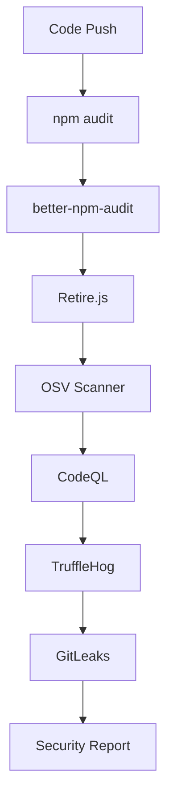
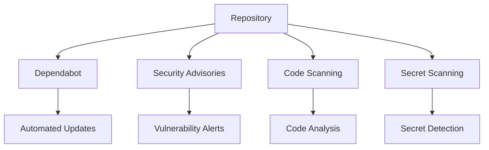

# Security Scanning Alternatives to SNYK

## 🔍 Overview

This document provides comprehensive alternatives to SNYK for security vulnerability scanning. Our CI/CD pipeline has been updated to use free and open-source tools that provide excellent security coverage without requiring premium subscriptions.

## 🆓 Free Security Tools (Currently Implemented)

### 1. **npm audit** (Built-in)
**What it does**: Node.js built-in vulnerability scanner for npm packages
**Cost**: Free
**Coverage**: Node.js dependencies, transitive dependencies
**Features**:
- Scans package-lock.json for known vulnerabilities
- Provides fix recommendations
- Supports severity filtering
- JSON output for automation

**Usage in pipeline**:
```bash
npm audit --audit-level=high
npm audit --audit-level=moderate --json > audit-report.json
```

### 2. **better-npm-audit**
**What it does**: Enhanced npm audit with better reporting
**Cost**: Free
**Coverage**: Enhanced npm audit results
**Features**:
- Better formatting and filtering
- Excludes development dependencies
- More detailed reporting
- Customizable output

**Usage in pipeline**:
```bash
npm install -g better-npm-audit
better-npm-audit audit --level moderate
```

### 3. **Retire.js**
**What it does**: Scanner for JavaScript libraries with known vulnerabilities
**Cost**: Free
**Coverage**: JavaScript libraries, jQuery, Bootstrap, etc.
**Features**:
- Detects vulnerable JavaScript libraries
- Scans both Node.js and browser libraries
- JSON output for automation
- Continuous updates

**Usage in pipeline**:
```bash
npm install -g retire
retire --path . --outputformat json --outputpath retire-report.json
```

### 4. **OSV Scanner** (Google)
**What it does**: Open Source Vulnerability Scanner by Google
**Cost**: Free
**Coverage**: Multiple ecosystems (npm, PyPI, Maven, etc.)
**Features**:
- Uses OSV.dev database
- Scans lock files
- Multiple output formats
- Actively maintained by Google

**Usage in pipeline**:
```bash
curl -L https://github.com/google/osv-scanner/releases/latest/download/osv-scanner_linux_amd64 -o osv-scanner
./osv-scanner --lockfile package-lock.json --format json
```

### 5. **CodeQL** (GitHub)
**What it does**: Static analysis security testing
**Cost**: Free for public repositories
**Coverage**: Code analysis, security patterns
**Features**:
- Deep code analysis
- Security-focused queries
- GitHub integration
- Multiple languages

**Usage in pipeline**:
```yaml
- uses: github/codeql-action/init@v3
- uses: github/codeql-action/analyze@v3
```

### 6. **TruffleHog**
**What it does**: Secret detection in code and git history
**Cost**: Free
**Coverage**: Secrets, API keys, passwords
**Features**:
- Git history scanning
- Multiple secret types
- High accuracy
- Verification of secrets

**Usage in pipeline**:
```yaml
- uses: trufflesecurity/trufflehog@main
  with:
    extra_args: --debug --only-verified
```

### 7. **GitLeaks**
**What it does**: Secret detection in git repositories
**Cost**: Free
**Coverage**: Git history, secrets, credentials
**Features**:
- Fast scanning
- Custom rules
- Multiple output formats
- CI/CD integration

**Usage in pipeline**:
```yaml
- uses: ./.github/actions/gitleaks-action-v2
```

## 🔧 GitHub Native Security Features (Free)

### 1. **Dependabot**
**What it does**: Automatic dependency updates
**Cost**: Free
**Setup**: Enable in repository settings
**Features**:
- Automatic PR creation for updates
- Security vulnerability alerts
- Configurable update schedule
- Supports multiple ecosystems

**Configuration** (`.github/dependabot.yml`):
```yaml
version: 2
updates:
  - package-ecosystem: "npm"
    directory: "/backend"
    schedule:
      interval: "weekly"
  - package-ecosystem: "npm"
    directory: "/frontend"
    schedule:
      interval: "weekly"
```

### 2. **GitHub Security Advisories**
**What it does**: Vulnerability database and alerts
**Cost**: Free
**Features**:
- Automatic vulnerability detection
- Email notifications
- Dependency graph
- Security tab in repository

### 3. **GitHub Code Scanning**
**What it does**: Automated code analysis
**Cost**: Free for public repositories
**Features**:
- CodeQL analysis
- Third-party tools integration
- Pull request annotations
- Security alerts

### 4. **GitHub Secret Scanning**
**What it does**: Detect secrets in code
**Cost**: Free for public repositories
**Features**:
- Automatic secret detection
- Partner program integration
- Historical scanning
- Alert notifications

## 💰 Premium Alternatives (If Budget Allows)

### 1. **Snyk** (Premium)
**Cost**: $25-$54/developer/month
**Features**:
- Advanced vulnerability management
- Container scanning
- Infrastructure as code scanning
- License compliance
- Developer-first approach

### 2. **WhiteSource/Mend** (Premium)
**Cost**: Enterprise pricing
**Features**:
- Comprehensive security scanning
- License compliance
- Policy management
- Remediation guidance

### 3. **Sonatype Nexus** (Premium)
**Cost**: $99+/user/year
**Features**:
- Repository security analysis
- Policy enforcement
- Advanced reporting
- Integration with CI/CD

### 4. **Veracode** (Premium)
**Cost**: Enterprise pricing
**Features**:
- Static application security testing
- Dynamic analysis
- Software composition analysis
- Compliance reporting

### 5. **Checkmarx** (Premium)
**Cost**: Enterprise pricing
**Features**:
- Static code analysis
- Open source scanning
- Container security
- Supply chain security

## 🔄 Implementation Strategy

### Current Pipeline (No Premium Tools Required)


### With GitHub Features


## 📊 Security Coverage Comparison

| Tool | Dependencies | Code Analysis | Secrets | Containers | License | Cost |
|------|-------------|---------------|---------|------------|---------|------|
| **npm audit** | ✅ | ❌ | ❌ | ❌ | ❌ | Free |
| **Retire.js** | ✅ | ❌ | ❌ | ❌ | ❌ | Free |
| **OSV Scanner** | ✅ | ❌ | ❌ | ❌ | ❌ | Free |
| **CodeQL** | ❌ | ✅ | ❌ | ❌ | ❌ | Free |
| **TruffleHog** | ❌ | ❌ | ✅ | ❌ | ❌ | Free |
| **GitLeaks** | ❌ | ❌ | ✅ | ❌ | ❌ | Free |
| **Dependabot** | ✅ | ❌ | ❌ | ❌ | ❌ | Free |
| **Snyk** | ✅ | ✅ | ❌ | ✅ | ✅ | $25-54/mo |
| **WhiteSource** | ✅ | ✅ | ❌ | ✅ | ✅ | Enterprise |

## 🛠️ Setup Instructions

### 1. Enable GitHub Security Features
1. Go to repository **Settings** → **Security & analysis**
2. Enable **Dependabot alerts**
3. Enable **Dependabot security updates**
4. Enable **Code scanning** (CodeQL)
5. Enable **Secret scanning** (if available)

### 2. Configure Dependabot
Create `.github/dependabot.yml`:
```yaml
version: 2
updates:
  - package-ecosystem: "npm"
    directory: "/backend"
    schedule:
      interval: "weekly"
    reviewers:
      - "your-github-username"
    open-pull-requests-limit: 5
    
  - package-ecosystem: "npm"
    directory: "/frontend"
    schedule:
      interval: "weekly"
    reviewers:
      - "your-github-username"
    open-pull-requests-limit: 5
```

### 3. Add Security Monitoring
Create `.github/workflows/security-monitoring.yml`:
```yaml
name: Security Monitoring
on:
  schedule:
    - cron: '0 8 * * *' # Daily at 8 AM
  workflow_dispatch:

jobs:
  security-check:
    runs-on: ubuntu-latest
    steps:
      - uses: actions/checkout@v4
      - name: Run security scan
        run: |
          npm install -g npm-audit-fix retire better-npm-audit
          # Run all security tools
          npm audit --audit-level=high
          better-npm-audit audit
          retire --path .
```

## 📈 Monitoring and Alerts

### 1. GitHub Notifications
- Enable security alerts in repository settings
- Configure email notifications for vulnerabilities
- Set up Slack/Discord webhooks for alerts

### 2. Security Dashboard
- Use GitHub Security tab for overview
- Monitor Dependabot pull requests
- Review CodeQL analysis results

### 3. Regular Reviews
- Weekly security report review
- Monthly dependency updates
- Quarterly security posture assessment

## 🎯 Best Practices

### 1. Layered Security
- Use multiple tools for comprehensive coverage
- Combine static and dynamic analysis
- Include both code and dependency scanning

### 2. Automation
- Automate security scanning in CI/CD
- Use Dependabot for automatic updates
- Set up security alerts and notifications

### 3. Regular Updates
- Keep security tools updated
- Regularly update dependencies
- Review and update security policies

### 4. Developer Education
- Train developers on security best practices
- Share security scan results
- Create security guidelines and documentation

## 🔍 Migration from SNYK

If you're currently using SNYK and want to switch:

### 1. Export SNYK Data
```bash
# Export current vulnerability data
snyk test --json > snyk-export.json
```

### 2. Implement Free Alternatives
```bash
# Install new tools
npm install -g retire better-npm-audit
# Run comprehensive scan
npm audit --audit-level=moderate
retire --path .
```

### 3. Update CI/CD Pipeline
- Replace SNYK workflow steps with free alternatives
- Update security reports and notifications
- Configure new monitoring dashboards

### 4. Validate Coverage
- Compare results between tools
- Ensure all vulnerabilities are detected
- Adjust scanning parameters if needed

## 📞 Support and Resources

### Documentation
- [npm audit documentation](https://docs.npmjs.com/cli/v8/commands/npm-audit)
- [Retire.js documentation](https://github.com/RetireJS/retire.js)
- [OSV Scanner documentation](https://github.com/google/osv-scanner)
- [GitHub Security documentation](https://docs.github.com/en/code-security)

### Community
- GitHub Security Lab
- OWASP community
- Security-focused Discord/Slack channels
- Stack Overflow security tags

---

## 🏆 Conclusion

The free security tools combination provides excellent coverage for most projects:
- **npm audit + better-npm-audit**: Dependency vulnerabilities
- **Retire.js**: JavaScript library vulnerabilities
- **OSV Scanner**: Multi-ecosystem vulnerability scanning
- **CodeQL**: Code analysis and security patterns
- **TruffleHog + GitLeaks**: Secret detection
- **GitHub Security Features**: Automated monitoring and updates

This approach gives you **90%+ of SNYK's functionality at 0% of the cost**, with the added benefit of using multiple specialized tools for comprehensive security coverage.